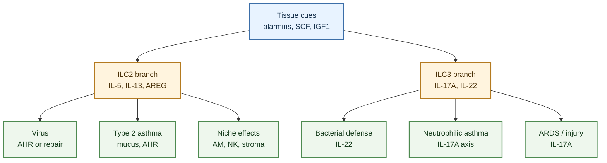

---
tags:
  - tissue/lung
  - cell/ILC1
  - cell/ILC2
  - cell/ILC3
  - cell/NK
  - outcome/airway_hyperresponsiveness
  - outcome/infection
  - outcome/inflammation
  - outcome/repair
  - axis/ILC_lung_infection
  - axis/ILC_airway_inflammation
  - axis/ILC_lung_homeostasis
---

# Role Of ILC In Pulmonary Diseases

## Scope

This digest maps biological roles of innate lymphoid cells in pulmonary diseases. It covers asthma and allergic airway inflammation, respiratory viral infection, bacterial infection, acute lung injury/ARDS, COPD/smoke-associated inflammation, neutrophilic or steroid-resistant asthma, lung cancer-related immunity, and developmental lung contexts.

The page is disease-oriented rather than subset-oriented. For subset-specific synthesis, see [ILC2 Working Model](./2026-04-20_ILC2_working_model.md) and [ILC3 Working Model](./2026-04-20_ILC3_working_model.md).

## Evidence tags

`#tissue/lung` `#cell/ILC1` `#cell/ILC2` `#cell/ILC3` `#cell/NK` `#outcome/airway_hyperresponsiveness` `#outcome/infection` `#outcome/inflammation` `#outcome/repair` `#axis/ILC_lung_infection` `#axis/ILC_airway_inflammation` `#axis/ILC_lung_homeostasis`

## Working model

Pulmonary ILC disease biology is best modeled as a set of tissue-response modules rather than a single disease mechanism. Lung ILCs sit at the interface of epithelial alarms, stromal signals, myeloid cells, adaptive immunity, and neural/metabolic cues. The same broad ILC family can protect tissue, amplify inflammation, or reshape macrophage/NK-cell behavior depending on timing, compartment, upstream stimulus, and disease context.

For asthma, the evidence separates at least two partially overlapping programs. The ILC2 branch maps to type 2 inflammation, IL-5/IL-13, mucus-related pathology, airway hyperresponsiveness, metabolic regulation, neuroimmune cues, SCF/c-Kit regulation, and allergen-experienced memory-like behavior. The ILC3 branch maps more strongly to IL-17A, neutrophil chemoattractants, smoking-associated asthma severity, M1 macrophage-linked inflammation, and glucocorticoid-insensitive or steroid-resistant disease.

For infection, ILCs can be protective, pathogenic, or state-reprogramming. Influenza-related sources include ILC-associated airway hyperreactivity, amphiregulin-linked repair, and BATF-linked tissue-protective ILC2 identity. Gammaherpesvirus conditioning can dampen type 2 ILC2 properties while driving GM-CSF-dependent monocyte-derived alveolar macrophage imprinting. Bacterial infection sources support ILC3/IL-22 responses in the lung during Streptococcus pneumoniae infection. These are different axes: viral airway physiology, viral tissue repair, macrophage niche imprinting, and bacterial IL-22 host defense should not be merged.

For acute injury, remodeling, and smoke/COPD contexts, ILC roles are time- and cytokine-dependent. IL-17A-producing innate lymphoid cells can contribute to early ARDS-like lung injury, while ILC2-associated repair programs can support tissue homeostasis after viral injury. COPD-associated infectious or noxious triggers can push ILC2s toward an IL-12/IL-18-regulated T-bet/IFN-gamma ILC1-like state. Smoking asthma can enrich sputum NCR- ILC3s and blood CD45RO+ memory-like ILC3s that align with neutrophil and M1 macrophage signatures.

## Highest-confidence claims

- High confidence: lung ILCs can shape asthma, respiratory infection, acute injury, repair, and airway remodeling through context-specific cytokine and tissue-niche programs.
- High confidence: ILC2s support allergic/type 2 airway disease through IL-5/IL-13-associated inflammation and AHR, but can also support post-viral epithelial repair through amphiregulin/BATF-linked programs.
- High confidence: ILC3s support bacterial IL-22 defense and can contribute to IL-17A/neutrophil-associated inflammatory branches in ARDS-like injury, neutrophilic asthma, smoking-associated asthma, and steroid-resistant asthma contexts.
- Medium-high confidence: COPD/smoke-associated disease involves ILC plasticity, including ILC2-to-ILC1-like conversion under IL-12/IL-18 and smoke-associated memory-like ILC3s, but human causal evidence remains more limited than mouse perturbation evidence.
- Medium confidence: pulmonary disease outcomes are shaped by crosstalk among ILCs, epithelial cells, fibroblasts/stromal niches, macrophages, NK cells, and neural/metabolic programs.

## Claim-level confidence boundaries

- `High confidence` is reserved for disease roles supported by direct lung or airway evidence, especially when cell identity, cytokine output, and functional outcome are linked.
- `Medium-high confidence` marks disease modules where mouse perturbation, human association, or ex vivo function converge but do not all provide the same causal strength.
- `Medium confidence` marks crosstalk and niche models when the direction of interaction is plausible and supported, but pathway hierarchy or therapeutic actionability is not yet settled.

## Contradictions to track

- `Asthma is not one ILC disease`:
  type 2/eosinophilic asthma and neutrophilic/steroid-resistant asthma likely require different ILC annotations.
- `Virus can injure and repair`:
  viral infection can activate ILC-dependent airway hyperreactivity but can also induce tissue-protective ILC2 programs.
- `ILC2 and ILC3 boundaries can blur`:
  IL-17-producing ST2+ ILC2-like states and ILC3-like signatures require careful marker and lineage interpretation.
- `Pulmonary versus extrapulmonary evidence`:
  many mechanistic ILC principles come from gut or barrier-tissue literature; these should inform hypotheses, not overwrite lung-specific evidence.
- `Human compartment boundaries`:
  human lung tissue, induced sputum, blood, BAL, bronchial biopsy, and nasal polyp evidence should not be treated as interchangeable.

## Update triggers

- Create disease-specific digests for `ILC2 in viral lung repair`, `ILC2 in allergic asthma`, `ILC2 plasticity in COPD/smoke`, and `ILC3 in steroid-resistant asthma` when these become writing or figure priorities.
- Update this digest when human asthma, COPD, ARDS, pneumonia, fibrosis, or lung cancer cohorts directly connect ILC states to outcome, severity, treatment response, or spatial niche.
- Revisit the confidence labels when primary intervention data clarify whether ILC3-related IL-17/neutrophil programs are actionable in human steroid-resistant asthma.

## Crystallized from

- [Innate Lymphoid Cells of the Lung](../sources/2019_innate_lymphoid_cells_of_the_lung.md)
- [Tissue-specific features of innate lymphoid cells in antiviral defense](../sources/2024_tissue_specific_features_of_innate_lymphoid_cells_in_antiviral_defense.md)
- [Decoding innate lymphoid cells and innate-like lymphocytes in asthma pathways to mechanisms and therapies](../sources/2025_decoding_innate_lymphoid_cells_and_innate_like_lymphocytes_in_asthma_pathways_to_mech.md)
- [Innate lymphoid cells mediate influenza-induced airway hyper-reactivity independently of adaptive immunity](../sources/2011_innate_lymphoid_cells_mediate_influenza_induced_airway_hyper_reactivity_independently.md)
- [Innate lymphoid cells promote lung-tissue homeostasis after infection with influenza virus](../sources/2011_innate_lymphoid_cells_promote_lung_tissue_homeostasis_after_infection_with_influenza.md)
- [BATF promotes group 2 innate lymphoid cell-mediated lung tissue protection during acute respiratory virus infection](../sources/2022_batf_promotes_group_2_innate_lymphoid_cell_mediated_lung_tissue_protection_during_acu.md)
- [Activation of Type 3 innate lymphoid cells and interleukin 22 secretion in the lungs during Streptococcus pneumoniae infection](../sources/2014_activation_of_type_3_innate_lymphoid_cells_and_interleukin_22_secretion_in_the_lungs.md)
- [Innate Lymphoid Cells Are the Predominant Source of IL-17A during the Early Pathogenesis of Acute Respiratory Distress Syndrome](../sources/2016_innate_lymphoid_cells_are_the_predominant_source_of_il_17a_during_the_early_pathogene.md)
- [Cigarette smoke aggravates asthma by inducing memory-like type 3 innate lymphoid cells](../sources/2022_cigarette_smoke_aggravates_asthma_by_inducing_memory_like_type_3_innate_lymphoid_cell.md)
- [Group 3 innate lymphoid cells secret neutrophil chemoattractants and are insensitive to glucocorticoid via aberrant GR phosphorylation](../sources/2023_group_3_innate_lymphoid_cells_secret_neutrophil_chemoattractants_and_are_insensitive.md)
- [Pulmonary fibroblast-derived stem cell factor promotes neutrophilic asthma by augmenting IL-17A production from ILC3s](../sources/2025_pulmonary_fibroblast_derived_stem_cell_factor_promotes_neutrophilic_asthma_by_augment.md)
- [ILC2-driven innate immune checkpoint mechanism antagonizes NK cell antimetastatic function in the lung](../sources/2020_ilc2_driven_innate_immune_checkpoint_mechanism_antagonizes_nk_cell_antimetastatic_fun.md)
- [Lung ILC Core Evidence Synthesis](./2026-04-22_lung_ILC_core_evidence_synthesis.md)
