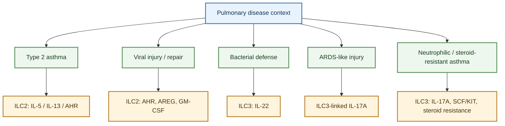

---
tags:
  - tissue/lung
  - cell/ILC1
  - cell/ILC2
  - cell/ILC3
  - digest/companion_page
  - disease/asthma
  - disease/infection
  - disease/ARDS
---

# Lung ILC Disease Roles Companion

## Scope

This page is now a companion page to [Lung ILC Core Evidence Synthesis](./2026-04-22_lung_ILC_core_evidence_synthesis.md), not a parallel digest competing with it.

Use the core evidence page as the main cross-subset synthesis. Use this companion when you want the same biology rearranged by disease context rather than by cell state.

## Evidence tags

`#tissue/lung` `#cell/ILC1` `#cell/ILC2` `#cell/ILC3` `#digest/companion_page` `#disease/asthma` `#disease/infection` `#disease/ARDS`

## Disease-first map

## Disease-oriented reading guide

| Disease question | Dominant ILC branch | Best next page | Representative anchors |
|---|---|---|---|
| Allergic or eosinophilic asthma | ILC2 type 2 amplification | [ILC2 Roles In Pulmonary Disease](../topics/ILC2_roles_in_pulmonary_disease.md) | [Innate lymphoid cells mediate influenza-induced airway hyper-reactivity independently of adaptive immunity](../sources/2011_innate_lymphoid_cells_mediate_influenza_induced_airway_hyper_reactivity_independently.md), [Lung type 2 innate lymphoid cells express cysteinyl leukotriene receptor 1 which regulates TH2 cytokine production](../sources/2013_lung_type_2_innate_lymphoid_cells_express_cysteinyl_leukotriene_receptor_1_which_regu.md) |
| Upstream drivers of type 2 or eosinophilic airway disease | ILC2 alarmin, lipid, neuroimmune, stromal, and metabolic regulation | [ILC2 Functional Regulation Mechanisms](../topics/ILC2_functional_regulation_mechanisms.md) | [Cysteinyl leukotriene E4 activates human group 2 innate lymphoid cells and enhances the effect of prostaglandin D2 and epithelial cytokines](../sources/2017_cysteinyl_leukotriene_e4_activates_human_group_2_innate_lymphoid_cells_and_enhances_the_effect_of_prostaglandin.md), [The Role of the TL1A/DR3 Axis in the Activation of Group 2 Innate Lymphoid Cells in Subjects with Eosinophilic Asthma](../sources/2020_the_role_of_the_tl1a_dr3_axis_in_the_activation_of_group_2_innate_lymphoid_cells_in_subjects_with_eosinophilic_a.md), [Lipid-Droplet Formation Drives Pathogenic Group 2 Innate Lymphoid Cells in Airway Inflammation](../sources/2020_lipid_droplet_formation_drives_pathogenic_group_2_innate_lymphoid_cells_in_airway_inf.md) |
| Viral airway physiology versus repair | ILC2 AHR, AREG, BATF, GM-CSF branches | [ILC2](../entities/ILC2.md) | [Innate lymphoid cells promote lung-tissue homeostasis after infection with influenza virus](../sources/2011_innate_lymphoid_cells_promote_lung_tissue_homeostasis_after_infection_with_influenza.md), [BATF promotes group 2 innate lymphoid cell-mediated lung tissue protection during acute respiratory virus infection](../sources/2022_batf_promotes_group_2_innate_lymphoid_cell_mediated_lung_tissue_protection_during_acu.md) |
| Bacterial defense and neonatal pulmonary niches | ILC3 IL-22 and IGF1-supported developmental branch | [ILC3](../entities/ILC3.md) | [Activation of Type 3 innate lymphoid cells and interleukin 22 secretion in the lungs during Streptococcus pneumoniae infection](../sources/2014_activation_of_type_3_innate_lymphoid_cells_and_interleukin_22_secretion_in_the_lungs.md), [Insulin-like Growth Factor 1 Supports a Pulmonary Niche that Promotes Type 3 Innate Lymphoid Cell Development in Newborn Lungs](../sources/2020_insulin_like_growth_factor_1_supports_a_pulmonary_niche_that_promotes_type_3_innate_lymphoid_cell_development_in.md) |
| ARDS-like injury or neutrophilic inflammation | ILC3-linked IL-17A and neutrophil programs | [ILC3 Roles In Pulmonary Disease](../topics/ILC3_roles_in_pulmonary_disease.md) | [Innate Lymphoid Cells Are the Predominant Source of IL-17A during the Early Pathogenesis of Acute Respiratory Distress Syndrome](../sources/2016_innate_lymphoid_cells_are_the_predominant_source_of_il_17a_during_the_early_pathogene.md), [Group 3 innate lymphoid cells secret neutrophil chemoattractants and are insensitive to glucocorticoid via aberrant GR phosphorylation](../sources/2023_group_3_innate_lymphoid_cells_secret_neutrophil_chemoattractants_and_are_insensitive.md) |
| Smoke-associated, neutrophilic, or steroid-resistant asthma | ILC3 memory-like, SCF/KIT, glucocorticoid-insensitive, and obesity-associated IL-17 branches | [ILC3 Functional Regulation Mechanisms](../topics/ILC3_functional_regulation_mechanisms.md) | [Cigarette smoke aggravates asthma by inducing memory-like type 3 innate lymphoid cells](../sources/2022_cigarette_smoke_aggravates_asthma_by_inducing_memory_like_type_3_innate_lymphoid_cell.md), [Pulmonary fibroblast-derived stem cell factor promotes neutrophilic asthma by augmenting IL-17A production from ILC3s](../sources/2025_pulmonary_fibroblast_derived_stem_cell_factor_promotes_neutrophilic_asthma_by_augment.md), [Interleukin-17-producing innate lymphoid cells and the NLRP3 inflammasome facilitate obesity-associated airway hyperreactivity](../sources/2014_interleukin_17_producing_innate_lymphoid_cells_and_the_nlrp3_inflammasome_facilitate.md) |

## Interpretation boundaries

- Asthma should not be treated as one ILC disease. The wiki separates at least a type 2/eosinophilic ILC2-dominant branch and a neutrophilic/steroid-resistant ILC3-associated branch.
- Viral lung disease should not be collapsed into one effect. Some ILC2 programs drive airway physiology, whereas others support tissue repair or macrophage-state remodeling.
- Bacterial defense, neonatal development, ARDS-like injury, and smoke-associated asthma use different ILC outputs and should stay separated.
- Human lung tissue, sputum, blood, BAL, nasal airway, and mouse perturbation evidence answer different questions and should remain labeled.

## How This Companion Fits The Wiki

This page no longer serves as a second full synthesis layer parallel to the core digest. Instead:

- [Lung ILC Core Evidence Synthesis](./2026-04-22_lung_ILC_core_evidence_synthesis.md) is the main cross-subset interpretation page.
- [ILC2](../entities/ILC2.md) and [ILC3](../entities/ILC3.md) are the canonical cell hubs.
- This page is the disease-first rearrangement for readers who think in pathology or endotypes rather than in cell-state architecture.

## Representative Source Spine

- [Innate lymphoid cells mediate influenza-induced airway hyper-reactivity independently of adaptive immunity](../sources/2011_innate_lymphoid_cells_mediate_influenza_induced_airway_hyper_reactivity_independently.md)
- [Innate lymphoid cells promote lung-tissue homeostasis after infection with influenza virus](../sources/2011_innate_lymphoid_cells_promote_lung_tissue_homeostasis_after_infection_with_influenza.md)
- [BATF promotes group 2 innate lymphoid cell-mediated lung tissue protection during acute respiratory virus infection](../sources/2022_batf_promotes_group_2_innate_lymphoid_cell_mediated_lung_tissue_protection_during_acu.md)
- [Activation of Type 3 innate lymphoid cells and interleukin 22 secretion in the lungs during Streptococcus pneumoniae infection](../sources/2014_activation_of_type_3_innate_lymphoid_cells_and_interleukin_22_secretion_in_the_lungs.md)
- [Innate Lymphoid Cells Are the Predominant Source of IL-17A during the Early Pathogenesis of Acute Respiratory Distress Syndrome](../sources/2016_innate_lymphoid_cells_are_the_predominant_source_of_il_17a_during_the_early_pathogene.md)
- [Cigarette smoke aggravates asthma by inducing memory-like type 3 innate lymphoid cells](../sources/2022_cigarette_smoke_aggravates_asthma_by_inducing_memory_like_type_3_innate_lymphoid_cell.md)
- [Group 3 innate lymphoid cells secret neutrophil chemoattractants and are insensitive to glucocorticoid via aberrant GR phosphorylation](../sources/2023_group_3_innate_lymphoid_cells_secret_neutrophil_chemoattractants_and_are_insensitive.md)
- [Pulmonary fibroblast-derived stem cell factor promotes neutrophilic asthma by augmenting IL-17A production from ILC3s](../sources/2025_pulmonary_fibroblast_derived_stem_cell_factor_promotes_neutrophilic_asthma_by_augment.md)
- [ILC2-driven innate immune checkpoint mechanism antagonizes NK cell antimetastatic function in the lung](../sources/2020_ilc2_driven_innate_immune_checkpoint_mechanism_antagonizes_nk_cell_antimetastatic_fun.md)
- [Lung ILC Core Evidence Synthesis](./2026-04-22_lung_ILC_core_evidence_synthesis.md)
