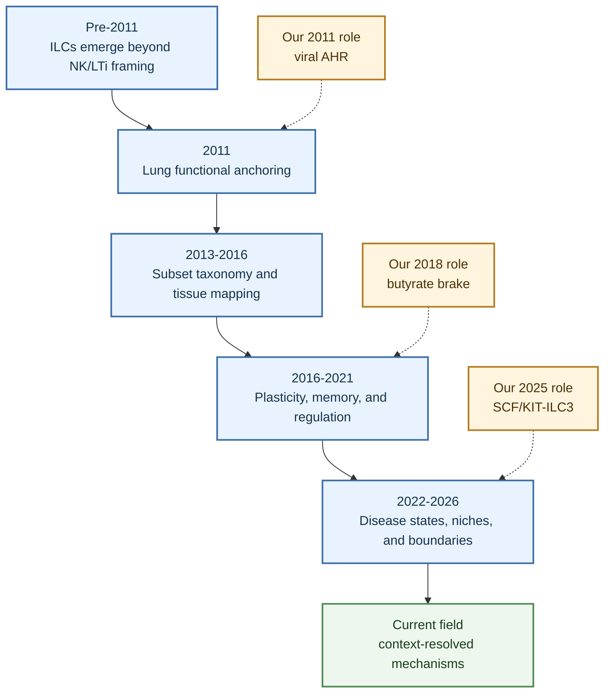

# ILC Research Trend From Then To Now

## Scope

This digest is an entry-level map of how the ILC field, especially lung and airway ILC research, moved from discovery to disease mechanism. It is not a bibliometric history of every ILC paper. Instead, it follows selected landmark and source-reviewed papers to explain what researchers learned at each stage, why those discoveries changed the field, and where our own work (Ya-Jen Chang, Christina Li-Ping Thio, and Jheng-Syuan Shao) fits within that broader trajectory.

The central trend is simple: ILC research moved from asking whether innate lymphoid cells exist and matter, to asking which ILC state acts in which tissue niche, during which disease phase, through which regulatory pathway.

## One-Sentence Orientation

For beginners, the safest mental model is: ILCs are tissue-positioned innate lymphocytes that can rapidly produce cytokines and repair mediators without antigen-specific receptors, but their function depends strongly on subset identity, activation state, tissue compartment, disease trigger, and timing.

## Conceptual Timeline

| Period                                          | What the field learned                                                                                                                                                                                                                                 | Lung and disease meaning                                                                                                                                                            | Representative anchors                                                                                                                                                                                                                                                                                                                                                                                                                                                                                                                                                                                                                                                                                                                                                                                                                                                                                                                                                               |
| ----------------------------------------------- | ------------------------------------------------------------------------------------------------------------------------------------------------------------------------------------------------------------------------------------------------------ | ----------------------------------------------------------------------------------------------------------------------------------------------------------------------------------- | ----------------------------------------------------------------------------------------------------------------------------------------------------------------------------------------------------------------------------------------------------------------------------------------------------------------------------------------------------------------------------------------------------------------------------------------------------------------------------------------------------------------------------------------------------------------------------------------------------------------------------------------------------------------------------------------------------------------------------------------------------------------------------------------------------------------------------------------------------------------------------------------------------------------------------------------------------------------------------------------- |
| Pre-2011 discovery era                          | Innate lymphoid biology began to expand beyond classical NK cells and lymphoid tissue inducer-like cells. The field was moving toward the idea that non-T, non-B lymphoid cells could organize barrier immunity, inflammation, and tissue homeostasis. | Lung relevance was still emerging. ILCs were not yet widely used as a disease-mechanism framework for airway physiology.                                                            | Broad reviews: [ILC 10 years on](../sources/2018_innate_lymphoid_cells_10_years_on.md), [The biology of innate lymphoid cells](../sources/2015_the_biology_of_innate_lymphoid_cells.md)                                                                                                                                                                                                                                                                                                                                                                                                                                                                                                                                                                                                                                                                                                                                                                                                   |
| 2011 lung functional anchoring                  | Lung ILCs became functionally important, not just phenotypic curiosities. Influenza studies showed that ILCs could shape airway physiology and tissue repair after viral injury.                                                                       | This period created the first strong lung-disease logic: ILC activation can be pathogenic in one context and reparative in another.                                                 | [Influenza-induced AHR via innate lymphoid/natural-helper cells](../sources/2011_innate_lymphoid_cells_mediate_influenza_induced_airway_hyper_reactivity_independently.md), [post-influenza lung homeostasis via amphiregulin-associated ILC repair](../sources/2011_innate_lymphoid_cells_promote_lung_tissue_homeostasis_after_infection_with_influenza.md)                                                                                                                                                                                                                                                                                                                                                                                                                                                                                                                                                                                                                             |
| 2013-2016 classification and tissue mapping     | ILC1, ILC2, and ILC3 frameworks became the language for organizing transcription factors, cytokine programs, and tissue distributions. Human lung characterization and review literature helped stabilize the field vocabulary.                        | Lung studies could now distinguish IL-5/IL-13 ILC2 biology from IL-17A/IL-22 ILC3 biology, rather than treating all innate lymphoid activity as one phenomenon.                     | [human lung ILC subsets](../sources/2016_characterization_and_quantification_of_innate_lymphoid_cell_subsets_in_human_lung.md), [ILC diversity and plasticity review](../sources/2018_innate_lymphoid_cells_diversity_plasticity_and_unique_functions_in_immunity.md), [lung ILC3 IL-22 in pneumococcal infection](../sources/2014_activation_of_type_3_innate_lymphoid_cells_and_interleukin_22_secretion_in_the_lungs.md), [IGF1 neonatal pulmonary ILC3 niche](../sources/2020_insulin_like_growth_factor_1_supports_a_pulmonary_niche_that_promotes_type_3_innate_lymphoid_cell_development_in.md)                                                                                                                                                                                                                                                                                                                                                                                    |
| 2016-2021 plasticity and regulation             | The field learned that ILC subset labels are useful but incomplete. ILCs can acquire memory-like behavior, shift cytokine programs, respond to metabolic cues, and change under inflammatory pressure.                                                 | Disease interpretation became more nuanced: the relevant question became not only "ILC2 or ILC3?" but "which ILC state, induced by which trigger?"                                  | [allergen-experienced memory-like ILC2s](../sources/2016_allergen_experienced_group_2_innate_lymphoid_cells_acquire_memory_like_properties_and.md), [COPD-associated ILC2 plasticity](../sources/2016_inflammatory_triggers_associated_with_exacerbations_of_copd_orchestrate_plasticity_of.md), [IL-17-producing ST2+ ILC2s](../sources/2019_il_17_producing_st2_group_2_innate_lymphoid_cells_play_a_pathogenic_role_in_lung_inflammation.md), [human ILC2-to-IL-17 plasticity in nasal inflammation](../sources/2019_il_1beta_il_23_and_tgf_beta_drive_plasticity_of_human_ilc2s_towards_il_17_producing_ilcs_in_nasal_inflammation.md), [reciprocal ILC3 transcription factor networks](../sources/2021_reciprocal_transcription_factor_networks_govern_tissue_resident_ilc3_subset_function.md)                                                                                                                                                                                      |
| 2022-2026 disease-state, niche, and boundary-aware era | Recent work increasingly connects ILC programs to disease endotypes, local stromal and epithelial niches, neuroimmune circuits, metabolism, adaptive-immunity interfaces, and lineage-boundary questions. | Lung ILC research now asks how ILC2 and ILC3 states participate in allergic asthma, viral injury, neutrophilic asthma, steroid resistance, smoking-associated asthma, tissue repair, and extrapulmonary mechanisms that may or may not translate to the lung. | [BATF protective ILC2 repair during respiratory virus infection](../sources/2022_batf_promotes_group_2_innate_lymphoid_cell_mediated_lung_tissue_protection_during_acu.md), [smoke-associated memory-like ILC3s](../sources/2022_cigarette_smoke_aggravates_asthma_by_inducing_memory_like_type_3_innate_lymphoid_cell.md), [glucocorticoid-insensitive ILC3 neutrophil chemoattractants](../sources/2023_group_3_innate_lymphoid_cells_secret_neutrophil_chemoattractants_and_are_insensitive.md), [HIF-1alpha/glycolysis control of ILC2s](../sources/2025_blocking_the_hif_1alpha_glycolysis_axis_inhibits_allergic_airway_inflammation_by_reducing_ilc2_metabolism_and_fu.md), [mTORC1-neuroimmune ILC2 regulation](../sources/2025_mtorc1_signaling_in_group_2_innate_lymphoid_cells_coordinates_neuro_immune_crosstalk.md), [fibroblast SCF/KIT-ILC3 neutrophilic asthma](../sources/2025_pulmonary_fibroblast_derived_stem_cell_factor_promotes_neutrophilic_asthma_by_augment.md), [human severe-asthma sputum ILC2/ILC3 boundary states](../sources/2025_a_population_of_c_kit_il_17a_ilc2s_in_sputum_from_individuals_with_severe_asthma_supp.md), [PDGF-D divergent ILC3 responses](../sources/2026_divergent_ilc3_responses_to_pdgf_d_control_mucosal_immunity.md), [RORgammat-positive dendritic-cell lineage boundary](../sources/2026_rorgammat_dendritic_cells_are_a_distinct_lymphoid_derived_lineage.md) |

## Knowledge Evolution Flowchart

## How Understanding Changed Over Time

### 1. From cell discovery to lung physiology

Early ILC research established that innate lymphoid cells are not simply minor lymphocyte contaminants. They are tissue-integrated immune cells capable of rapid cytokine and repair-mediator production. The lung became a major test bed when influenza studies showed two apparently opposite functions: innate lymphoid/natural-helper-cell pathways can drive airway hyperreactivity through IL-33/IL-13, while lung ILCs can also support epithelial integrity and lung function after influenza injury through amphiregulin-associated repair.

This is the first major lesson for beginners: "ILC activation" is not intrinsically good or bad. The same broad cell family can contribute to disease physiology or tissue recovery depending on timing, mediator, and injury context.

### 2. From one innate lymphoid idea to subset-resolved biology

The next major advance was the ILC1, ILC2, and ILC3 framework. This allowed lung immunologists to separate type 2 cytokine biology from IL-17A/IL-22 biology and from ILC1-like inflammatory programs. Human lung subset characterization provided a direct pulmonary anchor, while ILC3 studies in pneumococcal infection, neonatal lung development, and ARDS-like inflammation made clear that ILC3s could not be treated as only gut-resident cells.

Subset language is useful but never sufficient. Every claim still needs tissue, species, model, and assay context.

### 3. From fixed subsets to plastic and memory-like states

By the late 2010s, the field increasingly treated ILCs as stateful cells. Allergen-experienced ILC2s can acquire memory-like properties. COPD-associated triggers can push ILC2s toward ILC1-like inflammatory programs. IL-17-producing ST2+ ILC2-like cells and human nasal ILC2-to-IL-17 plasticity complicate strict ILC2-versus-ILC3 boundaries. ILC3 identity is also shaped by reciprocal transcription factor networks.

The practical implication is that disease-associated ILCs should be described as states when possible, not just as subsets. A phrase like "ILC2s are increased" is much less informative than "IL-33-responsive, IL-5/IL-13-producing lung ILC2s are increased in this mouse allergic airway model" or "human nasal ILC2s can acquire IL-17-producing features under IL-1beta/IL-23/TGF-beta conditions."

### 4. From presence to regulation

The field then moved from detecting ILCs to regulating ILC function. ILC2 studies highlight cysteinyl leukotriene signaling, CXCL16-dependent accumulation, autophagy, HIF-1alpha/glycolysis, mTORC1-linked neuroimmune crosstalk, butyrate/HDAC-linked suppression, SCF/c-Kit regulation, IL-1beta restraint in early-life rhinovirus models, and gammaherpesvirus-driven macrophage reprogramming. ILC3 studies highlight IGF1 developmental niches, IL-17A in ARDS-like inflammation, acetylcholine in protease-driven pathology, smoke-associated memory-like ILC3s, glucocorticoid-insensitive neutrophil chemoattractant production, fibroblast-derived SCF/KIT regulation, and gut/mucosal regulatory comparators such as RANKL/RANK, circadian timing, FFAR2, VIP circuits, trained defense states, and HB-EGF tissue protection.

This stage also sharpened the standard for interpretation: each regulatory node should be attached to the exact ILC subset or state, the disease model, and the evidence type.

### 5. From general ILC biology to pulmonary disease endotypes

The most recent literature is increasingly endotype-aware. Asthma is no longer treated as a single ILC2-dominated type 2 disease. Current lung ILC interpretation increasingly separates eosinophilic/type 2 asthma, viral airway hyperreactivity, steroid-resistant asthma, neutrophilic asthma, smoking-associated asthma, ARDS-like acute injury, respiratory infection, and repair.

This matters because therapeutic imagination changes when the mechanism changes. Targeting an IL-33/IL-13 ILC2 axis is conceptually different from targeting a fibroblast SCF/KIT-ILC3-IL-17A-neutrophil axis, and both are different from supporting BATF-associated repair ILC2 states during acute viral injury.

## Role Of Our Research In This Trajectory

Our research axis is not a side note; it sits at several important inflection points in lung ILC biology.

- `Ya-Jen Chang first-author, 2011`: the influenza-induced AHR study helped establish that innate lymphoid/natural-helper-cell pathways can mediate airway physiology independently of adaptive TH2 immunity. In this timeline, it belongs to the lung functional anchoring phase.
- `Christina Li-Ping Thio first-author, 2018`: the butyrate study helped move the field from ILC2 presence and activation toward functional regulation, showing that butyrate can suppress ILC2 cytokine output and ILC2-dependent AHR in reported systems. In this timeline, it belongs to the regulation and plasticity phase.
- `Christina Li-Ping Thio first-author, 2019`: the TLR9-dependent interferon source serves here as a source-reviewed anchor for a negative regulatory pathway in which TLR9/type I IFN/NK-cell IFN-gamma/STAT1 signaling suppresses ILC2-driven AHR.
- `Jheng-Syuan Shao first-author, 2025`: the pulmonary fibroblast-derived SCF study anchors a modern stromal-niche mechanism for ILC3-driven neutrophilic asthma-like inflammation. In this timeline, it belongs to the disease-endotype and tissue-niche mechanism phase.

## Beginner Reading Path

1. Start with the two 2011 influenza papers to learn why lung ILCs matter physiologically.
2. Read the 2015-2016 review and human lung characterization pages to understand ILC subset language.
3. Move to ILC2 plasticity, memory-like ILC2s, and ILC3 identity papers to understand why subset labels are not enough.
4. Use [Lung ILC Core Evidence Synthesis](./2026-04-22_lung_ILC_core_evidence_synthesis.md) for a cross-subset map, and [Lung ILC Disease Roles Companion](./2026-04-20_ILC_pulmonary_disease_roles.md) when you want the same biology rearranged by pathology.
5. Read [ILC2](../entities/ILC2.md) and [ILC3](../entities/ILC3.md) for cell-level mechanisms and interpretation boundaries.

## Claim-Level Confidence Boundaries

- `High confidence`: the broad trajectory from discovery to subset classification to state- and niche-specific disease mechanisms is well supported across multiple primary studies and mature reviews.
- `High confidence`: the 2011 lung influenza papers support the concept that lung ILCs can affect airway physiology and repair, but those claims should remain tied to the specific viral-injury settings and historical nomenclature.
- `Medium-high confidence`: ILC2 and ILC3 regulatory nodes such as butyrate/HDAC, HIF-1alpha/glycolysis, mTORC1, BATF, smoke-associated memory-like ILC3s, glucocorticoid-insensitive ILC3 programs, SCF/KIT, human sputum ILC2/ILC3 boundary states, and species-aware PDGF-D responses are coherent mechanism axes, but their generality differs by model, tissue, receptor context, and source type.
- `Medium confidence`: lineage-boundary and adaptive-interface sources are important for interpretation because RORgammat-positive, antigen-presenting, or cytokine-producing cells should not automatically be assigned to ILC3 biology without marker, lineage, tissue, and functional evidence.
- `Medium confidence`: translational claims about human asthma endotypes are strongest when human samples are paired with mechanistic mouse or ex vivo perturbation evidence; human association alone should not be overstated as causality.
- `Low confidence`: any claim that a single ILC subset, mediator, or pathway explains all asthma, all viral lung disease, or all pulmonary inflammation should be rejected unless future evidence is much stronger.

## Future Expansion Directions

- Revisit this page when a newly reviewed source changes the timing or interpretation of an ILC discovery phase.
- Add a new row if human lung, BAL, sputum, bronchial biopsy, or spatial single-cell studies directly connect ILC states to clinical outcomes in asthma, COPD, ARDS, pneumonia, fibrosis, or lung cancer.
- Revisit the 2019 TLR9-dependent interferon axis if new human airway or lung-tissue studies test whether this inhibitory ILC2 pathway is conserved in asthma endotypes.

## Representative Source Spine

- [ILC 10 years on](../sources/2018_innate_lymphoid_cells_10_years_on.md)
- [The biology of innate lymphoid cells](../sources/2015_the_biology_of_innate_lymphoid_cells.md)
- [Development, Differentiation, and Diversity of Innate Lymphoid Cells](../sources/2014_development_differentiation_and_diversity_of_innate_lymphoid_cells.md)
- [The evolution of innate lymphoid cells](../sources/2016_the_evolution_of_innate_lymphoid_cells.md)
- [Innate lymphoid cells: major players in inflammatory diseases](../sources/2017_innate_lymphoid_cells_major_players_in_inflammatory_diseases.md)
- [ILC 10 years on](../sources/2018_innate_lymphoid_cells_10_years_on.md)
- [Helper-like Innate Lymphoid Cells in Humans and Mice](../sources/2020_helper_like_innate_lymphoid_cells_in_humans_and_mice.md)

- [Innate Lymphoid Cells Diversity, Plasticity, and Unique Functions in Immunity](../sources/2018_innate_lymphoid_cells_diversity_plasticity_and_unique_functions_in_immunity.md)
- [Plasticity of innate lymphoid cell subsets](../sources/2020_plasticity_of_innate_lymphoid_cell_subsets.md)
- [Skin-resident innate lymphoid cells converge on a pathogenic effector state](../sources/2021_skin_resident_innate_lymphoid_cells_converge_on_a_pathogenic_effector_state.md)

- [Tissue-Specific Features of Innate Lymphoid Cells](../sources/2020_tissue_specific_features_of_innate_lymphoid_cells.md)
- [Innate Lymphoid Cells of the Lung](../sources/2019_innate_lymphoid_cells_of_the_lung.md)
- [Tissue-specific features of innate lymphoid cells in antiviral defense](../sources/2024_tissue_specific_features_of_innate_lymphoid_cells_in_antiviral_defense.md)
- [Innate lymphoid cells mediate influenza-induced airway hyper-reactivity independently of adaptive immunity](../sources/2011_innate_lymphoid_cells_mediate_influenza_induced_airway_hyper_reactivity_independently.md)
- [Innate lymphoid cells promote lung-tissue homeostasis after infection with influenza virus](../sources/2011_innate_lymphoid_cells_promote_lung_tissue_homeostasis_after_infection_with_influenza.md)
- [Characterization and Quantification of Innate Lymphoid Cell Subsets in Human Lung](../sources/2016_characterization_and_quantification_of_innate_lymphoid_cell_subsets_in_human_lung.md)
- [Regulation of type 2 innate lymphoid cell-dependent airway hyperreactivity by butyrate](../sources/2018_regulation_of_type_2_innate_lymphoid_cell_dependent_airway_hyperreactivity_by_butyrat.md)
- [Toll-like receptor 9-dependent interferon production prevents group 2 innate lymphoid cell-driven airway hyperreactivity](../sources/2019_toll_like_receptor_9_dependent_interferon_production_prevents_group_2_innate_lymphoid.md)
- [Pulmonary fibroblast-derived stem cell factor promotes neutrophilic asthma by augmenting IL-17A production from ILC3s](../sources/2025_pulmonary_fibroblast_derived_stem_cell_factor_promotes_neutrophilic_asthma_by_augment.md)
- [Retinoid X receptor gamma dictates the activation threshold of group 2 innate lymphoid cells and limits type 2 inflammation in the small intestine](../sources/2023_retinoid_x_receptor_gamma_dictates_the_activation_threshold_of_group_2_innate_lymphoi.md)
- [Tuft cell IL-17RB restrains IL-25 bioavailability and reveals context-dependent ILC2 hypoproliferation](../sources/2025_tuft_cell_il_17rb_restrains_il_25_bioavailability_and_reveals_context_dependent_ilc2_hypoproliferation.md)

- [A population of c-kit+ IL-17A+ ILC2s in sputum from individuals with severe asthma supports ILC2 to ILC3 trans-differentiation](../sources/2025_a_population_of_c_kit_il_17a_ilc2s_in_sputum_from_individuals_with_severe_asthma_supp.md)
- [Divergent ILC3 responses to PDGF-D control mucosal immunity](../sources/2026_divergent_ilc3_responses_to_pdgf_d_control_mucosal_immunity.md)
- [RORgammat+ dendritic cells are a distinct lymphoid-derived lineage](../sources/2026_rorgammat_dendritic_cells_are_a_distinct_lymphoid_derived_lineage.md)
- [ILC Regulation Of Adaptive Immunity](../topics/ILC_regulation_of_adaptive_immunity.md)
- [ILC2](../entities/ILC2.md)
- [ILC3](../entities/ILC3.md)
- [Lung ILC Disease Roles Companion](./2026-04-20_ILC_pulmonary_disease_roles.md)
- [Lung ILC Core Evidence Synthesis](./2026-04-22_lung_ILC_core_evidence_synthesis.md)
