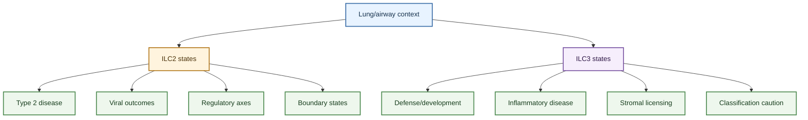

---
tags:
  - digest/core_evidence
  - tissue/lung
  - tissue/airway
  - cell/ILC2
  - cell/ILC3
  - cell/ILC1
  - cell/fibroblast
  - cell/eosinophil
  - cell/macrophage
  - disease/asthma
  - disease/infection
  - disease/ARDS
  - disease/COPD
  - axis/ILC_lung_infection
  - axis/ILC_airway_inflammation
  - axis/ILC_plasticity
  - axis/ILC_regulation
  - axis/human_lung_ILC
---

# Lung ILC Core Evidence Synthesis

## Scope

This digest replaces the former batch-based synthesis pages with a biology-first map of the core evidence currently supporting the ILC-in-lung wiki. It integrates manually crystallized lung and airway ILC sources across ILC2 and ILC3 disease roles, regulatory mechanisms, tissue context, and translational boundaries.

The digest is designed as a reusable orientation page: a reader should be able to understand the main lung ILC claims without knowing which ingest batch produced them. Batch provenance remains traceable through the audit and log pages.

## Evidence tags

`#digest/core_evidence` `#tissue/lung` `#tissue/airway` `#cell/ILC2` `#cell/ILC3` `#cell/ILC1` `#cell/fibroblast` `#cell/eosinophil` `#cell/macrophage` `#disease/asthma` `#disease/infection` `#disease/ARDS` `#disease/COPD` `#axis/ILC_lung_infection` `#axis/ILC_airway_inflammation` `#axis/ILC_plasticity` `#axis/ILC_regulation` `#axis/human_lung_ILC`

## Working model

The current focused evidence supports a lung ILC model organized around context, not around a single fixed function. ILC2s and ILC3s act as tissue-sensitive immune modules whose outputs depend on disease setting, tissue compartment, stimulus, timing, and regulatory niche.

ILC2s are best understood as lung and airway signal integrators. In allergic airway disease, they amplify type 2 inflammation through IL-5, IL-13, lipid mediators, epithelial alarmins, memory-like behavior, and eosinophil feedback. In respiratory viral disease, they can drive airway hyperreactivity, but they can also support repair or reprogram macrophage niches depending on the virus and time point. Their function is tuned by neuroimmune signals, metabolism, checkpoint pathways, microbial metabolites, and stromal or mechanical cues. This makes ILC2 biology broader than a simple "type 2 cytokine cell" model.

ILC3s are best understood as IL-22/IL-17-capable cells whose lung roles split into protective/developmental and inflammatory branches. In bacterial infection and newborn lung biology, ILC3s can support barrier defense and developmental niches. In ARDS-like injury, neutrophilic asthma, smoking-associated asthma, and steroid-resistant asthma, ILC3-related IL-17A, neutrophil chemoattractants, glucocorticoid resistance, and stromal SCF/KIT signaling become central. However, IL-17-producing ILC-like cells require careful classification because some IL-17-producing states may reflect ILC2/ILC3 boundary biology rather than stable canonical ILC3s.

## Core claims

- Lung ILC2s can drive airway hyperreactivity through innate, non-adaptive pathways, especially in IL-33/IL-13-linked respiratory viral or allergic contexts.
- Lung ILC2s can also support repair and niche remodeling, including amphiregulin-linked epithelial repair and GM-CSF-dependent monocyte-derived alveolar macrophage imprinting in infection-conditioned settings.
- Lung ILC2s can be anatomically positioned in adventitial/peribronchovascular stromal niches supported by IL-33/TSLP-producing fibroblast-like cells, creating a spatial layer for type 2 activation and feedback.
- IFN-gamma is a context-dependent ILC2 brake that can suppress IL-33-driven activation, constrain type 2 lymphocyte tissue dispersion, inhibit ILC2-driven AHR through TLR9/interferon/STAT1 signaling, or suppress protective ILC2 output during influenza.
- ILC2 disease activity is regulated by epithelial alarmins, lipid mediators, neuroimmune cues, metabolic state, checkpoint pathways, microbial metabolites, and stromal or cellular feedback.
- Activated pulmonary ILC2s are also shaped by spatial guidance cues, including CCR8-CCL8 positioning signals and collagen-I-dependent migratory behavior in inflamed lung.
- Human lung contains identifiable ILC subsets, but human lung tissue, sputum, blood, nasal airway, and mouse lung evidence should not be treated as interchangeable.
- Lung ILC3s can support IL-22-associated antibacterial defense and neonatal pulmonary niche development.
- Lung ILC3s can also participate in IL-17A/neutrophil-rich inflammatory disease, including ARDS-like injury, neutrophilic asthma, smoking-associated asthma, and steroid-resistant asthma.
- Obesity-associated airway hyperreactivity adds a distinct NLRP3-IL-1beta-IL-17-producing innate-lymphoid branch to the ILC3 disease map.
- Pulmonary fibroblast-derived SCF/KIT signaling is a focused stromal axis that can augment ILC3 IL-17A and neutrophilic asthma-like inflammation.
- ILC3 regulation also includes restraint programs; current source-linked context includes a gut-labeled CTLA-4-positive ILC3 checkpoint branch downstream of IL-23.
- ILC plasticity is not a side issue: ILC2-to-ILC1-like conversion, memory-like ILC2s, IL-17-producing ST2+ ILC2s, c-Kit+ ILC2/ILC3-like states, and memory-like ILC3s all shape interpretation.

## ILC2 Niche And Interferon Update

Focused crystallization on 2026-04-23 added a stronger spatial and counter-regulatory layer to the core synthesis. Lung ILC2s are supported by adventitial stromal niches, epithelial alarmins can activate parallel ILC2 and IL-17/neutrophil modules, IFN-gamma can function as a direct ILC2 brake, and neuroimmune signals can either activate tissue-protective AREG programs or inhibit IL-13/type 2 inflammation depending on receptor context. This layer is maintained here as part of the core ILC2 model rather than as a separate digest.

## Evidence layers

| Evidence layer | What it supports | Main caution |
|---|---|---|
| Mouse perturbation models | Strongest causal links between mediator, ILC state, and disease readout | Translation to human asthma, COPD, ARDS, or infection requires tissue and disease matching |
| Human lung tissue | Baseline presence and subset potential of pulmonary ILCs | Often not causal by itself |
| Human sputum or airway sampling | Disease-associated airway ILC states in asthma phenotypes | Compartment differs from lung parenchyma and blood |
| Human nasal airway or polyp systems | Useful airway plasticity comparator | Should not be treated as lower-lung proof |
| Reviews and pathway syntheses | Field-level framing and therapeutic hypotheses | Need primary-source support before upgrading mechanistic confidence |

## Contradictions to track

- ILC2s can be pathogenic, reparative, or niche-modifying depending on virus, allergen, timing, mediator output, and outcome readout.
- ILC3 IL-22-associated defense and ILC3 IL-17A-associated pathology should not be collapsed into one "ILC3 protective" or "ILC3 pathogenic" model.
- Human association and mouse perturbation answer different questions. The strongest wiki claims preserve whether the evidence is human tissue association, ex vivo function, mouse causality, or review-level synthesis.
- SCF/c-Kit has distinct ILC2 and ILC3 branches. ILC2 SCF/c-Kit in chronic allergic disease should not be merged with fibroblast SCF/KIT-driven ILC3 IL-17A in neutrophilic asthma.
- IL-17-producing ILC-like states may reflect bona fide ILC3s, ILC2-derived boundary states, or mixed gating contexts. Marker, lineage, and tissue labels are essential.

## How to use this digest

Use this page as the first evidence synthesis layer after the homepage. For cell-specific detail, go to [ILC2](../entities/ILC2.md) or [ILC3](../entities/ILC3.md). For question-specific detail, go to [ILC2 roles in pulmonary disease](../topics/ILC2_roles_in_pulmonary_disease.md), [ILC3 roles in pulmonary disease](../topics/ILC3_roles_in_pulmonary_disease.md), [ILC2 functional regulation mechanisms](../topics/ILC2_functional_regulation_mechanisms.md), or [ILC3 functional regulation mechanisms](../topics/ILC3_functional_regulation_mechanisms.md). For a disease-first rearrangement of the same cross-subset material, use [Lung ILC Disease Roles Companion](./2026-04-20_ILC_pulmonary_disease_roles.md).

## Update triggers

- Add human lung, BAL, bronchial biopsy, sputum, or spatial data that directly links ILC2/ILC3 states to asthma, COPD, ARDS, pneumonia, fibrosis, or lung cancer outcomes.
- Add primary intervention evidence for ILC3-related steroid-resistant asthma or neutrophilic asthma targets before upgrading therapeutic claims.
- Revisit the ILC2 regulatory hierarchy if the same human cohort measures alarmins, neuroimmune receptors, metabolic programs, checkpoint molecules, and ILC2 cytokine output.
- Revisit IL-17-producing ILC taxonomy when new lineage, fate-mapping, or single-cell multiome evidence separates bona fide ILC3s from plastic ILC2-derived states in lung disease.

## Crystallized from

### Viral disease, repair, and ILC2 lung function

- [Innate lymphoid cells mediate influenza-induced airway hyper-reactivity independently of adaptive immunity](../sources/2011_innate_lymphoid_cells_mediate_influenza_induced_airway_hyper_reactivity_independently.md)
- [Innate lymphoid cells promote lung-tissue homeostasis after infection with influenza virus](../sources/2011_innate_lymphoid_cells_promote_lung_tissue_homeostasis_after_infection_with_influenza.md)
- [Pulmonary IL-33 orchestrates innate immune cells to mediate respiratory syncytial virus-evoked airway hyperreactivity and eosinophilia](../sources/2020_pulmonary_il_33_orchestrates_innate_immune_cells_to_mediate_respiratory_syncytial_virus_evoked_airway_hyperreact.md)
- [IL-1beta prevents ILC2 expansion, type 2 cytokine secretion, and mucus metaplasia in response to early-life rhinovirus infection in mice](../sources/2020_il_1beta_prevents_ilc2_expansion_type_2_cytokine_secretion_and_mucus_metaplasia_in_response_to_early_life_rhinov.md)
- [BATF promotes group 2 innate lymphoid cell-mediated lung tissue protection during acute respiratory virus infection](../sources/2022_batf_promotes_group_2_innate_lymphoid_cell_mediated_lung_tissue_protection_during_acu.md)
- [Dampening type 2 properties of group 2 innate lymphoid cells by a gammaherpesvirus infection reprograms alveolar macrophages](../sources/2023_dampening_type_2_properties_of_group_2_innate_lymphoid_cells_by_a_gammaherpesvirus_in.md)

### ILC2 allergic inflammation, regulation, and plasticity

- [Lung type 2 innate lymphoid cells express cysteinyl leukotriene receptor 1 which regulates TH2 cytokine production](../sources/2013_lung_type_2_innate_lymphoid_cells_express_cysteinyl_leukotriene_receptor_1_which_regu.md)
- [Cysteinyl leukotriene E4 activates human group 2 innate lymphoid cells and enhances the effect of prostaglandin D2 and epithelial cytokines](../sources/2017_cysteinyl_leukotriene_e4_activates_human_group_2_innate_lymphoid_cells_and_enhances_the_effect_of_prostaglandin.md)
- [Kinetics of the accumulation of group 2 innate lymphoid cells in IL-33-induced and IL-25-induced murine models of asthma a potential role for the chemokine CXCL16](../sources/2019_kinetics_of_the_accumulation_of_group_2_innate_lymphoid_cells_in_il_33_induced_and_il_25_induced_murine_models_o.md)
- [Pulmonary environmental cues drive group 2 innate lymphoid cell dynamics in mice and humans](../sources/2019_pulmonary_environmental_cues_drive_group_2_innate_lymphoid_cell_dynamics_in_mice_and_human.md)
- [Fevipiprant, a selective prostaglandin D2 receptor 2 antagonist, inhibits human group 2 innate lymphoid cell aggregation and function](../sources/2019_fevipiprant_a_selective_prostaglandin_d2_receptor_2_antagonist_inhibits_human_group_2_innate_lymphoid_cell_aggre.md)
- [Allergen-Experienced Group 2 Innate Lymphoid Cells Acquire Memory-like Properties and Enhance Allergic Lung Inflammation](../sources/2016_allergen_experienced_group_2_innate_lymphoid_cells_acquire_memory_like_properties_and.md)
- [Inflammatory triggers associated with exacerbations of COPD orchestrate plasticity of group 2 innate lymphoid cells in the lungs](../sources/2016_inflammatory_triggers_associated_with_exacerbations_of_copd_orchestrate_plasticity_of.md)
- [IL-17-producing ST2(+) group 2 innate lymphoid cells play a pathogenic role in lung inflammation](../sources/2019_il_17_producing_st2_group_2_innate_lymphoid_cells_play_a_pathogenic_role_in_lung_inflammation.md)
- [IL-1beta, IL-23, and TGF-beta drive plasticity of human ILC2s towards IL-17-producing ILCs in nasal inflammation](../sources/2019_il_1beta_il_23_and_tgf_beta_drive_plasticity_of_human_ilc2s_towards_il_17_producing_ilcs_in_nasal_inflammation.md)
- [The Role of the TL1A/DR3 Axis in the Activation of Group 2 Innate Lymphoid Cells in Subjects with Eosinophilic Asthma](../sources/2020_the_role_of_the_tl1a_dr3_axis_in_the_activation_of_group_2_innate_lymphoid_cells_in_subjects_with_eosinophilic_a.md)
- [Lipid-Droplet Formation Drives Pathogenic Group 2 Innate Lymphoid Cells in Airway Inflammation](../sources/2020_lipid_droplet_formation_drives_pathogenic_group_2_innate_lymphoid_cells_in_airway_inf.md)
- [Dichotomous metabolic networks govern human ILC2 proliferation and function](../sources/2021_dichotomous_metabolic_networks_govern_human_ilc2_proliferation_and_function.md)
- [Long-acting muscarinic antagonist regulates group 2 innate lymphoid cell-dependent airway eosinophilic inflammation](../sources/2021_long_acting_muscarinic_antagonist_regulates_group_2_innate_lymphoid_cell_dependent_ai.md)
- [Cannabinoid receptor 2 engagement promotes group 2 innate lymphoid cell expansion and enhances airway hyperreactivity](../sources/2022_cannabinoid_receptor_2_engagement_promotes_group_2_innate_lymphoid_cell_expansion_and_enhances_airway_hyperreact.md)
- [Group 2 innate lymphoid cells (ILC2) are regulated by stem cell factor during chronic asthmatic disease](../sources/2019_group_2_innate_lymphoid_cells_ilc2_are_regulated_by_stem_cell_factor_during_chronic_a.md)
- [The neuropeptide NMU amplifies ILC2-driven allergic lung inflammation](../sources/2017_the_neuropeptide_nmu_amplifies_ilc2_driven_allergic_lung_inflammation.md)
- [Regulation of type 2 innate lymphoid cell-dependent airway hyperreactivity by butyrate](../sources/2018_regulation_of_type_2_innate_lymphoid_cell_dependent_airway_hyperreactivity_by_butyrat.md)
- [PD-1 pathway regulates ILC2 metabolism and PD-1 agonist treatment ameliorates airway hyperreactivity](../sources/2020_pd_1_pathway_regulates_ilc2_metabolism_and_pd_1_agonist_treatment_ameliorates_airway.md)
- [Blocking the HIF-1alpha glycolysis axis inhibits allergic airway inflammation by reducing ILC2 metabolism and function](../sources/2025_blocking_the_hif_1alpha_glycolysis_axis_inhibits_allergic_airway_inflammation_by_reducing_ilc2_metabolism_and_fu.md)
- [Dopamine inhibits group 2 innate lymphoid cell-driven allergic lung inflammation by dampening mitochondrial activity](../sources/2023_dopamine_inhibits_group_2_innate_lymphoid_cell_driven_allergic_lung_inflammation_by_d.md)
- [Neuromedin-U Mediates Rapid Activation of Airway Group 2 Innate Lymphoid Cells in Mild Asthma](../sources/2024_neuromedin_u_mediates_rapid_activation_of_airway_group_2_innate_lymphoid_cells_in_mil.md)
- [mTORC1 signaling in group 2 innate lymphoid cells coordinates neuro-immune crosstalk in allergic lung inflammation](../sources/2025_mtorc1_signaling_in_group_2_innate_lymphoid_cells_coordinates_neuro_immune_crosstalk.md)
- [Eosinophils promote effector functions of lung group 2 innate lymphoid cells in allergic airway inflammation in mice](../sources/2023_eosinophils_promote_effector_functions_of_lung_group_2_innate_lymphoid_cells_in_aller.md)
- [Mechanics-activated fibroblasts promote pulmonary group 2 innate lymphoid cell plasticity propelling silicosis progression](../sources/2024_mechanics_activated_fibroblasts_promote_pulmonary_group_2_innate_lymphoid_cell_plasti.md)
- [Tissue signals imprint ILC2 identity with anticipatory function](../sources/2018_tissue_signals_imprint_ilc2_identity_with_anticipatory_function.md)
- [ILC2-driven innate immune checkpoint mechanism antagonizes NK cell antimetastatic function in the lung](../sources/2020_ilc2_driven_innate_immune_checkpoint_mechanism_antagonizes_nk_cell_antimetastatic_fun.md)
- [Innate lymphoid cells contribute to allergic airway disease exacerbation by obesity](../sources/2016_innate_lymphoid_cells_contribute_to_allergic_airway_disease_exacerbation_by_obesity.md)

### ILC3 defense, injury, asthma, and classification

- [Activation of Type 3 innate lymphoid cells and interleukin 22 secretion in the lungs during Streptococcus pneumoniae infection](../sources/2014_activation_of_type_3_innate_lymphoid_cells_and_interleukin_22_secretion_in_the_lungs.md)
- [Insulin-like Growth Factor 1 Supports a Pulmonary Niche that Promotes Type 3 Innate Lymphoid Cell Development in Newborn Lungs](../sources/2020_insulin_like_growth_factor_1_supports_a_pulmonary_niche_that_promotes_type_3_innate_lymphoid_cell_development_in.md)
- [Innate Lymphoid Cells Are the Predominant Source of IL-17A during the Early Pathogenesis of Acute Respiratory Distress Syndrome](../sources/2016_innate_lymphoid_cells_are_the_predominant_source_of_il_17a_during_the_early_pathogene.md)
- [Interleukin-17-producing innate lymphoid cells and the NLRP3 inflammasome facilitate obesity-associated airway hyperreactivity](../sources/2014_interleukin_17_producing_innate_lymphoid_cells_and_the_nlrp3_inflammasome_facilitate.md)
- [ILC3-derived acetylcholine promotes protease-driven allergic lung pathology](../sources/2021_ilc3_derived_acetylcholine_promotes_protease_driven_allergic_lung_pathology.md)
- [Group 3 innate lymphoid cells secret neutrophil chemoattractants and are insensitive to glucocorticoid via aberrant GR phosphorylation](../sources/2023_group_3_innate_lymphoid_cells_secret_neutrophil_chemoattractants_and_are_insensitive.md)
- [Cigarette smoke aggravates asthma by inducing memory-like type 3 innate lymphoid cells](../sources/2022_cigarette_smoke_aggravates_asthma_by_inducing_memory_like_type_3_innate_lymphoid_cell.md)
- [Innate Lymphoid Cells Are Required to Induce Airway Hyperreactivity in a Murine Neutrophilic Asthma Model](../sources/2022_innate_lymphoid_cells_are_required_to_induce_airway_hyperreactivity_in_a_murine_neutr.md)
- [Group 3 Innate Lymphoid Cells A Potential Therapeutic Target for Steroid Resistant Asthma](../sources/2024_group_3_innate_lymphoid_cells_a_potential_therapeutic_target_for_steroid_resistant_asthma.md)
- [Pulmonary fibroblast-derived stem cell factor promotes neutrophilic asthma by augmenting IL-17A production from ILC3s](../sources/2025_pulmonary_fibroblast_derived_stem_cell_factor_promotes_neutrophilic_asthma_by_augment.md)
- [c-Kit-positive ILC2s exhibit an ILC3-like signature that may contribute to IL-17-mediated pathologies](../sources/2019_c_kit_positive_ilc2s_exhibit_an_ilc3_like_signature_that_may_contribute_to_il_17_medi.md)
- [Differentiation of type 1 ILCs from a common progenitor to all helper-like innate lymphoid cell lineages](../sources/2014_differentiation_of_type_1_ilcs_from_a_common_progenitor_to_all_helper_like_innate_lymphoid_cell_lineages.md)
- [Tissue residency of innate lymphoid cells in lymphoid and nonlymphoid organs](../sources/2015_tissue_residency_of_innate_lymphoid_cells_in_lymphoid_and_nonlymphoid_organs.md)
- [CTLA-4-expressing ILC3s restrain interleukin-23-mediated inflammation](../sources/2024_ctla_4_expressing_ilc3s_restrain_interleukin_23_mediated_inflammation.md)

### Human baseline and airway translation

- [Characterization and Quantification of Innate Lymphoid Cell Subsets in Human Lung](../sources/2016_characterization_and_quantification_of_innate_lymphoid_cell_subsets_in_human_lung.md)
- [Spatial and Temporal Mapping of Human Innate Lymphoid Cells Reveals Elements of Tissue Specificity](../sources/2019_spatial_and_temporal_mapping_of_human_innate_lymphoid_cells_reveals_elements_of_tissue_specificity.md)
- [Innate immune crosstalk in asthmatic airways Innate lymphoid cells coordinate polarization of lung macrophages](../sources/2019_innate_immune_crosstalk_in_asthmatic_airways_innate_lymphoid_cells_coordinate_polarization_of_lung_macrophages.md)

### ILC2 niche, interferon brake, and type 2 circuit

- [Adventitial Stromal Cells Define Group 2 Innate Lymphoid Cell Tissue Niches](../sources/2019_adventitial_stromal_cells_define_group_2_innate_lymphoid_cell_tissue_niches.md)
- [Chitin activates parallel immune modules that direct distinct inflammatory responses via innate lymphoid type 2 and gamma delta T cells](../sources/2014_chitin_activates_parallel_immune_modules_that_direct_distinct_inflammatory_responses_via_innate_lymphoid_type_2.md)
- [IFN-gamma increases susceptibility to influenza A infection through suppression of group II innate lymphoid cells](../sources/2018_ifn_gamma_increases_susceptibility_to_influenza_a_infection_through_suppression_of_group_ii_innate_lymphoid_cell.md)
- [Interleukin-33 and Interferon-gamma Counter-Regulate Group 2 Innate Lymphoid Cell Activation during Immune Perturbation](../sources/2015_interleukin_33_and_interferon_gamma_counter_regulate_group_2_innate_lymphoid_cell_activation_during_immune_pertu.md)
- [Interferon gamma constrains type 2 lymphocyte niche boundaries during mixed inflammation](../sources/2022_interferon_gamma_constrains_type_2_lymphocyte_niche_boundaries_during_mixed_inflammation.md)
- [Toll-like receptor 9-dependent interferon production prevents group 2 innate lymphoid cell-driven airway hyperreactivity](../sources/2019_toll_like_receptor_9_dependent_interferon_production_prevents_group_2_innate_lymphoid.md)
- [Maturation and specialization of group 2 innate lymphoid cells through the lung-gut axis](../sources/2022_maturation_and_specialization_of_group_2_innate_lymphoid_cells_through_the_lung_gut_a.md)
- [Neuropeptide regulation of non-redundant ILC2 responses at barrier surfaces](../sources/2022_neuropeptide_regulation_of_non_redundant_ilc2_responses_at_barrier_surfaces.md)
- [PAC1 constrains type 2 inflammation through promotion of CGRP signaling in ILC2s](../sources/2024_pac1_constrains_type_2_inflammation_through_promotion_of_cgrp_signaling_in_ilc2s.md)
- [The ins and outs of innate and adaptive type 2 immunity](../sources/2023_the_ins_and_outs_of_innate_and_adaptive_type_2_immunity.md)
