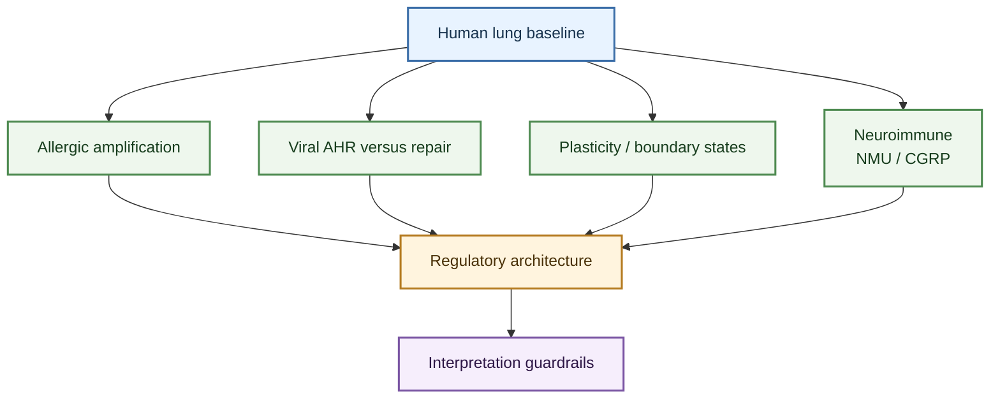

---
tags:
  - entity/cell_type
  - cell/ILC2
  - tissue/lung
  - topic/pulmonary_disease
  - topic/regulation
  - status/working
---

# ILC2

## Scope

This entity page defines group 2 innate lymphoid cells (ILC2s) as they are used in the ILC-in-lung wiki. It is the canonical ILC2 hub for this wiki.

Use this page when the question is "what is the current source-aware ILC2 model in lung biology?" Then move to disease or regulation topics when you need a narrower branch.

## Evidence tags

`#entity/cell_type` `#cell/ILC2` `#tissue/lung` `#topic/pulmonary_disease` `#topic/regulation` `#status/working`

## At a glance

| Lens | Current take |
|---|---|
| Canonical role | Lung ILC2s are tissue-positioned type 2-biased innate lymphocytes that can drive allergic airway inflammation, but they also support repair and niche remodeling after respiratory injury. |
| Strongest pulmonary branches | Allergic amplification, viral AHR versus repair, macrophage-niche instruction, COPD-associated ILC1-like conversion, and IL-17-producing boundary states. |
| Strongest regulatory layers | Epithelial alarmins, lipid mediators, neuroimmune signals, stromal niches, interorgan trafficking, adaptive costimulation, interferon brakes, and metabolic/checkpoint programs. |
| Main caution | `ILC2 activation` is too broad to be a reusable claim; interpretation should preserve tissue compartment, upstream cue, dominant output, and disease readout. |

## How to use this page

- Start with `Integrated working model` and `Review map` for the fastest orientation.
- Use `Major biological branches` when the question is disease- or context-specific.
- Use `Regulatory architecture` when the question is mechanistic.
- Use `Interpretation guardrails` and `Claim-level confidence boundaries` before lifting claims into figures, digests, or manuscripts.

## Integrated working model

Lung and airway ILC2s are best modeled as tissue-positioned response modules rather than as one fixed type 2 effector population. In one setting they amplify allergic airway disease through IL-5, IL-13, lipid mediators, epithelial alarmins, and memory-like amplification. In another they support epithelial repair, macrophage-niche reprogramming, or tissue homeostasis after respiratory viral injury. Their output is shaped by stromal niches, neuroimmune inputs, metabolism, checkpoint pathways, interferon-mediated brakes, and inflammatory plasticity.

The practical implication is that "ILC2 activation" is not a sufficient biological description. The reusable unit in this wiki is an ILC2 state defined by tissue compartment, upstream cue, dominant output, and disease readout. Selective mouse ILC2-deficiency systems further support the idea that ILC2s can have non-redundant immune functions rather than simply duplicating adaptive Th2 activity, but those findings should still be interpreted within their genetic and tissue-model boundaries ([Non-redundant functions of group 2 innate lymphoid cells](../sources/2022_non_redundant_functions_of_group_2_innate_lymphoid_cells.md)).

## Review map

## Major biological branches

### Human lung baseline

- Human lung baseline: ILC2s are directly detected in human lung tissue using CD45+ Lin- CD127+ CRTH2+ flow-cytometric gating, supporting ILC2 as a true pulmonary entity rather than only a mouse-model construct ([Characterization and Quantification of Innate Lymphoid Cell Subsets in Human Lung](../sources/2016_characterization_and_quantification_of_innate_lymphoid_cell_subsets_in_human_lung.md)).

- Epigenetic memory branch: repetitive Alternaria exposure can generate memory-like mouse ILC2s that amplify later subthreshold recall responses, with ATAC-seq and single-cell data supporting distinct repression and preparedness programs rather than simple acute activation ([The molecular and epigenetic mechanisms of innate lymphoid cell (ILC) memory and its relevance for asthma](../sources/2021_the_molecular_and_epigenetic_mechanisms_of_innate_lymphoid_cell_ilc_memory_and_its_re.md)).
### Allergic amplification and memory-like states

- Allergic amplification: ILC2s respond to IL-33/IL-25, CXCL16, cysteinyl leukotrienes, and allergen experience; allergen-experienced ILC2s can persist as memory-like cells that amplify later allergic lung inflammation ([Kinetics of the accumulation of group 2 innate lymphoid cells in IL-33-induced and IL-25-induced murine models of asthma a potential role for the chemokine CXCL16](../sources/2019_kinetics_of_the_accumulation_of_group_2_innate_lymphoid_cells_in_il_33_induced_and_il_25_induced_murine_models_o.md); [Lung type 2 innate lymphoid cells express cysteinyl leukotriene receptor 1 which regulates TH2 cytokine production](../sources/2013_lung_type_2_innate_lymphoid_cells_express_cysteinyl_leukotriene_receptor_1_which_regu.md); [Allergen-Experienced Group 2 Innate Lymphoid Cells Acquire Memory-like Properties and Enhance Allergic Lung Inflammation](../sources/2016_allergen_experienced_group_2_innate_lymphoid_cells_acquire_memory_like_properties_and.md)).
- Human translational amplification branch: human ILC2s respond strongly to LTE4 and PGD2-linked lipid signaling, while airway eosinophilic asthma can recruit a TL1A/DR3 activation axis and DP2 antagonism can block PGD2-driven migration, aggregation, and cytokine production ex vivo ([Cysteinyl leukotriene E4 activates human group 2 innate lymphoid cells and enhances the effect of prostaglandin D2 and epithelial cytokines](../sources/2017_cysteinyl_leukotriene_e4_activates_human_group_2_innate_lymphoid_cells_and_enhances_the_effect_of_prostaglandin.md); [The Role of the TL1A/DR3 Axis in the Activation of Group 2 Innate Lymphoid Cells in Subjects with Eosinophilic Asthma](../sources/2020_the_role_of_the_tl1a_dr3_axis_in_the_activation_of_group_2_innate_lymphoid_cells_in_subjects_with_eosinophilic_a.md); [Fevipiprant, a selective prostaglandin D2 receptor 2 antagonist, inhibits human group 2 innate lymphoid cell aggregation and function](../sources/2019_fevipiprant_a_selective_prostaglandin_d2_receptor_2_antagonist_inhibits_human_group_2_innate_lymphoid_cell_aggre.md)).

### Viral AHR, repair, and macrophage niche effects

- Viral disease bifurcation: influenza can trigger an innate lymphoid IL-33/IL-13 AHR branch, while lung ILCs can also support amphiregulin-mediated epithelial repair after influenza injury. BATF further sharpens the protective wound-healing branch, gammaherpesvirus conditioning shows that ILC2s can reduce type 2 output while instructing monocyte-derived alveolar macrophage identity through GM-CSF, and allergen or IL-33 type 2 inflammation can use ILC2-derived IL-13 to reprogram tissue-resident alveolar macrophages from a PPARgamma-centered homeostatic state toward an IRF4-driven inflammatory niche program ([Innate lymphoid cells mediate influenza-induced airway hyper-reactivity independently of adaptive immunity](../sources/2011_innate_lymphoid_cells_mediate_influenza_induced_airway_hyper_reactivity_independently.md); [Innate lymphoid cells promote lung-tissue homeostasis after infection with influenza virus](../sources/2011_innate_lymphoid_cells_promote_lung_tissue_homeostasis_after_infection_with_influenza.md); [BATF promotes group 2 innate lymphoid cell-mediated lung tissue protection during acute respiratory virus infection](../sources/2022_batf_promotes_group_2_innate_lymphoid_cell_mediated_lung_tissue_protection_during_acu.md); [Dampening type 2 properties of group 2 innate lymphoid cells by a gammaherpesvirus infection reprograms alveolar macrophages](../sources/2023_dampening_type_2_properties_of_group_2_innate_lymphoid_cells_by_a_gammaherpesvirus_in.md); [Innate type 2 lymphocytes trigger an inflammatory switch in alveolar macrophages](../sources/2026_innate_type_2_lymphocytes_trigger_an_inflammatory_switch_in_alveolar_macrophages.md)).

### Plasticity and noncanonical disease branches

- Plasticity branches: COPD-associated infectious or noxious triggers can convert ILC2s toward an IL-12/IL-18-regulated T-bet+ IFN-gamma+ ILC1-like state; papain/IL-33 plus leukotrienes can drive pathogenic IL-17-producing ST2+ ILC2s; human nasal inflammation shows IL-1beta/IL-23/TGF-beta-driven ILC2-to-IL-17-producing plasticity ([Inflammatory triggers associated with exacerbations of COPD orchestrate plasticity of group 2 innate lymphoid cells in the lungs](../sources/2016_inflammatory_triggers_associated_with_exacerbations_of_copd_orchestrate_plasticity_of.md); [IL-17-producing ST2(+) group 2 innate lymphoid cells play a pathogenic role in lung inflammation](../sources/2019_il_17_producing_st2_group_2_innate_lymphoid_cells_play_a_pathogenic_role_in_lung_inflammation.md); [IL-1beta, IL-23, and TGF-beta drive plasticity of human ILC2s towards IL-17-producing ILCs in nasal inflammation](../sources/2019_il_1beta_il_23_and_tgf_beta_drive_plasticity_of_human_ilc2s_towards_il_17_producing_ilcs_in_nasal_inflammation.md)).

- Human severe-asthma sputum boundary state: c-kit+ IL-17A+ intermediate ILC2s are enriched in mixed granulocytic airway inflammation, correlate with neutrophilia, and can be modeled in vitro by IL-1beta plus IL-18 stimulation of sort-purified human ILC2s ([A population of c-kit+ IL-17A+ ILC2s in sputum from individuals with severe asthma supports ILC2 to ILC3 trans-differentiation](../sources/2025_a_population_of_c_kit_il_17a_ilc2s_in_sputum_from_individuals_with_severe_asthma_supp.md)).
- Adaptive costimulation and feedback: IL-33/ST2-activated pulmonary ILC2s can use PD-L1 to promote CD4 T-cell GATA3/IL-13 in mouse helminth-associated type 2 immunity, and ILC2 OX40L can license local Th2/Treg expansion while also supporting a Gata3high Treg feedback circuit that limits effector-memory Th2 expansion. ILC2-derived LIF adds a separate pulmonary lymphatic CCL21/CCR7+ immune-cell egress branch ([ILC2s regulate adaptive Th2 cell functions via PD-L1 checkpoint control](../sources/2017_ilc2s_regulate_adaptive_th2_cell_functions_via_pd_l1_checkpoint_control.md); [Tissue-Restricted Adaptive Type 2 Immunity Is Orchestrated by Expression of the Costimulatory Molecule OX40L on Group 2 Innate Lymphoid Cells](../sources/2018_tissue_restricted_adaptive_type_2_immunity_is_orchestrated_by_expression_of_the_costimulatory_molecule_ox40l_on.md); [Cross-talk between ILC2 and Gata3high Tregs locally constrains adaptive type 2 immunity](../sources/2024_cross_talk_between_ilc2_and_gata3high_tregs_locally_constrains_adaptive_type_2_immuni.md); [ILC2-derived LIF licences progress from tissue to systemic immunity](../sources/2024_ilc2_derived_lif_licences_progress_from_tissue_to_systemic_immunity.md)).
### Stromal and airway immune crosstalk

- Stromal/growth-factor regulation: SCF/c-Kit can regulate ILC2 activation and chronic allergic airway disease severity in mouse models, while the separate ILC3 SCF/KIT source should be kept as a neutrophilic asthma branch rather than merged into one universal SCF mechanism ([Group 2 innate lymphoid cells (ILC2) are regulated by stem cell factor during chronic asthmatic disease](../sources/2019_group_2_innate_lymphoid_cells_ilc2_are_regulated_by_stem_cell_factor_during_chronic_a.md); [Pulmonary fibroblast-derived stem cell factor promotes neutrophilic asthma by augmenting IL-17A production from ILC3s](../sources/2025_pulmonary_fibroblast_derived_stem_cell_factor_promotes_neutrophilic_asthma_by_augment.md)).
- Spatial guidance branch: during airway inflammation, activated pulmonary ILC2s aggregate in peribronchial and perivascular regions and use CCR8-CCL8 and matrix cues such as collagen-I to navigate inflamed lung tissue ([Pulmonary environmental cues drive group 2 innate lymphoid cell dynamics in mice and humans](../sources/2019_pulmonary_environmental_cues_drive_group_2_innate_lymphoid_cell_dynamics_in_mice_and_human.md)).
- Human airway crosstalk: induced-sputum asthma data link ILC2s with M2-like macrophage polarization, whereas ILC1/ILC3s align with M1-like macrophage polarization in noneosinophilic asthma contexts ([Innate immune crosstalk in asthmatic airways Innate lymphoid cells coordinate polarization of lung macrophages](../sources/2019_innate_immune_crosstalk_in_asthmatic_airways_innate_lymphoid_cells_coordinate_polarization_of_lung_macrophages.md)).

## Regulatory architecture

### Activation and amplification layer

- High confidence: ILC2 allergic lung inflammation is regulated by neuroimmune pathways, including NMU/NMUR1 amplification in mouse allergic inflammation and human allergen-challenge airway ILC2 activation, plus mTORC1-dependent coordination of neuroimmune crosstalk ([The neuropeptide NMU amplifies ILC2-driven allergic lung inflammation](../sources/2017_the_neuropeptide_nmu_amplifies_ilc2_driven_allergic_lung_inflammation.md); [Neuromedin-U Mediates Rapid Activation of Airway Group 2 Innate Lymphoid Cells in Mild Asthma](../sources/2024_neuromedin_u_mediates_rapid_activation_of_airway_group_2_innate_lymphoid_cells_in_mil.md); [mTORC1 signaling in group 2 innate lymphoid cells coordinates neuro-immune crosstalk in allergic lung inflammation](../sources/2025_mtorc1_signaling_in_group_2_innate_lymphoid_cells_coordinates_neuro_immune_crosstalk.md)).
- High confidence: lipid-mediator signaling forms a human-relevant activation and inhibition axis in ILC2s, with LTE4 amplifying PGD2 and epithelial-cytokine responses, and fevipiprant blocking PGD2/DP2-driven migration, aggregation, and cytokine production in human ILC2s ([Cysteinyl leukotriene E4 activates human group 2 innate lymphoid cells and enhances the effect of prostaglandin D2 and epithelial cytokines](../sources/2017_cysteinyl_leukotriene_e4_activates_human_group_2_innate_lymphoid_cells_and_enhances_the_effect_of_prostaglandin.md); [Fevipiprant, a selective prostaglandin D2 receptor 2 antagonist, inhibits human group 2 innate lymphoid cell aggregation and function](../sources/2019_fevipiprant_a_selective_prostaglandin_d2_receptor_2_antagonist_inhibits_human_group_2_innate_lymphoid_cell_aggre.md)).
- Medium-high confidence: human airway eosinophilic asthma includes a TL1A/DR3 activation branch, ILC2s also use ICOS:ICOSL costimulatory support for homeostasis and AHR, and activated ILC2s can be positively tuned by CB2 signaling in mouse and humanized systems ([ICOS-ligand interaction is required for type 2 innate lymphoid cell function, homeostasis, and induction of airway hyperreactivity](../sources/2015_icos_icos_ligand_interaction_is_required_for_type_2_innate_lymphoid_cell_function_homeostasis_and_induction_of_a.md); [The Role of the TL1A/DR3 Axis in the Activation of Group 2 Innate Lymphoid Cells in Subjects with Eosinophilic Asthma](../sources/2020_the_role_of_the_tl1a_dr3_axis_in_the_activation_of_group_2_innate_lymphoid_cells_in_subjects_with_eosinophilic_a.md); [Cannabinoid receptor 2 engagement promotes group 2 innate lymphoid cell expansion and enhances airway hyperreactivity](../sources/2022_cannabinoid_receptor_2_engagement_promotes_group_2_innate_lymphoid_cell_expansion_and_enhances_airway_hyperreact.md)).

- High confidence: IL-25- or helminth-induced inflammatory ILC2s can move from intestinal tissue to lung through S1P-dependent lymphatic entry and blood circulation in mouse models, adding an interorgan trafficking layer distinct from steady-state tissue residency ([S1P-dependent interorgan trafficking of group 2 innate lymphoid cells supports host defense](../sources/2018_s1p_dependent_interorgan_trafficking_of_group_2_innate_lymphoid_cells_supports_host_d.md)).
### Spatial niche and positioning layer

- High confidence: lung ILC2s are spatially organized in adventitial/peribronchovascular niches where fibroblast-like ASCs provide IL-33 and TSLP, and ILC2-derived IL-13 can reciprocally expand or activate the stromal niche ([Adventitial Stromal Cells Define Group 2 Innate Lymphoid Cell Tissue Niches](../sources/2019_adventitial_stromal_cells_define_group_2_innate_lymphoid_cell_tissue_niches.md)).
- High confidence: activated pulmonary ILC2s are dynamically guided within inflamed lung by CCR8-CCL8 localization and extracellular-matrix cues, especially collagen-I-dependent motility programs ([Pulmonary environmental cues drive group 2 innate lymphoid cell dynamics in mice and humans](../sources/2019_pulmonary_environmental_cues_drive_group_2_innate_lymphoid_cell_dynamics_in_mice_and_human.md)).
- Medium-high confidence: airway and alveolar niche consequences are not limited to stromal positioning; in a recent pulmonary type 2 inflammation source, IL-33-activated ILC2-derived IL-13 reprogrammed tissue-resident alveolar macrophages toward an IRF4-driven inflammatory state, linking ILC2 activation to downstream niche restructuring ([Innate type 2 lymphocytes trigger an inflammatory switch in alveolar macrophages](../sources/2026_innate_type_2_lymphocytes_trigger_an_inflammatory_switch_in_alveolar_macrophages.md)).

### Interferon and checkpoint brakes

- High confidence: IFN-gamma is a direct negative regulator of IL-33-driven ILC2 activation and can restrict ILC2 cytokine output, proliferation, survival, and parenchymal trafficking depending on the model ([Interleukin-33 and Interferon-gamma Counter-Regulate Group 2 Innate Lymphoid Cell Activation during Immune Perturbation](../sources/2015_interleukin_33_and_interferon_gamma_counter_regulate_group_2_innate_lymphoid_cell_activation_during_immune_pertu.md); [Interferon gamma constrains type 2 lymphocyte niche boundaries during mixed inflammation](../sources/2022_interferon_gamma_constrains_type_2_lymphocyte_niche_boundaries_during_mixed_inflammation.md)).
- High confidence: during H1N1 influenza in the reported mouse model, IFN-gamma suppresses protective ILC2 IL-5/amphiregulin output without changing viral load, supporting a distinction between ILC2 number and ILC2 function ([IFN-gamma increases susceptibility to influenza A infection through suppression of group II innate lymphoid cells](../sources/2018_ifn_gamma_increases_susceptibility_to_influenza_a_infection_through_suppression_of_group_ii_innate_lymphoid_cell.md)).
- High confidence: in allergic airway models, a TLR9-type I IFN-NK cell-IFN-gamma-STAT1 cascade can suppress ILC2-driven AHR, placing microbial sensing upstream of an ILC2 inhibitory checkpoint ([Toll-like receptor 9-dependent interferon production prevents group 2 innate lymphoid cell-driven airway hyperreactivity](../sources/2019_toll_like_receptor_9_dependent_interferon_production_prevents_group_2_innate_lymphoid.md)).

### Metabolic and state-control layer

- High confidence: ILC2 metabolic and checkpoint programs can either promote or restrain airway inflammation; autophagy preserves activated ILC2 survival and fatty-acid-linked fitness, HIF-1alpha/glycolysis supports ILC2 function, whereas PD-1, dopamine/DRD1, and butyrate constrain ILC2 activation or cytokine output in reported models ([Autophagy is critical for group 2 innate lymphoid cell metabolic homeostasis and effector function](../sources/2020_autophagy_is_critical_for_group_2_innate_lymphoid_cell_metabolic_homeostasis_and_effector_function.md); [Blocking the HIF-1alpha glycolysis axis inhibits allergic airway inflammation by reducing ILC2 metabolism and function](../sources/2025_blocking_the_hif_1alpha_glycolysis_axis_inhibits_allergic_airway_inflammation_by_reducing_ilc2_metabolism_and_fu.md); [PD-1 pathway regulates ILC2 metabolism and PD-1 agonist treatment ameliorates airway hyperreactivity](../sources/2020_pd_1_pathway_regulates_ilc2_metabolism_and_pd_1_agonist_treatment_ameliorates_airway.md); [Dopamine inhibits group 2 innate lymphoid cell-driven allergic lung inflammation by dampening mitochondrial activity](../sources/2023_dopamine_inhibits_group_2_innate_lymphoid_cell_driven_allergic_lung_inflammation_by_d.md); [Regulation of type 2 innate lymphoid cell-dependent airway hyperreactivity by butyrate](../sources/2018_regulation_of_type_2_innate_lymphoid_cell_dependent_airway_hyperreactivity_by_butyrat.md)).
- High confidence: pathogenic airway ILC2 states can also depend on lipid-droplet metabolism, whereas circulating human ILC2s show a distinct OXPHOS-dominant baseline program with glycolysis/mTOR engaged during IL-33-driven activation ([Lipid-Droplet Formation Drives Pathogenic Group 2 Innate Lymphoid Cells in Airway Inflammation](../sources/2020_lipid_droplet_formation_drives_pathogenic_group_2_innate_lymphoid_cells_in_airway_inf.md); [Dichotomous metabolic networks govern human ILC2 proliferation and function](../sources/2021_dichotomous_metabolic_networks_govern_human_ilc2_proliferation_and_function.md)).
- Medium-high confidence: cholinergic and therapeutic modulation can reshape ILC2-dependent airway inflammation indirectly, as tiotropium reduced papain-driven ILC2/eosinophilic inflammation through a basophil-linked M3R pathway rather than by directly blocking IL-33-stimulated ILC2 cytokine production ([Long-acting muscarinic antagonist regulates group 2 innate lymphoid cell-dependent airway eosinophilic inflammation](../sources/2021_long_acting_muscarinic_antagonist_regulates_group_2_innate_lymphoid_cell_dependent_ai.md)).
- Medium-high confidence: neuroimmune and tissue-maturation axes further diversify ILC2 function; NMU/NMUR1 can induce non-redundant ILC2-derived amphiregulin at barrier surfaces, PAC1/CGRP and beta2-adrenergic signaling can inhibit type 2 inflammation, basophils can prime ILC2s for NMB-mediated inhibition, and mouse lung-gut studies support CCR2/CCR4-linked tissue specialization ([beta(2)-adrenergic receptor-mediated negative regulation of group 2 innate lymphoid cell responses](../sources/2018_beta_2_adrenergic_receptor_mediated_negative_regulation_of_group_2_innate_lymphoid_cell_responses.md); [Basophils prime group 2 innate lymphoid cells for neuropeptide-mediated inhibition](../sources/2020_basophils_prime_group_2_innate_lymphoid_cells_for_neuropeptide_mediated_inhibition.md); [Neuropeptide regulation of non-redundant ILC2 responses at barrier surfaces](../sources/2022_neuropeptide_regulation_of_non_redundant_ilc2_responses_at_barrier_surfaces.md); [PAC1 constrains type 2 inflammation through promotion of CGRP signaling in ILC2s](../sources/2024_pac1_constrains_type_2_inflammation_through_promotion_of_cgrp_signaling_in_ilc2s.md); [Maturation and specialization of group 2 innate lymphoid cells through the lung-gut axis](../sources/2022_maturation_and_specialization_of_group_2_innate_lymphoid_cells_through_the_lung_gut_a.md)).
- Medium-high confidence: ILC2s also sit in a broader type 2 tissue circuit that includes epithelial alarmins, stromal border niches, neuroimmune inputs, and adaptive Th2 reinforcement; this framework is useful for interpretation but primary claims should remain source anchored ([The ins and outs of innate and adaptive type 2 immunity](../sources/2023_the_ins_and_outs_of_innate_and_adaptive_type_2_immunity.md)).
- Medium confidence: extrapulmonary ILC2 regulation includes gut aryl-hydrocarbon-receptor/AHR restraint, RXRgamma lipid-metabolic activation-threshold control, thymic RORalpha lineage commitment, enteric ADM2 tissue-protective neuroimmune signaling, and tuft-cell IL-17RB control of IL-25 bioavailability; these sharpen ILC2 vocabulary but are not direct lung claims ([Aryl Hydrocarbon Receptor Signaling Cell Intrinsically Inhibits Intestinal Group 2 Innate Lymphoid Cell Function](../sources/2018_aryl_hydrocarbon_receptor_signaling_cell_intrinsically_inhibits_intestinal_group_2_in.md); [Retinoid X receptor gamma dictates the activation threshold of group 2 innate lymphoid cells and limits type 2 inflammation in the small intestine](../sources/2023_retinoid_x_receptor_gamma_dictates_the_activation_threshold_of_group_2_innate_lymphoi.md); [RORalpha is a critical checkpoint for T cell and ILC2 commitment in the embryonic thymus](../sources/2021_roralpha_is_a_critical_checkpoint_for_t_cell_and_ilc2_commitment_in_the_embryonic_thymus.md); [CGRP-related neuropeptide adrenomedullin 2 promotes tissue-protective ILC2 responses and limits intestinal inflammation](../sources/2025_cgrp_related_neuropeptide_adrenomedullin_2_promotes_tissue_protective_ilc2_responses_and_limits_intestinal_infla.md); [Tuft cell IL-17RB restrains IL-25 bioavailability and reveals context-dependent ILC2 hypoproliferation](../sources/2025_tuft_cell_il_17rb_restrains_il_25_bioavailability_and_reveals_context_dependent_ilc2_hypoproliferation.md)).
- High confidence: IL-9/Blimp-1 supports a direct mouse lung allergic-asthma ILC2 identity-fidelity axis, while fungal-infection work adds a pulmonary infection plasticity context in which ILC2s can shift toward ILC3-like states under defined cytokine pressure ([IL-9 and Blimp-1 protect the transcriptional identity of group 2 innate lymphocytes in allergic asthma](../sources/2026_il_9_and_blimp_1_protect_the_transcriptional_identity_of_group_2_innate_lymphocytes_in_allergic_asthma.md); [Innate lymphoid cells integrate sensing and plasticity to control fungal infections](../sources/2026_innate_lymphoid_cells_integrate_sensing_and_plasticity_to_control_fungal_infections.md)).
- High confidence: human severe-asthma induced sputum supports an airway ILC2 clinical-association branch in which GATA3+ and CRTH2+/IL-5+ ILC signatures associate with worse lung function, while anti-IL-5/5Ralpha therapy suppresses IL-5+/IL-13+ airway ILCs without depleting core ILC subset abundance ([Severe asthma is characterized by a sex-specific ILC landscape and aberrant airway profile that is suppressed by anti-IL-5/5Ralpha biologics](../sources/2025_severe_asthma_is_characterized_by_a_sex_specific_ilc_landscape_and_aberrant_airway_pr.md)).

- Medium-high confidence: ILC2 asthma output can be restrained by broader immune-regulatory contexts, including hUC-MSC suppression of IL-5/IL-13-producing Th2 and ILC2 responses in severe-asthma model systems and vitamin D3-associated Blimp-1/IL-10 regulatory programs in human and experimental asthma ([Mesenchymal Stem Cells Suppress Severe Asthma by Directly Regulating Th2 Cells and Type 2 Innate Lymphoid Cells](../sources/2021_mesenchymal_stem_cells_suppress_severe_asthma_by_directly_regulating_th2_cells_and_ty.md); [Vitamin D3 resolved human and experimental asthma via B lymphocyte-induced maturation protein 1 in T cells and innate lymphoid cells](../sources/2023_vitamin_d3_resolved_human_and_experimental_asthma_via_b_lymphocyte_induced_maturation_protein_1_in_t_cells_and_i.md)).

### Boundary states and noncanonical contexts

- Medium-high confidence: ILC2s participate in noncanonical lung contexts including eosinophil feedback, tumor/NK antagonism, obesity-exacerbated allergic airway disease, silicosis-associated fibroblast/mechanics-driven ILC2-to-ILC1-like plasticity, and tissue-imprinted anticipatory states ([Eosinophils promote effector functions of lung group 2 innate lymphoid cells in allergic airway inflammation in mice](../sources/2023_eosinophils_promote_effector_functions_of_lung_group_2_innate_lymphoid_cells_in_aller.md); [ILC2-driven innate immune checkpoint mechanism antagonizes NK cell antimetastatic function in the lung](../sources/2020_ilc2_driven_innate_immune_checkpoint_mechanism_antagonizes_nk_cell_antimetastatic_fun.md); [Innate lymphoid cells contribute to allergic airway disease exacerbation by obesity](../sources/2016_innate_lymphoid_cells_contribute_to_allergic_airway_disease_exacerbation_by_obesity.md); [Mechanics-activated fibroblasts promote pulmonary group 2 innate lymphoid cell plasticity propelling silicosis progression](../sources/2024_mechanics_activated_fibroblasts_promote_pulmonary_group_2_innate_lymphoid_cell_plasti.md); [Tissue signals imprint ILC2 identity with anticipatory function](../sources/2018_tissue_signals_imprint_ilc2_identity_with_anticipatory_function.md)).
- Medium-high confidence: c-Kit+ CCR6+ ILC2s with ILC3-like IL-17-producing potential should be treated as a boundary-state warning when interpreting IL-17+ ILC populations ([c-Kit-positive ILC2s exhibit an ILC3-like signature that may contribute to IL-17-mediated pathologies](../sources/2019_c_kit_positive_ilc2s_exhibit_an_ilc3_like_signature_that_may_contribute_to_il_17_medi.md)).

## Claim-level confidence boundaries

- `High confidence` is used for ILC2 claims supported by direct lung or airway evidence linking ILC2 identity to cytokine output, repair activity, airway physiology, macrophage imprinting, or spatial niche behavior.
- `Medium-high confidence` is used for regulatory and plasticity mechanisms that are experimentally supported but still need tighter lower-lung, human, or disease-general mapping.
- Human nasal, sputum, blood, and lung tissue findings should remain compartment-labeled; they should not be promoted to pan-lung causal claims without matched functional evidence.

## Interpretation guardrails

ILC2s should be modeled as lung and airway signal integrators rather than a single fixed type 2 effector cell. In one context they drive IL-5/IL-13 allergic pathology and AHR; in another they support epithelial repair, imprint macrophages, become memory-like, acquire ILC1-like features during COPD-associated inflammation, or enter IL-17-producing boundary states. Entity-level claims should always preserve species, tissue compartment, stimulus, timing, and outcome readout.

## Contradiction and supersession

- Pathogenic and protective ILC2 roles are not contradictions unless they are compared in the same disease model, time point, tissue compartment, and perturbation.
- COPD-associated ILC2-to-ILC1-like conversion, allergen-experienced memory-like ILC2s, and IL-17-producing ST2+ ILC2s are distinct plasticity branches.
- Human nasal ILC2-to-IL-17 evidence should not supersede lower-lung or sputum data; keep the tissue label visible. Human sputum intermediate ILC2 evidence should likewise stay compartment-labeled and should not be treated as definitive in vivo lineage tracing.
- SCF/c-Kit effects on ILC2 should be kept separate from fibroblast SCF/KIT effects on ILC3 unless a source directly compares them.

## Open questions

- Which ILC2 regulatory axes are conserved between mouse allergic airway models and human asthma phenotypes?
- When do viral infections drive protective wound-healing ILC2 states versus pathogenic type 2 inflammation?
- Are IL-17-producing ST2+ ILC2-like states stable lineages, transient activation states, or mixed-gate artifacts in some settings?
- Which ILC2 mechanisms are actionable in steroid-resistant, neutrophilic, or mixed-granulocytic asthma?

## Confidence snapshot

- High confidence: human lung tissue contains identifiable ILC2s within the broader CD45+ Lin- CD127+ pulmonary ILC compartment, giving the entity page a direct human lung anchor beyond mouse models ([Characterization and Quantification of Innate Lymphoid Cell Subsets in Human Lung](../sources/2016_characterization_and_quantification_of_innate_lymphoid_cell_subsets_in_human_lung.md)).
- High confidence: ILC2s can drive airway type 2 pathology and AHR in lung/allergy models through IL-33/IL-13 and lipid-mediator pathways, including functional CysLT1R/LTD4 signaling ([Innate lymphoid cells mediate influenza-induced airway hyper-reactivity independently of adaptive immunity](../sources/2011_innate_lymphoid_cells_mediate_influenza_induced_airway_hyper_reactivity_independently.md); [Lung type 2 innate lymphoid cells express cysteinyl leukotriene receptor 1 which regulates TH2 cytokine production](../sources/2013_lung_type_2_innate_lymphoid_cells_express_cysteinyl_leukotriene_receptor_1_which_regu.md)).
- High confidence: ILC2s can also support lung repair or niche reprogramming after respiratory viral infection through amphiregulin, BATF-linked wound-healing identity, and gammaherpesvirus-conditioned GM-CSF effects on monocyte-derived alveolar macrophages ([Innate lymphoid cells promote lung-tissue homeostasis after infection with influenza virus](../sources/2011_innate_lymphoid_cells_promote_lung_tissue_homeostasis_after_infection_with_influenza.md); [BATF promotes group 2 innate lymphoid cell-mediated lung tissue protection during acute respiratory virus infection](../sources/2022_batf_promotes_group_2_innate_lymphoid_cell_mediated_lung_tissue_protection_during_acu.md); [Dampening type 2 properties of group 2 innate lymphoid cells by a gammaherpesvirus infection reprograms alveolar macrophages](../sources/2023_dampening_type_2_properties_of_group_2_innate_lymphoid_cells_by_a_gammaherpesvirus_in.md)).
- High confidence: ILC2 identity and output are plastic in lung or airway disease contexts, including allergen-experienced memory-like ILC2s, COPD-triggered IL-12/IL-18-regulated ILC1-like conversion, and IL-17-producing ST2+ ILC2 states ([Allergen-Experienced Group 2 Innate Lymphoid Cells Acquire Memory-like Properties and Enhance Allergic Lung Inflammation](../sources/2016_allergen_experienced_group_2_innate_lymphoid_cells_acquire_memory_like_properties_and.md); [Inflammatory triggers associated with exacerbations of COPD orchestrate plasticity of group 2 innate lymphoid cells in the lungs](../sources/2016_inflammatory_triggers_associated_with_exacerbations_of_copd_orchestrate_plasticity_of.md); [IL-17-producing ST2(+) group 2 innate lymphoid cells play a pathogenic role in lung inflammation](../sources/2019_il_17_producing_st2_group_2_innate_lymphoid_cells_play_a_pathogenic_role_in_lung_inflammation.md)).
- Medium-high confidence: human nasal inflammation shows IL-1beta/IL-23/TGF-beta-driven ILC2-to-IL-17-producing plasticity, but this should remain labeled as human nasal/airway evidence rather than lower-lung proof ([IL-1beta, IL-23, and TGF-beta drive plasticity of human ILC2s towards IL-17-producing ILCs in nasal inflammation](../sources/2019_il_1beta_il_23_and_tgf_beta_drive_plasticity_of_human_ilc2s_towards_il_17_producing_ilcs_in_nasal_inflammation.md)).
- Medium-high confidence: SCF/c-Kit regulates ILC2 activation and chronic allergic airway disease severity in mouse models, but SCF/c-Kit also affects other c-Kit+ cell types and should not be framed as ILC2-exclusive without context ([Group 2 innate lymphoid cells (ILC2) are regulated by stem cell factor during chronic asthmatic disease](../sources/2019_group_2_innate_lymphoid_cells_ilc2_are_regulated_by_stem_cell_factor_during_chronic_a.md)).
- Medium-high confidence: activated pulmonary ILC2s are not only niche-positioned but dynamically guided by airway environmental cues, including CCR8-CCL8 localization and collagen-I-dependent motility programs in inflamed lung ([Pulmonary environmental cues drive group 2 innate lymphoid cell dynamics in mice and humans](../sources/2019_pulmonary_environmental_cues_drive_group_2_innate_lymphoid_cell_dynamics_in_mice_and_human.md)).
- Medium-high confidence: ILC2 state is also shaped by costimulatory and metabolic infrastructure, including ICOS:ICOSL support of homeostasis and AHR, autophagy-dependent fatty-acid-linked fitness, and inhibitory neuroimmune branches such as beta2-adrenergic signaling and basophil-primed NMB responsiveness ([ICOS-ligand interaction is required for type 2 innate lymphoid cell function, homeostasis, and induction of airway hyperreactivity](../sources/2015_icos_icos_ligand_interaction_is_required_for_type_2_innate_lymphoid_cell_function_homeostasis_and_induction_of_a.md); [Autophagy is critical for group 2 innate lymphoid cell metabolic homeostasis and effector function](../sources/2020_autophagy_is_critical_for_group_2_innate_lymphoid_cell_metabolic_homeostasis_and_effector_function.md); [beta(2)-adrenergic receptor-mediated negative regulation of group 2 innate lymphoid cell responses](../sources/2018_beta_2_adrenergic_receptor_mediated_negative_regulation_of_group_2_innate_lymphoid_cell_responses.md); [Basophils prime group 2 innate lymphoid cells for neuropeptide-mediated inhibition](../sources/2020_basophils_prime_group_2_innate_lymphoid_cells_for_neuropeptide_mediated_inhibition.md)).

- Medium-high confidence: human severe-asthma sputum provides direct airway evidence for a c-kit+ IL-17A+ intermediate ILC2 state enriched in mixed granulocytic inflammation and associated with IL-1beta/IL-18, but this should be framed as a sputum/airway boundary-state observation rather than in vivo lineage tracing ([A population of c-kit+ IL-17A+ ILC2s in sputum from individuals with severe asthma supports ILC2 to ILC3 trans-differentiation](../sources/2025_a_population_of_c_kit_il_17a_ilc2s_in_sputum_from_individuals_with_severe_asthma_supp.md)).
- Medium-high confidence: ILC2 regulation also includes interorgan trafficking, adaptive costimulation, immune-cell egress control, and epigenetic memory-like preparedness. Mouse sources support S1P-dependent inflammatory ILC2 trafficking to lung, IL-33-induced ILC2 OX40L licensing of local Th2/Treg responses, ILC2-derived LIF control of pulmonary lymphatic egress, and Alternaria-driven memory-like ILC2 programs with distinct chromatin accessibility ([S1P-dependent interorgan trafficking of group 2 innate lymphoid cells supports host defense](../sources/2018_s1p_dependent_interorgan_trafficking_of_group_2_innate_lymphoid_cells_supports_host_d.md); [Tissue-Restricted Adaptive Type 2 Immunity Is Orchestrated by Expression of the Costimulatory Molecule OX40L on Group 2 Innate Lymphoid Cells](../sources/2018_tissue_restricted_adaptive_type_2_immunity_is_orchestrated_by_expression_of_the_costimulatory_molecule_ox40l_on.md); [ILC2-derived LIF licences progress from tissue to systemic immunity](../sources/2024_ilc2_derived_lif_licences_progress_from_tissue_to_systemic_immunity.md); [The molecular and epigenetic mechanisms of innate lymphoid cell (ILC) memory and its relevance for asthma](../sources/2021_the_molecular_and_epigenetic_mechanisms_of_innate_lymphoid_cell_ilc_memory_and_its_re.md)).
- High confidence for the source-specific mouse lung branch: IL-33-induced ILC2 OX40L can license local Th2 and Treg expansion, making ILC2-to-adaptive-immunity costimulation a direct pulmonary mechanism in the current wiki ([Tissue-Restricted Adaptive Type 2 Immunity Is Orchestrated by Expression of the Costimulatory Molecule OX40L on Group 2 Innate Lymphoid Cells](../sources/2018_tissue_restricted_adaptive_type_2_immunity_is_orchestrated_by_expression_of_the_costimulatory_molecule_ox40l_on.md); [ILC Regulation Of Adaptive Immunity](../topics/ILC_regulation_of_adaptive_immunity.md)).
- High confidence for source-specific mouse lung branches: ILC2 PD-L1 can promote Th2 polarization through T-cell PD-1 in primary helminth-associated type 2 immunity, and ILC2-OX40L can also support Gata3high Treg-mediated restraint of effector-memory Th2 expansion in allergen-driven lung inflammation ([ILC2s regulate adaptive Th2 cell functions via PD-L1 checkpoint control](../sources/2017_ilc2s_regulate_adaptive_th2_cell_functions_via_pd_l1_checkpoint_control.md); [Cross-talk between ILC2 and Gata3high Tregs locally constrains adaptive type 2 immunity](../sources/2024_cross_talk_between_ilc2_and_gata3high_tregs_locally_constrains_adaptive_type_2_immuni.md)).

- Medium confidence: intestinal ILC2s can occupy an IL-10-producing regulatory state, but this is gut-labeled context and should not be treated as default lung ILC2 behavior ([ILC2s are the predominant source of intestinal ILC-derived IL-10](../sources/2020_ilc2s_are_the_predominant_source_of_intestinal_ilc_derived_il_10.md)).

## Reading routes

- For disease-first reading, go next to [ILC2 roles in pulmonary disease](../topics/ILC2_roles_in_pulmonary_disease.md).
- For mechanism-first reading, go next to [ILC2 functional regulation mechanisms](../topics/ILC2_functional_regulation_mechanisms.md).
- For adaptive-immunity crosstalk, go next to [ILC Regulation Of Adaptive Immunity](../topics/ILC_regulation_of_adaptive_immunity.md).

- For cross-subset synthesis, go next to [Lung ILC Core Evidence Synthesis](../digests/2026-04-22_lung_ILC_core_evidence_synthesis.md).

## Related pages

- [ILC2 roles in pulmonary disease](../topics/ILC2_roles_in_pulmonary_disease.md)
- [ILC2 functional regulation mechanisms](../topics/ILC2_functional_regulation_mechanisms.md)
- [ILC Regulation Of Adaptive Immunity](../topics/ILC_regulation_of_adaptive_immunity.md)

- [Lung ILC Disease Roles Companion](../digests/2026-04-20_ILC_pulmonary_disease_roles.md)
- [Lung ILC Core Evidence Synthesis](../digests/2026-04-22_lung_ILC_core_evidence_synthesis.md)
- [Reference coverage notes](../audit/2026-04-20_reference_coverage_audit.md)

## Future Expansion Directions

This short appendix highlights future literature directions rather than part of the current evidence summary. Literature that would most strengthen this entity page includes:

- Human BAL, bronchial biopsy, sputum, and lung scRNA-seq studies that distinguish resident ILC2s from circulating or nasal ILC2s.
- COPD and smoke-exposure studies that test whether ILC2-to-ILC1-like plasticity occurs in human lung tissue, not only blood or mouse models.
- Perturbation studies separating ILC2 repair, pathogenic type 2 output, memory-like amplification, and IL-17-producing boundary states in the same disease time course.
