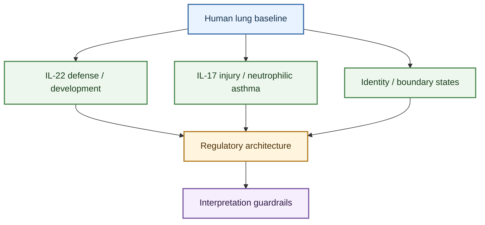

---
tags:
  - entity/cell_type
  - cell/ILC3
  - tissue/lung
  - topic/pulmonary_disease
  - topic/regulation
  - status/working
---

# ILC3

## Scope

This entity page defines group 3 innate lymphoid cells (ILC3s) as they are used in the ILC-in-lung wiki. It is the canonical ILC3 hub for this wiki: the former `ILC3 Working Model` page has been retired and merged here so the cell-level interpretation lives in one primary place.

Use this page when the question is "what is the current source-aware ILC3 model in lung biology?" Then move to disease or regulation topics when you need a narrower branch.

## Evidence tags

`#entity/cell_type` `#cell/ILC3` `#tissue/lung` `#topic/pulmonary_disease` `#topic/regulation` `#status/working`

## At a glance

| Lens | Current take |
|---|---|
| Canonical role | Lung ILC3s are IL-22/IL-17-capable innate lymphocytes whose pulmonary roles split into host-defense/developmental and inflammatory-disease branches. |
| Strongest pulmonary branches | Pneumococcal IL-22 defense, neonatal IGF1-supported niche biology, ARDS-like IL-17 injury, smoke-associated asthma, neutrophilic asthma, and steroid-resistant asthma. |
| Strongest regulatory layers | Stromal licensing, cytokine-driven IL-17 programs, glucocorticoid resistance, tissue identity control, and boundary-state taxonomy. |
| Main caution | `ILC3` is not shorthand for either protection or pathology; interpretation depends on mediator, compartment, model, and whether the data are human, mouse, ex vivo, or review-level. |

## How to use this page

- Start with `Integrated working model` and `Review map` for orientation.
- Use `Major biological branches` for disease or developmental context.
- Use `Regulatory architecture` for mechanism and identity questions.
- Use `Interpretation guardrails` before promoting ILC3 claims into broader synthesis or translational framing.

## Confidence snapshot

- High confidence: human lung tissue contains identifiable ILC3 subsets, including NCR+ and NCR- ILC3 compartments, with inducible IL-17A, IL-22, and GM-CSF potential after stimulation ([Characterization and Quantification of Innate Lymphoid Cell Subsets in Human Lung](../sources/2016_characterization_and_quantification_of_innate_lymphoid_cell_subsets_in_human_lung.md)).
- High confidence: lung ILC3 biology splits into protective/developmental and inflammatory branches, including IL-22 during Streptococcus pneumoniae infection, fibroblast-derived IGF1 support of neonatal pulmonary ILC3s, and IL-17A-associated ARDS-like injury ([Activation of Type 3 innate lymphoid cells and interleukin 22 secretion in the lungs during Streptococcus pneumoniae infection](../sources/2014_activation_of_type_3_innate_lymphoid_cells_and_interleukin_22_secretion_in_the_lungs.md); [Insulin-like Growth Factor 1 Supports a Pulmonary Niche that Promotes Type 3 Innate Lymphoid Cell Development in Newborn Lungs](../sources/2020_insulin_like_growth_factor_1_supports_a_pulmonary_niche_that_promotes_type_3_innate_lymphoid_cell_development_in.md); [Innate Lymphoid Cells Are the Predominant Source of IL-17A during the Early Pathogenesis of Acute Respiratory Distress Syndrome](../sources/2016_innate_lymphoid_cells_are_the_predominant_source_of_il_17a_during_the_early_pathogene.md)).
- High confidence: smoking asthma is associated with increased sputum NCR- ILC3s and blood CD45RO+ memory-like ILC3s, aligning with neutrophil and M1 macrophage signals rather than eosinophils ([Cigarette smoke aggravates asthma by inducing memory-like type 3 innate lymphoid cells](../sources/2022_cigarette_smoke_aggravates_asthma_by_inducing_memory_like_type_3_innate_lymphoid_cell.md)).
- High confidence: ILC3s can participate in neutrophilic or steroid-resistant asthma biology through neutrophil chemoattractants, glucocorticoid-insensitive programs, and fibroblast-derived SCF/KIT-driven IL-17A augmentation, but the strength of evidence varies by source and model ([Group 3 innate lymphoid cells secret neutrophil chemoattractants and are insensitive to glucocorticoid via aberrant GR phosphorylation](../sources/2023_group_3_innate_lymphoid_cells_secret_neutrophil_chemoattractants_and_are_insensitive.md); [Pulmonary fibroblast-derived stem cell factor promotes neutrophilic asthma by augmenting IL-17A production from ILC3s](../sources/2025_pulmonary_fibroblast_derived_stem_cell_factor_promotes_neutrophilic_asthma_by_augment.md)).
- Medium-high confidence: ILCs are required for AHR in a murine low-dose LPS neutrophilic asthma model, and lung ILC3s increase in that model, but the causal transfer claim should be worded as broad ILC requirement rather than ILC3-only causality ([Innate Lymphoid Cells Are Required to Induce Airway Hyperreactivity in a Murine Neutrophilic Asthma Model](../sources/2022_innate_lymphoid_cells_are_required_to_induce_airway_hyperreactivity_in_a_murine_neutr.md)).
- Medium confidence: ILC3-related IL-17/neutrophilic pathways are a coherent candidate target space for non-eosinophilic or steroid-resistant asthma, but review-level therapeutic framing needs primary intervention evidence before being upgraded ([Group 3 Innate Lymphoid Cells A Potential Therapeutic Target for Steroid Resistant Asthma](../sources/2024_group_3_innate_lymphoid_cells_a_potential_therapeutic_target_for_steroid_resistant_asthma.md)).
- Medium-high confidence: obesity-associated airway hyperreactivity can proceed through an NLRP3-IL-1beta-IL-17-producing innate-lymphoid branch that is distinct from canonical eosinophilic asthma framing ([Interleukin-17-producing innate lymphoid cells and the NLRP3 inflammasome facilitate obesity-associated airway hyperreactivity](../sources/2014_interleukin_17_producing_innate_lymphoid_cells_and_the_nlrp3_inflammasome_facilitate.md)).
- Medium confidence: extrapulmonary IL-23 biology includes an ILC3-intrinsic CTLA-4 checkpoint-restraint branch, which is useful for mechanism framing but should remain explicitly gut-labeled until matched pulmonary evidence appears ([CTLA-4-expressing ILC3s restrain interleukin-23-mediated inflammation](../sources/2024_ctla_4_expressing_ilc3s_restrain_interleukin_23_mediated_inflammation.md)).

## Integrated working model

The lung ILC3 model in this wiki has three durable branches. The first is a human pulmonary baseline branch: human lung tissue contains identifiable NCR+ and NCR- ILC3-like compartments with inducible IL-17A, IL-22, and GM-CSF potential. The second is a protective/developmental branch, where ILC3s contribute IL-22-mediated antibacterial defense and IGF1-supported neonatal pulmonary niche biology. The third is an inflammatory pathology branch, where IL-17A-, neutrophil-, smoke-, stromal-, and glucocorticoid-resistance-associated programs become central in ARDS-like injury and severe asthma endotypes.

The practical rule is to avoid treating ILC3 as automatically protective or pathogenic. The relevant biological unit is an ILC3-associated output in a defined lung context: IL-22 defense, IL-17A/neutrophilic inflammation, developmental niche support, or a noncanonical mediator branch such as acetylcholine.

## Review map

## Major biological branches

### Human lung baseline

- Human lung baseline: ILC3s are detectable in human lung as CD117+ pulmonary ILCs subdivided into NCR+ and NCR- compartments by NKp44, and pulmonary ILCs can show IL-17A, IL-22, and GM-CSF potential after stimulation ([Characterization and Quantification of Innate Lymphoid Cell Subsets in Human Lung](../sources/2016_characterization_and_quantification_of_innate_lymphoid_cell_subsets_in_human_lung.md)).

### Protective and developmental branches

- Protective/developmental branch: ILC3s can produce IL-22 during Streptococcus pneumoniae infection, while alveolar fibroblast-derived IGF1 supports neonatal pulmonary ILC3 development and antibacterial defense ([Activation of Type 3 innate lymphoid cells and interleukin 22 secretion in the lungs during Streptococcus pneumoniae infection](../sources/2014_activation_of_type_3_innate_lymphoid_cells_and_interleukin_22_secretion_in_the_lungs.md); [Insulin-like Growth Factor 1 Supports a Pulmonary Niche that Promotes Type 3 Innate Lymphoid Cell Development in Newborn Lungs](../sources/2020_insulin_like_growth_factor_1_supports_a_pulmonary_niche_that_promotes_type_3_innate_lymphoid_cell_development_in.md)).

### Injury, neutrophilic asthma, and steroid resistance

- Injury/neutrophilic branch: pulmonary ILC3s can be a major early IL-17A source in ARDS-like injury, and ILCs are required for AHR in a low-dose LPS neutrophilic asthma model in which lung ILC3s and IL-1beta/IL-17A/IL-22 increase ([Innate Lymphoid Cells Are the Predominant Source of IL-17A during the Early Pathogenesis of Acute Respiratory Distress Syndrome](../sources/2016_innate_lymphoid_cells_are_the_predominant_source_of_il_17a_during_the_early_pathogene.md); [Innate Lymphoid Cells Are Required to Induce Airway Hyperreactivity in a Murine Neutrophilic Asthma Model](../sources/2022_innate_lymphoid_cells_are_required_to_induce_airway_hyperreactivity_in_a_murine_neutr.md)).
- Obesity-associated inflammatory branch: high-fat-diet airway hyperreactivity in mice can proceed through macrophage-derived IL-1beta, NLRP3, and CCR6-positive IL-17-producing innate lymphoid cells, supporting a nonatopic metabolic-airway branch rather than a simple eosinophilic-asthma extension ([Interleukin-17-producing innate lymphoid cells and the NLRP3 inflammasome facilitate obesity-associated airway hyperreactivity](../sources/2014_interleukin_17_producing_innate_lymphoid_cells_and_the_nlrp3_inflammasome_facilitate.md)).
- Smoke/steroid-resistant branch: smoking asthma is associated with sputum NCR- ILC3s and blood CD45RO+ memory-like ILC3s; human non-eosinophilic asthma ILC3s can secrete neutrophil chemoattractants and resist glucocorticoid suppression in vitro; review-level SRA literature frames ILC3-related IL-17/neutrophilic pathways as candidate target space ([Cigarette smoke aggravates asthma by inducing memory-like type 3 innate lymphoid cells](../sources/2022_cigarette_smoke_aggravates_asthma_by_inducing_memory_like_type_3_innate_lymphoid_cell.md); [Group 3 innate lymphoid cells secret neutrophil chemoattractants and are insensitive to glucocorticoid via aberrant GR phosphorylation](../sources/2023_group_3_innate_lymphoid_cells_secret_neutrophil_chemoattractants_and_are_insensitive.md); [Group 3 Innate Lymphoid Cells A Potential Therapeutic Target for Steroid Resistant Asthma](../sources/2024_group_3_innate_lymphoid_cells_a_potential_therapeutic_target_for_steroid_resistant_asthma.md)).

### Stromal and noncanonical mediator branches

- Stromal and noncanonical mediator branch: pulmonary fibroblast-derived SCF/KIT augments ILC3 IL-17A and neutrophilic asthma-like inflammation, while ILC3-derived acetylcholine promotes protease-driven allergic lung pathology in a separate mediator branch ([Pulmonary fibroblast-derived stem cell factor promotes neutrophilic asthma by augmenting IL-17A production from ILC3s](../sources/2025_pulmonary_fibroblast_derived_stem_cell_factor_promotes_neutrophilic_asthma_by_augment.md); [ILC3-derived acetylcholine promotes protease-driven allergic lung pathology](../sources/2021_ilc3_derived_acetylcholine_promotes_protease_driven_allergic_lung_pathology.md)).
- Human airway crosstalk: induced-sputum asthma data associate ILC1/ILC3s with M1-like macrophage polarization and ILC2s with M2-like polarization, helping separate eosinophilic and noneosinophilic asthma branches ([Innate immune crosstalk in asthmatic airways Innate lymphoid cells coordinate polarization of lung macrophages](../sources/2019_innate_immune_crosstalk_in_asthmatic_airways_innate_lymphoid_cells_coordinate_polarization_of_lung_macrophages.md)).

## Regulatory architecture

### SCF/KIT stromal licensing

- High confidence: pulmonary fibroblast-derived SCF/KIT augments ILC3 IL-17A and neutrophilic asthma-like inflammation, making stromal ILC3 licensing a core branch of the ILC3 lung model ([Pulmonary fibroblast-derived stem cell factor promotes neutrophilic asthma by augmenting IL-17A production from ILC3s](../sources/2025_pulmonary_fibroblast_derived_stem_cell_factor_promotes_neutrophilic_asthma_by_augment.md)).
- Medium-high confidence: obesity-exacerbated allergic airway disease can involve both lung ILC2 and ILC3 responses in mouse models, but this should stay separate from lean type 2 asthma and human obesity-asthma claims ([Innate lymphoid cells contribute to allergic airway disease exacerbation by obesity](../sources/2016_innate_lymphoid_cells_contribute_to_allergic_airway_disease_exacerbation_by_obesity.md)).

### Effector-program and steroid-response layer

- High confidence: neutrophil-chemoattractant production, glucocorticoid insensitivity, and smoke-associated inflammatory conditioning are central to the current pulmonary ILC3 disease model ([Group 3 innate lymphoid cells secret neutrophil chemoattractants and are insensitive to glucocorticoid via aberrant GR phosphorylation](../sources/2023_group_3_innate_lymphoid_cells_secret_neutrophil_chemoattractants_and_are_insensitive.md); [Cigarette smoke aggravates asthma by inducing memory-like type 3 innate lymphoid cells](../sources/2022_cigarette_smoke_aggravates_asthma_by_inducing_memory_like_type_3_innate_lymphoid_cell.md)).
- High confidence: a macrophage-derived IL-1beta and NLRP3 axis can license IL-17-producing innate lymphoid cells in obesity-associated airway hyperreactivity, adding a metabolic-inflammatory upstream layer to the pulmonary ILC3 model ([Interleukin-17-producing innate lymphoid cells and the NLRP3 inflammasome facilitate obesity-associated airway hyperreactivity](../sources/2014_interleukin_17_producing_innate_lymphoid_cells_and_the_nlrp3_inflammasome_facilitate.md)).

### Restraint and counter-regulation

- Medium confidence: ILC3 biology also includes an ILC3-intrinsic CTLA-4 checkpoint branch that restrains IL-23-mediated inflammation in the gut; this is currently best used as conserved mechanism context rather than direct pulmonary evidence ([CTLA-4-expressing ILC3s restrain interleukin-23-mediated inflammation](../sources/2024_ctla_4_expressing_ilc3s_restrain_interleukin_23_mediated_inflammation.md)).

### Taxonomy and boundary states

- Medium-high confidence: helper-like ILC lineage and tissue-residency sources support conservative taxonomy for lung ILC3 interpretation: helper-like ILCs are developmentally distinct from conventional NK cells, and tissue ILCs can be resident sentinel populations ([Differentiation of type 1 ILCs from a common progenitor to all helper-like innate lymphoid cell lineages](../sources/2014_differentiation_of_type_1_ilcs_from_a_common_progenitor_to_all_helper_like_innate_lymphoid_cell_lineages.md); [Tissue residency of innate lymphoid cells in lymphoid and nonlymphoid organs](../sources/2015_tissue_residency_of_innate_lymphoid_cells_in_lymphoid_and_nonlymphoid_organs.md)).
- Medium-high confidence: IL-17-producing ILC-like cells require careful classification because c-Kit+ ILC2s can acquire ILC3-like IL-17-producing features, while SCF/KIT can also regulate bona fide pulmonary ILC3 IL-17A in neutrophilic asthma-like inflammation ([c-Kit-positive ILC2s exhibit an ILC3-like signature that may contribute to IL-17-mediated pathologies](../sources/2019_c_kit_positive_ilc2s_exhibit_an_ilc3_like_signature_that_may_contribute_to_il_17_medi.md); [Pulmonary fibroblast-derived stem cell factor promotes neutrophilic asthma by augmenting IL-17A production from ILC3s](../sources/2025_pulmonary_fibroblast_derived_stem_cell_factor_promotes_neutrophilic_asthma_by_augment.md)).

## Claim-level confidence boundaries

- `High confidence` is used for ILC3 claims supported by direct lung, airway, or pulmonary disease evidence linking ILC3 identity to IL-22, IL-17A, GM-CSF, neutrophil-associated inflammation, or developmental niche activity.
- `Medium-high confidence` is used when a mechanism is supported in lung-relevant models but still needs clearer human causality, compartment mapping, or pathway hierarchy.
- `Medium confidence` is used for therapeutic framing and broad endotype claims when the biology is coherent but primary intervention evidence remains limited.

## Interpretation guardrails

ILC3s should be modeled as tissue-niche-responsive IL-22/IL-17-capable innate lymphocytes whose lung roles split into defense/development, acute injury, and neutrophilic or steroid-resistant airway disease branches. Protective IL-22 and pathogenic IL-17/neutrophil-associated programs can coexist in the literature; source interpretation depends on disease model, tissue compartment, cytokine program, and whether evidence is human association, ex vivo function, mouse perturbation, or review-level synthesis.

## Contradiction and supersession

- IL-22-associated protection and IL-17-associated pathology can coexist in the ILC3 literature; interpretation depends on cytokine, disease model, timing, and tissue compartment.
- Human sputum, blood, BAL, and lung tissue should not be treated as interchangeable ILC3 compartments.
- ILC3 smoke/steroid-resistant asthma claims should distinguish primary human association, in vitro glucocorticoid resistance, mouse perturbation, and review-level target framing.
- IL-17-producing ST2+ ILC2s should not be collapsed into bona fide ILC3s without marker and lineage context.

## Open questions

- Which ILC3 IL-17 pathways are conserved across ARDS, neutrophilic asthma, smoke-associated asthma, and infection?
- Are memory-like ILC3 states durable in human lung disease, or mostly model-specific?
- Which stromal niche signals, especially IGF1 and SCF/KIT, are shared between development and adult inflammatory lung disease?
- How should ILC3-derived acetylcholine be integrated with canonical IL-17/IL-22 disease models?

## Reading routes

- For disease-first reading, go next to [ILC3 roles in pulmonary disease](../topics/ILC3_roles_in_pulmonary_disease.md).
- For mechanism-first reading, go next to [ILC3 functional regulation mechanisms](../topics/ILC3_functional_regulation_mechanisms.md).
- For cross-subset synthesis, go next to [Lung ILC Core Evidence Synthesis](../digests/2026-04-22_lung_ILC_core_evidence_synthesis.md).

## Related pages

- [ILC3 roles in pulmonary disease](../topics/ILC3_roles_in_pulmonary_disease.md)
- [ILC3 functional regulation mechanisms](../topics/ILC3_functional_regulation_mechanisms.md)
- [Lung ILC Disease Roles Companion](../digests/2026-04-20_ILC_pulmonary_disease_roles.md)
- [Lung ILC Core Evidence Synthesis](../digests/2026-04-22_lung_ILC_core_evidence_synthesis.md)
- [Reference coverage audit](../audit/2026-04-20_reference_coverage_audit.md)

## Future Expansion Directions

This short appendix is forward-looking curation guidance rather than part of the current evidence summary. Literature that would most strengthen this entity page includes:

- Human lung, BAL, sputum, and scRNA-seq studies that harmonize ILC3 subset markers across asthma, COPD, ARDS, pneumonia, and lung cancer.
- Primary intervention studies separating ILC3 IL-17, neutrophil chemoattractants, SCF/KIT, and glucocorticoid-resistance mechanisms in steroid-resistant asthma.
- Spatial datasets linking fibroblast, epithelial, macrophage, and ILC3 neighborhoods in diseased lung.
