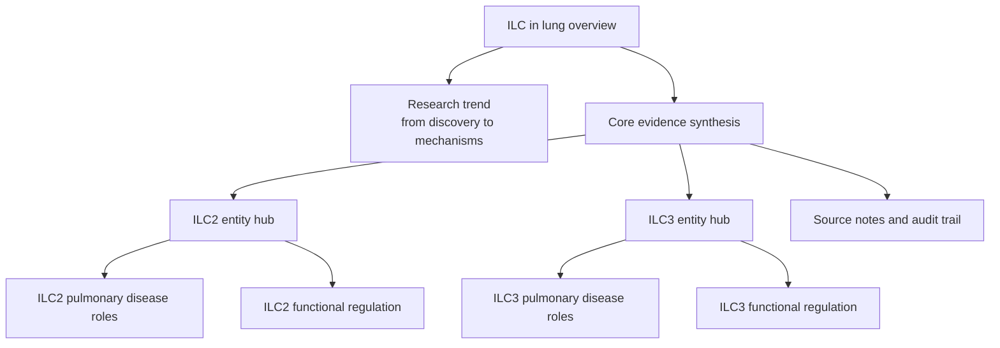

# ILC In Lung Wiki

Last updated: 2026-04-23

## Welcome

I am a researcher studying innate lymphoid cells (ILCs), with a particular focus on how ILCs shape pulmonary disease. I created this LLM-assisted wiki to help myself and readers who are curious about the ILC field quickly grasp the major conceptual threads, important mechanisms, and key papers that organize current thinking. The wiki is built from research articles that I find important, useful, or especially interesting, and it is structured as a source-aware knowledge map rather than a complete textbook or systematic review. This is a living document that will evolve with ongoing updates, with new content added on a rolling and unscheduled basis.

This homepage is designed as a starting point for browsing. Start with the overview, field history, and core evidence synthesis, then move into cell-specific entity pages, disease topics, regulatory mechanism maps, and source notes when you need traceability.

## Start Here

| Goal                                                    | Best entry point                                                                                                                          |
| ------------------------------------------------------- | ----------------------------------------------------------------------------------------------------------------------------------------- |
| Understand the whole wiki                               | [ILC In Lung](./topics/ILC_in_lung.md)                                                                                                    |
| Learn the field history                                 | [ILC Research Trend From Then To Now](./digests/2026-04-20_ILC_research_trend_then_to_now.md)                                             |
| See the strongest integrated evidence                   | [Lung ILC Core Evidence Synthesis](./digests/2026-04-22_lung_ILC_core_evidence_synthesis.md)                                              |
| Focus on ILC2                                           | [ILC2](./entities/ILC2.md)                                                                                                                |
| Focus on ILC3                                           | [ILC3](./entities/ILC3.md)                                                                                                                |
| Explore the new focused ILC2 niche/interferon synthesis | [ILC2 Niche, Interferon Brake, And Type 2 Regulatory Synthesis](./digests/2026-04-23_ILC2_niche_interferon_type2_regulatory_synthesis.md) |
| Browse all source notes                                 | [Source Index](./sources/source_index.md)                                                                                           |

## Core Knowledge Map

## Cell Entity Hubs

- [ILC2](./entities/ILC2.md): ILC2 identity, allergic and viral disease branches, repair and macrophage niche effects, neuroimmune and metabolic regulation, stromal/cellular feedback, and IL-17-producing boundary states.
- [ILC3](./entities/ILC3.md): ILC3 identity, bacterial defense, neonatal/developmental niches, ARDS and neutrophilic or steroid-resistant asthma, SCF/KIT stromal licensing, and IL-17-producing ILC classification cautions.

## Disease And Mechanism Topics

- [ILC2 Roles In Pulmonary Disease](./topics/ILC2_roles_in_pulmonary_disease.md): allergic asthma, respiratory viral AHR and repair, plastic/non-type-2 states, obesity-associated disease, silicosis-associated plasticity, and tumor/NK checkpoint context.
- [ILC3 Roles In Pulmonary Disease](./topics/ILC3_roles_in_pulmonary_disease.md): bacterial defense, neonatal lung development, ARDS/lung injury, neutrophilic and steroid-resistant asthma, smoke-associated asthma, and noncanonical mediator branches.
- [ILC2 Functional Regulation Mechanisms](./topics/ILC2_functional_regulation_mechanisms.md): alarmins, lipid mediators, costimulation/checkpoints, metabolism, neuroimmune signaling, stromal/mechanical feedback, and infection-conditioned reprogramming.
- [ILC3 Functional Regulation Mechanisms](./topics/ILC3_functional_regulation_mechanisms.md): cytokine activation, stromal niches, transcriptional identity, taxonomy, AHR/STING/vitamin D/nutrition/stress axes, and glucocorticoid resistance.

## Digests

- [Lung ILC Core Evidence Synthesis](./digests/2026-04-22_lung_ILC_core_evidence_synthesis.md): integrated evidence synthesis replacing batch-oriented digest pages.
- [ILC2 Niche, Interferon Brake, And Type 2 Regulatory Synthesis](./digests/2026-04-23_ILC2_niche_interferon_type2_regulatory_synthesis.md): focused synthesis of ILC2 stromal niches, epithelial activation, IFN-gamma brakes, neuroimmune regulation, and type 2 tissue-border framing.
- [ILC Research Trend From Then To Now](./digests/2026-04-20_ILC_research_trend_then_to_now.md): beginner-friendly field history from early functional discovery through tissue-specific disease mechanisms.
- [ILC2 Working Model](./digests/2026-04-20_ILC2_working_model.md): working synthesis of ILC2 roles in lung inflammation, infection, repair, plasticity, metabolism, and neuroimmune control.
- [ILC3 Working Model](./digests/2026-04-20_ILC3_working_model.md): working synthesis of ILC3 roles in lung IL-22 defense, IL-17/neutrophilic inflammation, steroid-resistant asthma, and stromal niche context.
- [Role Of ILC In Pulmonary Diseases](./digests/2026-04-20_ILC_pulmonary_disease_roles.md): disease-oriented map of ILC roles across asthma, infection, ARDS/lung injury, repair, and tumor/niche contexts.

## Source And Curation Layers

- [Sources README](./sources/README.md): explains source-page conventions and the difference between provisional bulk-ingest notes and focused manual crystallization.
- [Source Index](./sources/source_index.md): processing and source-note index for the local reference library.
- [Project Hub](./projects/ILC_in_lung_project.md): project scope, priority questions, key pages, working model, open risks, and next actions.
- [Wiki Rules](./_schema/wiki_rules.md): local rules for evidence confidence, ingest modes, page types, and auditability.

## Audit Trail

Audit pages preserve curation history, schema changes, and broad interpretation changes. They are useful for maintenance, but most readers should begin with the topic, entity, and digest pages above.

- [Topic And Entity Integration Audit](./audit/2026-04-22_topic_entity_integration_audit.md)
- [ILC2 Niche/Interferon Focused Crystallization Audit](./audit/2026-04-23_focused_manual_crystallization_ILC2_niche_interferon_type2.md)
- [Public Export Setup Audit](./audit/2026-04-22_public_export_setup.md)
- [Ingest Mode Schema Update](./audit/2026-04-22_ingest_mode_schema_update.md)
- [Focused Manual Crystallization Audit](./audit/2026-04-22_focused_manual_crystallization_batch3.md)
- [High-Priority Manual Crystallization Audit 1](./audit/2026-04-20_high_priority_manual_crystallization_batch1.md)
- [High-Priority Manual Crystallization Audit 2](./audit/2026-04-21_high_priority_manual_crystallization_batch2.md)
- [Digest Claim-Confidence Correction Audit](./audit/2026-04-21_digest_claim_confidence_correction.md)
- [Source Page Claim-Confidence Rewrite Audit](./audit/2026-04-20_source_page_claim_confidence_rewrite.md)
- [Reference Coverage Audit](./audit/2026-04-20_reference_coverage_audit.md)

## Reading Notes

This wiki is a research synthesis aid, not a clinical guideline. Claim-level confidence refers to biological claims and evidence directness, not to whether a PDF was successfully processed. Mouse perturbation, human lung tissue, sputum, blood, nasal airway, scRNA-seq, and review-level evidence are intentionally kept separate when they imply different levels of confidence.
