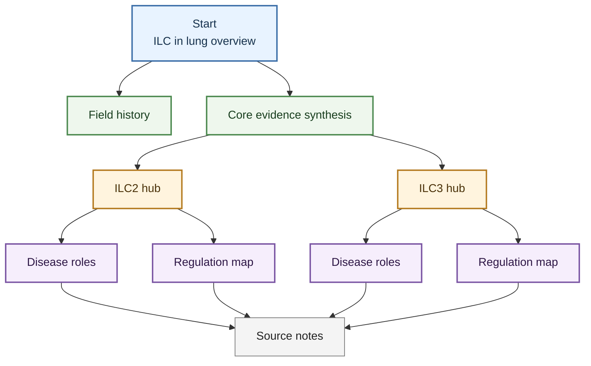

# ILC In Lung Wiki

Last updated: 2026-04-24

## Welcome

I am a researcher studying innate lymphoid cells (ILCs), with a particular focus on how ILCs shape pulmonary disease. I created this LLM-assisted wiki to help myself and readers who are curious about the ILC field quickly grasp the major conceptual threads, important mechanisms, and key papers that organize current thinking. The wiki is built from research articles that I find important, useful, or especially interesting, and it is structured as a source-aware knowledge map rather than a complete textbook or systematic review. This is a living document that will evolve as new literature and interpretation are added over time.

This homepage is designed as a starting point for browsing. Start with the overview, field history, and core evidence synthesis, then move into cell-specific entity pages, disease topics, regulatory mechanism maps, and source notes when you need traceability.

## Start Here

| Goal                                                    | Best entry point                                                                                                                          |
| ------------------------------------------------------- | ----------------------------------------------------------------------------------------------------------------------------------------- |
| Understand the whole wiki                               | [ILC In Lung](./topics/ILC_in_lung.md)                                                                                                    |
| Learn the field history                                 | [ILC Research Trend From Then To Now](./digests/2026-04-20_ILC_research_trend_then_to_now.md)                                             |
| See the strongest integrated evidence                   | [Lung ILC Core Evidence Synthesis](./digests/2026-04-22_lung_ILC_core_evidence_synthesis.md)                                              |
| Focus on ILC2                                           | [ILC2](./entities/ILC2.md)                                                                                                                |
| Focus on ILC3                                           | [ILC3](./entities/ILC3.md)                                                                                                                |
| Browse the reference library                            | [Reference Library](./sources/source_index.md)                                                                                      |

## Core Knowledge Map

## Cell Entity Hubs

- [ILC2](./entities/ILC2.md): canonical ILC2 hub with the integrated former working model, covering allergic amplification, viral AHR versus repair, macrophage niche effects, neuroimmune and metabolic regulation, stromal niches, interferon brakes, and IL-17-producing boundary states.
- [ILC3](./entities/ILC3.md): canonical ILC3 hub with the integrated former working model, covering human lung baseline, IL-22 defense, neonatal pulmonary niches, ARDS and neutrophilic or steroid-resistant asthma, SCF/KIT stromal licensing, and IL-17-producing ILC classification cautions.

## Disease And Mechanism Topics

- [ILC2 Roles In Pulmonary Disease](./topics/ILC2_roles_in_pulmonary_disease.md): allergic asthma, respiratory viral AHR and repair, plastic/non-type-2 states, obesity-associated disease, silicosis-associated plasticity, and tumor/NK checkpoint context.
- [ILC3 Roles In Pulmonary Disease](./topics/ILC3_roles_in_pulmonary_disease.md): bacterial defense, neonatal lung development, ARDS/lung injury, neutrophilic and steroid-resistant asthma, smoke-associated asthma, and noncanonical mediator branches.
- [ILC2 Functional Regulation Mechanisms](./topics/ILC2_functional_regulation_mechanisms.md): alarmins, lipid mediators, costimulation/checkpoints, metabolism, neuroimmune signaling, stromal/mechanical feedback, and infection-conditioned reprogramming.
- [ILC3 Functional Regulation Mechanisms](./topics/ILC3_functional_regulation_mechanisms.md): cytokine activation, stromal niches, transcriptional identity, taxonomy, AHR/STING/vitamin D/nutrition/stress axes, and glucocorticoid resistance.

## Synthesis And Companion Pages

- [Lung ILC Core Evidence Synthesis](./digests/2026-04-22_lung_ILC_core_evidence_synthesis.md): the main cross-subset synthesis page for the wiki.
- [ILC Research Trend From Then To Now](./digests/2026-04-20_ILC_research_trend_then_to_now.md): beginner-friendly field history from early functional discovery through tissue-specific disease mechanisms.
- [Lung ILC Disease Roles Companion](./digests/2026-04-20_ILC_pulmonary_disease_roles.md): disease-first companion page to the core synthesis, useful for pathology- or endotype-oriented reading.

---

The sections below preserve reference structure and project notes. Most readers can treat them as optional appendices.

<strong>Source Layer</strong>

<ul>
  <li><a href="./sources/">Source Guide</a>: explains how source notes are organized and how to read evidence strength.</li>
  <li><a href="./sources/source_index/">Reference Library</a>: browsable list of source notes for the local reference library.</li>
  <li><a href="./projects/ILC_in_lung_project/">Project Hub</a>: project scope, priority questions, key pages, open risks, and next actions.</li>
</ul>

<strong>Project Notes</strong>

<ul>
  <li><a href="./audit/2026-04-22_topic_entity_integration_audit/">Topic And Entity Integration Notes</a></li>
  <li><a href="./audit/2026-04-23_focused_manual_crystallization_ILC2_niche_interferon_type2/">ILC2 Niche And Interferon Notes</a></li>
  <li><a href="./audit/2026-04-22_public_export_setup/">Public Site Setup Notes</a></li>
  <li><a href="./audit/2026-04-22_ingest_mode_schema_update/">Source-Mode Notes</a></li>
  <li><a href="./audit/2026-04-22_focused_manual_crystallization_batch3/">Detailed Source Review Notes</a></li>
  <li><a href="./audit/2026-04-20_high_priority_manual_crystallization_batch1/">High-Priority Source Review Notes 1</a></li>
  <li><a href="./audit/2026-04-21_high_priority_manual_crystallization_batch2/">High-Priority Source Review Notes 2</a></li>
  <li><a href="./audit/2026-04-21_digest_claim_confidence_correction/">Digest Claim Confidence Notes</a></li>
  <li><a href="./audit/2026-04-20_source_page_claim_confidence_rewrite/">Source Claim Confidence Notes</a></li>
  <li><a href="./audit/2026-04-20_reference_coverage_audit/">Reference Coverage Notes</a></li>
</ul>

<strong>Rules And Notes</strong>

<ul>
  <li><a href="./_schema/wiki_rules/">Wiki Rules</a>: local rules for reading evidence confidence, page types, and source traceability.</li>
</ul>

This wiki is a research synthesis aid, not a clinical guideline. Claim-level confidence refers to biological claims and evidence directness, not to whether a PDF was successfully processed. Mouse perturbation, human lung tissue, sputum, blood, nasal airway, scRNA-seq, and review-level evidence are intentionally kept separate when they imply different levels of confidence.

