---
tags:
  - cell/ILC2
  - tissue/lung
  - assay/flow
  - assay/scRNAseq
  - assay/in_vivo
  - assay/in_vitro
  - outcome/airway_hyperresponsiveness
  - outcome/infection
  - outcome/repair
  - axis/ILC_airway_inflammation
  - axis/ILC_lung_infection
  - axis/ILC_plasticity
---

# ILC2 Functional Regulation Mechanisms

## Scope

This topic page organizes mechanisms that regulate `ILC2` function in the current `ILC_in_lung` wiki. It focuses on upstream epithelial alarmins, lipid mediators, costimulatory/checkpoint pathways, metabolic programs, neuroimmune signals, cytokine-driven plasticity, and infection-conditioned niche effects.

This page is a regulation map. For disease outcomes, see [ILC2 Roles In Pulmonary Disease](./ILC2_roles_in_pulmonary_disease.md).

## Evidence tags

`#cell/ILC2` `#tissue/lung` `#assay/flow` `#assay/scRNAseq` `#assay/in_vivo` `#assay/in_vitro` `#outcome/airway_hyperresponsiveness` `#outcome/infection` `#outcome/repair` `#axis/ILC_airway_inflammation` `#axis/ILC_lung_infection` `#axis/ILC_plasticity`

## Confidence snapshot

- High confidence:
  epithelial alarmins, especially IL-33 and IL-25, are central organizing signals for many ILC2 lung/asthma models in this source set.
- High confidence:
  metabolic state is a recurring regulator of ILC2 effector function, including autophagy, glycolysis/HIF-1alpha, mitochondrial activity, and PD-1-linked metabolism.
- Medium confidence:
  lipid mediators, neuropeptides, neurotransmitters, costimulatory pathways, and checkpoint pathways shape ILC2 activity in context-specific ways.
- Medium confidence:
  infection can reprogram ILC2 output and alter macrophage/niche consequences.
- Low confidence:
  mechanisms from gut or nasal inflammation should not be assumed to operate identically in lung ILC2s.

## Established observations

### Epithelial alarmins and cytokine activation

- IL-33/ST2 and IL-25 appear repeatedly as upstream ILC2 activation axes in asthma, allergen, and viral airway models.
- [Kinetics of the accumulation of group 2 innate lymphoid cells in IL-33-induced and IL-25-induced murine models of asthma a potential role for the chemokine CXCL16](../sources/2019_kinetics_of_the_accumulation_of_group_2_innate_lymphoid_cells_in_il_33_induced_and_il_25_induced_murine_models_o.md) links IL-33/IL-25-driven models to ILC2 accumulation and CXCL16 as a candidate recruitment or positioning cue.
- [IL-1beta prevents ILC2 expansion, type 2 cytokine secretion, and mucus metaplasia in response to early-life rhinovirus infection in mice](../sources/2020_il_1beta_prevents_ilc2_expansion_type_2_cytokine_secretion_and_mucus_metaplasia_in_response_to_early_life_rhinov.md) supports IL-1beta as a negative regulator of ILC2 expansion and type 2 output in early-life rhinovirus-like disease.
- [IL-1beta, IL-23, and TGF-beta drive plasticity of human ILC2s towards IL-17-producing ILCs in nasal inflammation](../sources/2019_il_1beta_il_23_and_tgf_beta_drive_plasticity_of_human_ilc2s_towards_il_17_producing_ilcs_in_nasal_inflammation.md) supports a cytokine-driven plasticity branch, but nasal inflammation should stay context-labeled.

### Lipid mediators and inflammatory amplifiers

- [Lung type 2 innate lymphoid cells express cysteinyl leukotriene receptor 1 which regulates TH2 cytokine production](../sources/2013_lung_type_2_innate_lymphoid_cells_express_cysteinyl_leukotriene_receptor_1_which_regu.md) supports cysteinyl leukotriene receptor signaling as a lung ILC2 regulatory mechanism.
- [Cysteinyl leukotriene E(4) activates human group 2 innate lymphoid cells and enhances the effect of prostaglandin D(2) and epithelial cytokines](../sources/2017_cysteinyl_leukotriene_e4_activates_human_group_2_innate_lymphoid_cells_and_enhances_the_effect_of_prostaglandin.md) supports synergistic lipid/epithelial cytokine activation of human ILC2s.
- [Fevipiprant, a selective prostaglandin D2 receptor 2 antagonist, inhibits human group 2 innate lymphoid cell aggregation and function](../sources/2019_fevipiprant_a_selective_prostaglandin_d2_receptor_2_antagonist_inhibits_human_group_2_innate_lymphoid_cell_aggre.md) supports DP2 antagonism as an upstream inhibitory branch that blocks PGD2-driven migration, aggregation, and cytokine output in human ILC2s.
- [Lipid-Droplet Formation Drives Pathogenic Group 2 Innate Lymphoid Cells in Airway Inflammation](../sources/2020_lipid_droplet_formation_drives_pathogenic_group_2_innate_lymphoid_cells_in_airway_inf.md) supports lipid-droplet biology as a pathogenic ILC2-state mechanism.

### Costimulatory and checkpoint control

- [ICOS-ligand interaction is required for type 2 innate lymphoid cell function, homeostasis, and induction of airway hyperreactivity](../sources/2015_icos_icos_ligand_interaction_is_required_for_type_2_innate_lymphoid_cell_function_homeostasis_and_induction_of_a.md) supports ICOS-ligand interaction as a regulator of ILC2 function, homeostasis, and AHR.
- [Tissue-Restricted Adaptive Type 2 Immunity Is Orchestrated by Expression of the Costimulatory Molecule OX40L on Group 2 Innate Lymphoid Cells](../sources/2018_tissue_restricted_adaptive_type_2_immunity_is_orchestrated_by_expression_of_the_costimulatory_molecule_ox40l_on.md) supports OX40L as a costimulatory ILC2-linked regulator of adaptive type 2 immunity.
- [The Role of the TL1ADR3 Axis in the Activation of Group 2 Innate Lymphoid Cells in Subjects with Eosinophilic Asthma](../sources/2020_the_role_of_the_tl1a_dr3_axis_in_the_activation_of_group_2_innate_lymphoid_cells_in_subjects_with_eosinophilic_a.md) supports TL1A/DR3 as a human eosinophilic-asthma-linked ILC2 activation axis.
- [PD-1 pathway regulates ILC2 metabolism and PD-1 agonist treatment ameliorates airway hyperreactivity](../sources/2020_pd_1_pathway_regulates_ilc2_metabolism_and_pd_1_agonist_treatment_ameliorates_airway.md) supports PD-1 as a metabolic checkpoint that limits ILC2 viability and effector function.

### Metabolic regulation

- [Autophagy is critical for group 2 innate lymphoid cell metabolic homeostasis and effector function](../sources/2020_autophagy_is_critical_for_group_2_innate_lymphoid_cell_metabolic_homeostasis_and_effector_function.md) supports autophagy as a regulator of ILC2 metabolic balance, proliferation, apoptosis, and cytokine secretion.
- [Dichotomous metabolic networks govern human ILC2 proliferation and function](../sources/2021_dichotomous_metabolic_networks_govern_human_ilc2_proliferation_and_function.md) supports a human baseline-versus-activated metabolic split in which circulating ILC2s rely on amino-acid-supported OXPHOS at rest but use glycolysis and mTOR for IL-33-driven effector activation.
- [Blocking the HIF-1alpha glycolysis axis inhibits allergic airway inflammation by reducing ILC2 metabolism and function](../sources/2025_blocking_the_hif_1alpha_glycolysis_axis_inhibits_allergic_airway_inflammation_by_reducing_ilc2_metabolism_and_fu.md) supports HIF-1alpha/glycolysis as a pro-inflammatory ILC2 metabolic axis in allergic airway inflammation.
- [Regulation of type 2 innate lymphoid cell-dependent airway hyperreactivity by butyrate](../sources/2018_regulation_of_type_2_innate_lymphoid_cell_dependent_airway_hyperreactivity_by_butyrat.md) supports butyrate/HDAC-linked suppression of ILC2 cytokine output and ILC2-dependent airway hyperreactivity in the reported systems.
- [Dopamine inhibits group 2 innate lymphoid cell-driven allergic lung inflammation by dampening mitochondrial activity](../sources/2023_dopamine_inhibits_group_2_innate_lymphoid_cell_driven_allergic_lung_inflammation_by_d.md) supports mitochondrial activity as a dopamine-sensitive ILC2 effector-control node.
- [mTORC1 signaling in group 2 innate lymphoid cells coordinates neuro-immune crosstalk in allergic lung inflammation](../sources/2025_mtorc1_signaling_in_group_2_innate_lymphoid_cells_coordinates_neuro_immune_crosstalk.md) supports mTORC1 as a link between ILC2 metabolism and neuroimmune crosstalk.

### Spatial niche, interferon, and inter-organ regulation

- [Adventitial Stromal Cells Define Group 2 Innate Lymphoid Cell Tissue Niches](../sources/2019_adventitial_stromal_cells_define_group_2_innate_lymphoid_cell_tissue_niches.md) supports a stromal niche model in which ASCs provide IL-33/TSLP and receive IL-13-linked reciprocal feedback from ILC2s.
- [Pulmonary environmental cues drive group 2 innate lymphoid cell dynamics in mice and humans](../sources/2019_pulmonary_environmental_cues_drive_group_2_innate_lymphoid_cell_dynamics_in_mice_and_human.md) adds a dynamic positioning layer in which pulmonary ILC2s use CCR8-CCL8 and collagen-I-dependent migration cues to navigate inflamed lung tissue.
- [Innate type 2 lymphocytes trigger an inflammatory switch in alveolar macrophages](../sources/2026_innate_type_2_lymphocytes_trigger_an_inflammatory_switch_in_alveolar_macrophages.md) adds an alveolar niche-remodeling branch in which IL-33-activated ILC2-derived IL-13 converts tissue-resident alveolar macrophages from a PPARgamma-centered homeostatic state toward an IRF4-driven inflammatory program.
- [Interleukin-33 and Interferon-gamma Counter-Regulate Group 2 Innate Lymphoid Cell Activation during Immune Perturbation](../sources/2015_interleukin_33_and_interferon_gamma_counter_regulate_group_2_innate_lymphoid_cell_activation_during_immune_pertu.md) and [Interferon gamma constrains type 2 lymphocyte niche boundaries during mixed inflammation](../sources/2022_interferon_gamma_constrains_type_2_lymphocyte_niche_boundaries_during_mixed_inflammation.md) support IFN-gamma as both a functional brake on IL-33-driven ILC2 activation and a spatial brake on ILC2/Th2 tissue dispersion.
- [Toll-like receptor 9-dependent interferon production prevents group 2 innate lymphoid cell-driven airway hyperreactivity](../sources/2019_toll_like_receptor_9_dependent_interferon_production_prevents_group_2_innate_lymphoid.md) connects microbial/TLR9 sensing to type I IFN, NK-derived IFN-gamma, ILC2 STAT1 signaling, and suppressed AHR.
- [Maturation and specialization of group 2 innate lymphoid cells through the lung-gut axis](../sources/2022_maturation_and_specialization_of_group_2_innate_lymphoid_cells_through_the_lung_gut_a.md) adds CCR2/CCR4-defined tissue specialization and IL-33-induced lung-gut movement as a developmental and inflammatory regulation layer.

### Neuroimmune and neurotransmitter regulation

- [The neuropeptide NMU amplifies ILC2-driven allergic lung inflammation](../sources/2017_the_neuropeptide_nmu_amplifies_ilc2_driven_allergic_lung_inflammation.md) supports NMU/NMUR1 as a pro-inflammatory neuroimmune amplifier of ILC2-driven allergic lung inflammation in mouse models.
- [Neuromedin-U Mediates Rapid Activation of Airway Group 2 Innate Lymphoid Cells in Mild Asthma](../sources/2024_neuromedin_u_mediates_rapid_activation_of_airway_group_2_innate_lymphoid_cells_in_mil.md) supports the NMU/NMUR1 axis as a rapid airway ILC2 activation pathway in mild asthma challenge settings.
- [Cannabinoid receptor 2 engagement promotes group 2 innate lymphoid cell expansion and enhances airway hyperreactivity](../sources/2022_cannabinoid_receptor_2_engagement_promotes_group_2_innate_lymphoid_cell_expansion_and_enhances_airway_hyperreact.md) supports CB2 signaling as a positive receptor-level amplifier of activated ILC2 function and airway hyperreactivity.
- [Basophils prime group 2 innate lymphoid cells for neuropeptide-mediated inhibition](../sources/2020_basophils_prime_group_2_innate_lymphoid_cells_for_neuropeptide_mediated_inhibition.md) supports cell-cell priming of ILC2s for neuropeptide-mediated inhibition.
- [PAC1 constrains type 2 inflammation through promotion of CGRP signaling in ILC2s](../sources/2024_pac1_constrains_type_2_inflammation_through_promotion_of_cgrp_signaling_in_ilc2s.md) supports PAC1/CGRP-linked negative regulation of type 2 inflammation through ILC2s.
- [beta(2)-adrenergic receptor-mediated negative regulation of group 2 innate lymphoid cell responses](../sources/2018_beta_2_adrenergic_receptor_mediated_negative_regulation_of_group_2_innate_lymphoid_cell_responses.md) supports beta2-adrenergic signaling as an inhibitory ILC2 regulatory axis.
- [Long-acting muscarinic antagonist regulates group 2 innate lymphoid cell-dependent airway eosinophilic inflammation](../sources/2021_long_acting_muscarinic_antagonist_regulates_group_2_innate_lymphoid_cell_dependent_ai.md) supports a related but indirect cholinergic branch in which tiotropium restrains ILC2-dependent airway inflammation through basophil M3R signaling.

### Stromal, mechanical, and cellular-feedback regulation

- [Mechanics-activated fibroblasts promote pulmonary group 2 innate lymphoid cell plasticity propelling silicosis progression](../sources/2024_mechanics_activated_fibroblasts_promote_pulmonary_group_2_innate_lymphoid_cell_plasti.md) supports a fibroblast-mechanics axis in which IL-18-producing fibroblasts promote pulmonary ILC2-to-ILC1-like plasticity in silicosis-associated inflammation.
- [Eosinophils promote effector functions of lung group 2 innate lymphoid cells in allergic airway inflammation in mice](../sources/2023_eosinophils_promote_effector_functions_of_lung_group_2_innate_lymphoid_cells_in_aller.md) supports eosinophils as positive feedback partners that can augment lung ILC2 effector function in allergic airway inflammation.
- [Tissue signals imprint ILC2 identity with anticipatory function](../sources/2018_tissue_signals_imprint_ilc2_identity_with_anticipatory_function.md) supports the broader principle that local tissue cues can imprint ILC2 identity and prepare context-specific effector capacity.

### Infection-conditioned reprogramming

- [BATF promotes group 2 innate lymphoid cell-mediated lung tissue protection during acute respiratory virus infection](../sources/2022_batf_promotes_group_2_innate_lymphoid_cell_mediated_lung_tissue_protection_during_acu.md) supports BATF as a transcriptional regulator that maintains protective ILC2 identity and restricts pathogenic plasticity during acute respiratory viral infection.
- [Dampening type 2 properties of group 2 innate lymphoid cells by a gammaherpesvirus infection reprograms alveolar macrophages](../sources/2023_dampening_type_2_properties_of_group_2_innate_lymphoid_cells_by_a_gammaherpesvirus_in.md) supports viral conditioning as a mechanism that reduces ILC2 type 2 expansion/cytokine output while enabling GM-CSF-dependent monocyte-to-AM imprinting.

## Interpretation

ILC2 function is regulated by layered controls rather than a single master pathway. Epithelial alarmins and lipid mediators provide rapid activation, costimulatory and checkpoint receptors tune expansion and function, metabolism sets effector capacity, neuroimmune inputs provide fast excitatory or inhibitory control, and infection can redirect ILC2 identity toward repair or niche-imprinting roles. The map below separates positive inputs, negative inputs, and state-rerouting signals so the reader can see both accelerating and restraining branches at a glance.

```mermaid
flowchart TD
    accTitle: ILC2 Regulation Map
    accDescr: Mechanistic map separating positive, negative, and state-rerouting controls of ILC2 function in the current wiki source set.

    subgraph positive["Positive regulation"]
        alarmins["Alarmins<br/>IL-33/ST2, IL-25"]
        lipids["Lipid amplifiers<br/>CysLT1/LTE4, PGD2/DP2"]
        costim["Costimulation<br/>ICOS-L, OX40L, TL1A/DR3"]
        metabolism["Metabolic support<br/>autophagy, OXPHOS-glycolysis<br/>HIF-1a, mTORC1, lipid droplets"]
        niche["Stromal/spatial cues<br/>ASC IL-33/TSLP<br/>CCR8-CCL8, collagen-I"]
        neuro_pos["Neuroimmune activators<br/>NMU/NMUR1, CB2"]
        feedback["Cellular feedback<br/>eosinophils"]
        repair_prog["Repair and niche programs<br/>BATF, GM-CSF,<br/>IL-13-trAM switch"]
    end

    subgraph negative["Negative regulation"]
        il1b_brake["Cytokine brake<br/>IL-1b in early-life RV model"]
        dp2_block["Lipid-pathway blockade<br/>fevipiprant / DP2 antagonism"]
        checkpoint["Checkpoint restraint<br/>PD-1"]
        metabolic_brake["Metabolic inhibition<br/>butyrate, dopamine"]
        neuro_brake["Neuroimmune brakes<br/>PAC1/CGRP, beta2-AR"]
        interferon["Interferon control<br/>IFN-gamma, TLR9-type I IFN<br/>STAT1"]
        cholinergic["Indirect cholinergic brake<br/>tiotropium-basophil<br/>M3R axis"]
        viral_dampen["Type 2 dampening<br/>gammaherpesvirus-conditioned<br/>suppression"]
    end

    subgraph rerouting["State rerouting and plasticity"]
        plasticity["Plasticity cues<br/>IL-1b + IL-23 + TGF-beta"]
        mechanics["Mechanical fibroblast cue<br/>IL-18-driven ILC2 to<br/>ILC1-like shift"]
        lung_gut["Inter-organ specialization<br/>lung-gut trafficking<br/>and maturation"]
    end

    ilc2["ILC2 state"]
    type2["Type 2 outputs<br/>IL-5, IL-13, AHR"]
    repair["Repair/niche outputs<br/>AREG, GM-CSF<br/>macrophage imprinting"]
    boundary["Boundary states<br/>IL-17-producing or<br/>ILC1-like programs"]

    alarmins --> ilc2
    lipids --> ilc2
    costim --> ilc2
    metabolism --> ilc2
    niche --> ilc2
    neuro_pos --> ilc2
    feedback --> ilc2
    repair_prog --> ilc2

    il1b_brake -. restrains .-> ilc2
    dp2_block -. restrains .-> ilc2
    checkpoint -. restrains .-> ilc2
    metabolic_brake -. restrains .-> ilc2
    neuro_brake -. restrains .-> ilc2
    interferon -. restrains .-> ilc2
    cholinergic -. restrains .-> ilc2
    viral_dampen -. restrains .-> ilc2

    plasticity -. reroutes .-> boundary
    mechanics -. reroutes .-> boundary
    lung_gut -. specializes .-> ilc2
    ilc2 --> type2
    ilc2 --> repair

    classDef positive_class fill:#e8f3ff,stroke:#3b6ea8,stroke-width:2px,color:#17324d
    classDef negative_class fill:#f4f4f4,stroke:#777,stroke-width:1px,color:#222
    classDef reroute_class fill:#f6eefc,stroke:#7a55a3,stroke-width:2px,color:#2d1645
    classDef cell fill:#fff4de,stroke:#b47a1f,stroke-width:2px,color:#4a3108
    classDef output_class fill:#eef7ed,stroke:#4d8a50,stroke-width:2px,color:#173d1d

    class alarmins,lipids,costim,metabolism,niche,neuro_pos,feedback,repair_prog positive_class
    class il1b_brake,dp2_block,checkpoint,metabolic_brake,neuro_brake,interferon,cholinergic,viral_dampen negative_class
    class plasticity,mechanics,lung_gut,boundary reroute_class
    class ilc2 cell
    class type2,repair output_class
```

## Contradiction and supersession

- Contradiction:
  some pathways activate ILC2s in one context but restrain them in another. For example, neuroimmune inputs include both NMU activation and beta2-adrenergic, dopamine, or PAC1/CGRP inhibitory branches.
- Contradiction:
  metabolic activation can be required for effector function but can also define pathogenic inflammatory states.
- Contradiction:
  infection can activate ILC2-mediated AHR, promote BATF-linked repair, or dampen type 2 properties depending on viral model and timing.
- Supersession:
  no single regulatory pathway supersedes the others. The working model is multi-layered and context-specific.

## Open questions

- Which regulatory layer is most measurable in the user's data: cytokines, receptor expression, metabolism, neuroimmune genes, or plasticity markers?
- Does the project have protein-level evidence for ILC2 cytokine output, or only transcript/marker evidence?
- Are ILC2 metabolic claims based on direct assays, pathway scores, or inferred signatures?
- Are neuroimmune signals measured in ILC2s, neurons, epithelial cells, or tissue-level ligand expression?
- Which regulatory node should be prioritized experimentally: IL-33/ST2, lipid mediators, PD-1, HIF-1alpha/glycolysis, mTORC1, BATF, or GM-CSF?

## Related pages

- [ILC2](../entities/ILC2.md)
- [ILC2 Roles In Pulmonary Disease](./ILC2_roles_in_pulmonary_disease.md)
- [Lung ILC Disease Roles Companion](../digests/2026-04-20_ILC_pulmonary_disease_roles.md)
- [ILC In Lung](./ILC_in_lung.md)

## Future Expansion Directions

This short appendix highlights future literature directions rather than current mechanistic conclusions. The most useful additions for later versions of this page would be:

- Additional ILC2 metabolic sources that separate direct metabolic assays from transcriptomic or pathway-score inference.
- More neuroimmune ILC2 sources that clarify excitatory versus inhibitory pathways across receptor contexts and tissues.
- A tighter source-linked table connecting each ILC2 regulatory mechanism to disease outcome, species, assay type, and directness of evidence.
