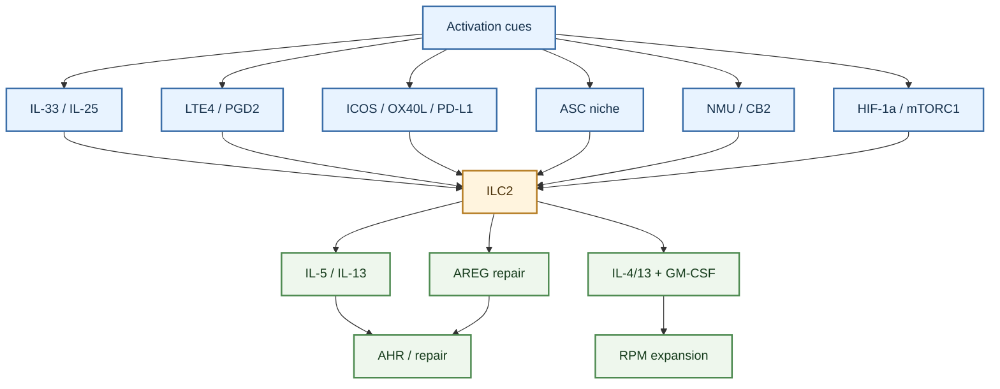
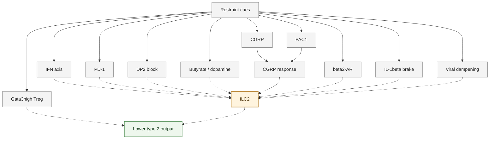
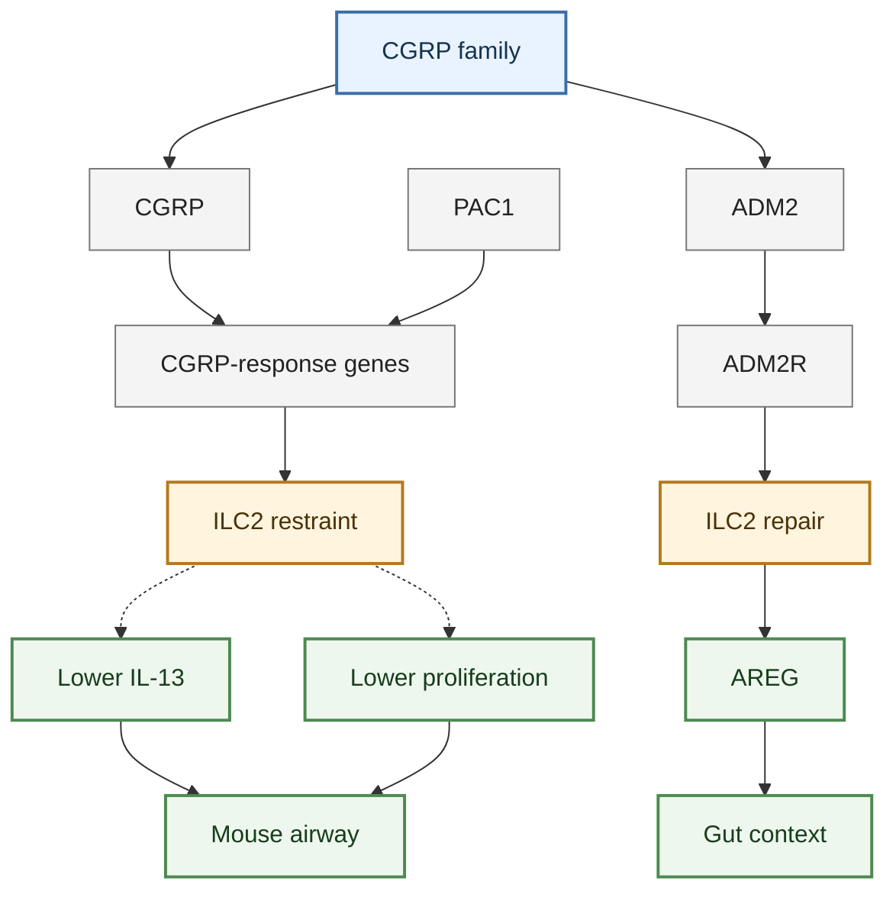
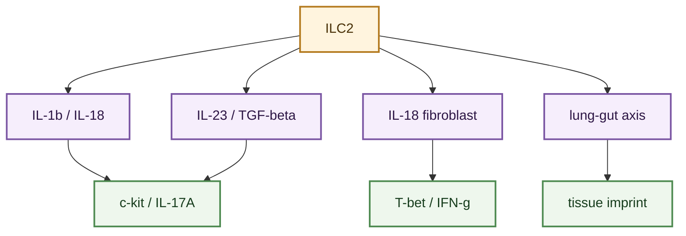

---
tags:
  - cell/ILC2
  - tissue/lung
  - assay/flow
  - assay/scRNAseq
  - assay/in_vivo
  - assay/in_vitro
  - outcome/airway_hyperresponsiveness
  - outcome/infection
  - outcome/repair
  - axis/ILC_airway_inflammation
  - axis/ILC_lung_infection
  - axis/ILC_plasticity
---

# ILC2 Functional Regulation Mechanisms

## Scope

This topic page organizes mechanisms that regulate `ILC2` function in the current `ILC_in_lung` wiki. It focuses on upstream epithelial alarmins, lipid mediators, costimulatory/checkpoint pathways, adaptive-immunity feedback circuits, metabolic programs, neuroimmune signals, cytokine-driven plasticity, and infection-conditioned niche effects.

This page is a regulation map. For disease outcomes, see [ILC2 Roles In Pulmonary Disease](./ILC2_roles_in_pulmonary_disease.md).

## Evidence Tags

`#cell/ILC2` `#tissue/lung` `#assay/flow` `#assay/scRNAseq` `#assay/in_vivo` `#assay/in_vitro` `#outcome/airway_hyperresponsiveness` `#outcome/infection` `#outcome/repair` `#axis/ILC_airway_inflammation` `#axis/ILC_lung_infection` `#axis/ILC_plasticity`

## Confidence Snapshot

- High confidence:
  epithelial alarmins, especially IL-33 and IL-25, are central organizing signals for many ILC2 lung/asthma models in this source set.
- High confidence:
  metabolic state is a recurring regulator of ILC2 effector function, including autophagy, glycolysis/HIF-1alpha, mitochondrial activity, and PD-1-linked metabolism.
- Medium confidence:
  lipid mediators, neuropeptides, neurotransmitters, costimulatory pathways, and checkpoint pathways shape ILC2 activity in context-specific ways.
- Medium confidence:
  infection can reprogram ILC2 output and alter macrophage/niche consequences.
- Low confidence:
  mechanisms from gut or nasal inflammation should not be assumed to operate identically in lung ILC2s.
- Medium confidence:
  extrapulmonary ILC2 regulatory context includes aryl-hydrocarbon-receptor/AHR and RXRgamma nuclear-receptor restraint, RORalpha developmental lineage boundaries, ADM2 tissue-protective neuroimmune signaling, and tuft-cell IL-17RB control of IL-25 bioavailability; these refine regulatory vocabulary but should stay tissue-labeled.

## Established Observations

### Epithelial alarmins and cytokine activation

- IL-33/ST2 and IL-25 appear repeatedly as upstream ILC2 activation axes in asthma, allergen, and viral airway models.
- [Kinetics of the accumulation of group 2 innate lymphoid cells in IL-33-induced and IL-25-induced murine models of asthma a potential role for the chemokine CXCL16](../sources/2019_kinetics_of_the_accumulation_of_group_2_innate_lymphoid_cells_in_il_33_induced_and_il_25_induced_murine_models_o.md) links IL-33/IL-25-driven models to ILC2 accumulation and CXCL16 as a candidate recruitment or positioning cue.
- [IL-1beta prevents ILC2 expansion, type 2 cytokine secretion, and mucus metaplasia in response to early-life rhinovirus infection in mice](../sources/2020_il_1beta_prevents_ilc2_expansion_type_2_cytokine_secretion_and_mucus_metaplasia_in_response_to_early_life_rhinov.md) supports IL-1beta as a negative regulator of ILC2 expansion and type 2 output in early-life rhinovirus-like disease.
- [Tuft cell IL-17RB restrains IL-25 bioavailability and reveals context-dependent ILC2 hypoproliferation](../sources/2025_tuft_cell_il_17rb_restrains_il_25_bioavailability_and_reveals_context_dependent_ilc2_hypoproliferation.md) refines the IL-25-ILC2 axis by showing epithelial control of IL-25 bioavailability in a gut tuft-cell circuit.
- [IL-9 and Blimp-1 protect the transcriptional identity of group 2 innate lymphocytes in allergic asthma](../sources/2026_il_9_and_blimp_1_protect_the_transcriptional_identity_of_group_2_innate_lymphocytes_in_allergic_asthma.md) adds a lung allergic-asthma state-fidelity branch in which IL-33/IL-25-induced IL-9 upregulates Blimp-1 to maintain ILC2 type 2 identity while restraining IFN-gamma/TNF programs.

- [IL-33-induced ILC2 effector cytokine responses promote the expansion of red pulp macrophages](../sources/2026_il_33_induced_ilc2_effector_cytokine_responses_promote_the_expansion_of_red_pulp_macr.md) adds a systemic/splenic IL-33 branch in which activated ILC2s use IL-4/IL-13 and GM-CSF to promote red pulp macrophage expansion; this is type 2 macrophage crosstalk context, not a pulmonary macrophage claim.

- [IL-1beta, IL-23, and TGF-beta drive plasticity of human ILC2s towards IL-17-producing ILCs in nasal inflammation](../sources/2019_il_1beta_il_23_and_tgf_beta_drive_plasticity_of_human_ilc2s_towards_il_17_producing_ilcs_in_nasal_inflammation.md) supports a cytokine-driven plasticity branch, but nasal inflammation should stay context-labeled.

### Lipid mediators and inflammatory amplifiers

- [Lung type 2 innate lymphoid cells express cysteinyl leukotriene receptor 1 which regulates TH2 cytokine production](../sources/2013_lung_type_2_innate_lymphoid_cells_express_cysteinyl_leukotriene_receptor_1_which_regu.md) supports cysteinyl leukotriene receptor signaling as a lung ILC2 regulatory mechanism.
- [Cysteinyl leukotriene E(4) activates human group 2 innate lymphoid cells and enhances the effect of prostaglandin D(2) and epithelial cytokines](../sources/2017_cysteinyl_leukotriene_e4_activates_human_group_2_innate_lymphoid_cells_and_enhances_the_effect_of_prostaglandin.md) supports synergistic lipid/epithelial cytokine activation of human ILC2s.
- [Fevipiprant, a selective prostaglandin D2 receptor 2 antagonist, inhibits human group 2 innate lymphoid cell aggregation and function](../sources/2019_fevipiprant_a_selective_prostaglandin_d2_receptor_2_antagonist_inhibits_human_group_2_innate_lymphoid_cell_aggre.md) supports DP2 antagonism as an upstream inhibitory branch that blocks PGD2-driven migration, aggregation, and cytokine output in human ILC2s.
- [Lipid-Droplet Formation Drives Pathogenic Group 2 Innate Lymphoid Cells in Airway Inflammation](../sources/2020_lipid_droplet_formation_drives_pathogenic_group_2_innate_lymphoid_cells_in_airway_inf.md) supports lipid-droplet biology as a pathogenic ILC2-state mechanism.

- [Tissue-Restricted Adaptive Type 2 Immunity Is Orchestrated by Expression of the Costimulatory Molecule OX40L on Group 2 Innate Lymphoid Cells](../sources/2018_tissue_restricted_adaptive_type_2_immunity_is_orchestrated_by_expression_of_the_costimulatory_molecule_ox40l_on.md) supports OX40L as an IL-33-induced ILC2 costimulatory pathway that licenses local Th2/Treg expansion in mouse lung type 2 inflammation.

### Costimulatory and checkpoint control

- [ICOS-ligand interaction is required for type 2 innate lymphoid cell function, homeostasis, and induction of airway hyperreactivity](../sources/2015_icos_icos_ligand_interaction_is_required_for_type_2_innate_lymphoid_cell_function_homeostasis_and_induction_of_a.md) supports ICOS-ligand interaction as a regulator of ILC2 function, homeostasis, and AHR.
- [Tissue-Restricted Adaptive Type 2 Immunity Is Orchestrated by Expression of the Costimulatory Molecule OX40L on Group 2 Innate Lymphoid Cells](../sources/2018_tissue_restricted_adaptive_type_2_immunity_is_orchestrated_by_expression_of_the_costimulatory_molecule_ox40l_on.md) supports OX40L as a costimulatory ILC2-linked regulator of adaptive type 2 immunity.
- [ILC2s regulate adaptive Th2 cell functions via PD-L1 checkpoint control](../sources/2017_ilc2s_regulate_adaptive_th2_cell_functions_via_pd_l1_checkpoint_control.md) adds an ILC2-to-Th2 checkpoint branch in which IL-33/ST2-activated pulmonary ILC2s use PD-L1:PD-1 contact to promote CD4 T-cell GATA3 and IL-13 in mouse helminth-associated type 2 immunity.
- [Cross-talk between ILC2 and Gata3high Tregs locally constrains adaptive type 2 immunity](../sources/2024_cross_talk_between_ilc2_and_gata3high_tregs_locally_constrains_adaptive_type_2_immuni.md) refines OX40L regulation by showing that ILC2s support Gata3high Treg accumulation, and that these Tregs feed back to tune OX40L bioavailability on ILC2s and restrain effector-memory Th2 expansion.

- In the adaptive-immunity map, lung-direct ILC2 evidence now separates PD-L1-to-Th2 polarization, OX40L-to-Th2/Treg licensing, and Gata3high Treg feedback; see [ILC Regulation Of Adaptive Immunity](./ILC_regulation_of_adaptive_immunity.md).
- Gut ILC2-derived IL-10 adds a regulatory cytokine branch distinct from lung OX40L costimulation; it is useful for ILC2 state diversity but should remain gut-labeled ([ILC2s are the predominant source of intestinal ILC-derived IL-10](../sources/2020_ilc2s_are_the_predominant_source_of_intestinal_ilc_derived_il_10.md)).

- [The Role of the TL1ADR3 Axis in the Activation of Group 2 Innate Lymphoid Cells in Subjects with Eosinophilic Asthma](../sources/2020_the_role_of_the_tl1a_dr3_axis_in_the_activation_of_group_2_innate_lymphoid_cells_in_subjects_with_eosinophilic_a.md) supports TL1A/DR3 as a human eosinophilic-asthma-linked ILC2 activation axis.
- [PD-1 pathway regulates ILC2 metabolism and PD-1 agonist treatment ameliorates airway hyperreactivity](../sources/2020_pd_1_pathway_regulates_ilc2_metabolism_and_pd_1_agonist_treatment_ameliorates_airway.md) supports PD-1 as a metabolic checkpoint that limits ILC2 viability and effector function.

### Metabolic regulation

- [Autophagy is critical for group 2 innate lymphoid cell metabolic homeostasis and effector function](../sources/2020_autophagy_is_critical_for_group_2_innate_lymphoid_cell_metabolic_homeostasis_and_effector_function.md) supports autophagy as a regulator of ILC2 metabolic balance, proliferation, apoptosis, and cytokine secretion.
- [Dichotomous metabolic networks govern human ILC2 proliferation and function](../sources/2021_dichotomous_metabolic_networks_govern_human_ilc2_proliferation_and_function.md) supports a human baseline-versus-activated metabolic split in which circulating ILC2s rely on amino-acid-supported OXPHOS at rest but use glycolysis and mTOR for IL-33-driven effector activation.
- [Blocking the HIF-1alpha glycolysis axis inhibits allergic airway inflammation by reducing ILC2 metabolism and function](../sources/2025_blocking_the_hif_1alpha_glycolysis_axis_inhibits_allergic_airway_inflammation_by_reducing_ilc2_metabolism_and_fu.md) supports HIF-1alpha/glycolysis as a pro-inflammatory ILC2 metabolic axis in allergic airway inflammation.
- [Regulation of type 2 innate lymphoid cell-dependent airway hyperreactivity by butyrate](../sources/2018_regulation_of_type_2_innate_lymphoid_cell_dependent_airway_hyperreactivity_by_butyrat.md) supports butyrate/HDAC-linked suppression of ILC2 cytokine output and ILC2-dependent airway hyperreactivity in the reported systems.
- [Aryl Hydrocarbon Receptor Signaling Cell Intrinsically Inhibits Intestinal Group 2 Innate Lymphoid Cell Function](../sources/2018_aryl_hydrocarbon_receptor_signaling_cell_intrinsically_inhibits_intestinal_group_2_in.md) adds a gut ILC2 aryl-hydrocarbon-receptor/AHR restraint branch, and [Retinoid X receptor gamma dictates the activation threshold of group 2 innate lymphoid cells and limits type 2 inflammation in the small intestine](../sources/2023_retinoid_x_receptor_gamma_dictates_the_activation_threshold_of_group_2_innate_lymphoi.md) adds an RXRgamma lipid-metabolic activation-threshold branch.

- [Dopamine inhibits group 2 innate lymphoid cell-driven allergic lung inflammation by dampening mitochondrial activity](../sources/2023_dopamine_inhibits_group_2_innate_lymphoid_cell_driven_allergic_lung_inflammation_by_d.md) supports mitochondrial activity as a dopamine-sensitive ILC2 effector-control node.
- [mTORC1 signaling in group 2 innate lymphoid cells coordinates neuro-immune crosstalk in allergic lung inflammation](../sources/2025_mtorc1_signaling_in_group_2_innate_lymphoid_cells_coordinates_neuro_immune_crosstalk.md) supports mTORC1 as a link between ILC2 metabolism and neuroimmune crosstalk.
- [Metabolic features of innate lymphoid cells](../sources/2022_metabolic_features_of_innate_lymphoid_cells.md) is useful as review-level orientation for ILC metabolic adaptability, but individual pathway claims should remain anchored to primary sources.

- [S1P-dependent interorgan trafficking of group 2 innate lymphoid cells supports host defense](../sources/2018_s1p_dependent_interorgan_trafficking_of_group_2_innate_lymphoid_cells_supports_host_d.md) supports S1P-dependent interorgan trafficking as a mouse inflammatory ILC2 positioning mechanism, separate from steady-state tissue residency.
- [ILC2-derived LIF licences progress from tissue to systemic immunity](../sources/2024_ilc2_derived_lif_licences_progress_from_tissue_to_systemic_immunity.md) supports ILC2-derived LIF as a lung immune-egress regulator through lymphatic endothelial CCL21 and CCR7+ cell migration.
### Spatial niche, interferon, and inter-organ regulation

- [Adventitial Stromal Cells Define Group 2 Innate Lymphoid Cell Tissue Niches](../sources/2019_adventitial_stromal_cells_define_group_2_innate_lymphoid_cell_tissue_niches.md) supports a stromal niche model in which ASCs provide IL-33/TSLP and receive IL-13-linked reciprocal feedback from ILC2s.
- [Pulmonary environmental cues drive group 2 innate lymphoid cell dynamics in mice and humans](../sources/2019_pulmonary_environmental_cues_drive_group_2_innate_lymphoid_cell_dynamics_in_mice_and_human.md) adds a dynamic positioning layer in which pulmonary ILC2s use CCR8-CCL8 and collagen-I-dependent migration cues to navigate inflamed lung tissue.
- [Innate type 2 lymphocytes trigger an inflammatory switch in alveolar macrophages](../sources/2026_innate_type_2_lymphocytes_trigger_an_inflammatory_switch_in_alveolar_macrophages.md) adds an alveolar niche-remodeling branch in which IL-33-activated ILC2-derived IL-13 converts tissue-resident alveolar macrophages from a PPARgamma-centered homeostatic state toward an IRF4-driven inflammatory program.
- [Interleukin-33 and Interferon-gamma Counter-Regulate Group 2 Innate Lymphoid Cell Activation during Immune Perturbation](../sources/2015_interleukin_33_and_interferon_gamma_counter_regulate_group_2_innate_lymphoid_cell_activation_during_immune_pertu.md) and [Interferon gamma constrains type 2 lymphocyte niche boundaries during mixed inflammation](../sources/2022_interferon_gamma_constrains_type_2_lymphocyte_niche_boundaries_during_mixed_inflammation.md) support IFN-gamma as both a functional brake on IL-33-driven ILC2 activation and a spatial brake on ILC2/Th2 tissue dispersion.
- [Toll-like receptor 9-dependent interferon production prevents group 2 innate lymphoid cell-driven airway hyperreactivity](../sources/2019_toll_like_receptor_9_dependent_interferon_production_prevents_group_2_innate_lymphoid.md) connects microbial/TLR9 sensing to type I IFN, NK-derived IFN-gamma, ILC2 STAT1 signaling, and suppressed AHR.
- [Maturation and specialization of group 2 innate lymphoid cells through the lung-gut axis](../sources/2022_maturation_and_specialization_of_group_2_innate_lymphoid_cells_through_the_lung_gut_a.md) adds CCR2/CCR4-defined tissue specialization and IL-33-induced lung-gut movement as a developmental and inflammatory regulation layer.

### Neuroimmune and neurotransmitter regulation

- [The neuropeptide NMU amplifies ILC2-driven allergic lung inflammation](../sources/2017_the_neuropeptide_nmu_amplifies_ilc2_driven_allergic_lung_inflammation.md) supports NMU/NMUR1 as a pro-inflammatory neuroimmune amplifier of ILC2-driven allergic lung inflammation in mouse models.
- [Neuromedin-U Mediates Rapid Activation of Airway Group 2 Innate Lymphoid Cells in Mild Asthma](../sources/2024_neuromedin_u_mediates_rapid_activation_of_airway_group_2_innate_lymphoid_cells_in_mil.md) supports the NMU/NMUR1 axis as a rapid airway ILC2 activation pathway in mild asthma challenge settings.
- [Cannabinoid receptor 2 engagement promotes group 2 innate lymphoid cell expansion and enhances airway hyperreactivity](../sources/2022_cannabinoid_receptor_2_engagement_promotes_group_2_innate_lymphoid_cell_expansion_and_enhances_airway_hyperreact.md) supports CB2 signaling as a positive receptor-level amplifier of activated ILC2 function and airway hyperreactivity.
- [Basophils prime group 2 innate lymphoid cells for neuropeptide-mediated inhibition](../sources/2020_basophils_prime_group_2_innate_lymphoid_cells_for_neuropeptide_mediated_inhibition.md) supports cell-cell priming of ILC2s for neuropeptide-mediated inhibition.
- [PAC1 constrains type 2 inflammation through promotion of CGRP signaling in ILC2s](../sources/2024_pac1_constrains_type_2_inflammation_through_promotion_of_cgrp_signaling_in_ilc2s.md) supports PAC1/CGRP-linked negative regulation of type 2 inflammation through ILC2s.
- [CGRP-related neuropeptide adrenomedullin 2 promotes tissue-protective ILC2 responses and limits intestinal inflammation](../sources/2025_cgrp_related_neuropeptide_adrenomedullin_2_promotes_tissue_protective_ilc2_responses_and_limits_intestinal_infla.md) adds an enteric ADM2-ILC2-AREG tissue-protection branch; it is neuroimmune ILC2 context but not direct lung ADM2 evidence.

- [beta(2)-adrenergic receptor-mediated negative regulation of group 2 innate lymphoid cell responses](../sources/2018_beta_2_adrenergic_receptor_mediated_negative_regulation_of_group_2_innate_lymphoid_cell_responses.md) supports beta2-adrenergic signaling as an inhibitory ILC2 regulatory axis.
- [Long-acting muscarinic antagonist regulates group 2 innate lymphoid cell-dependent airway eosinophilic inflammation](../sources/2021_long_acting_muscarinic_antagonist_regulates_group_2_innate_lymphoid_cell_dependent_ai.md) supports a related but indirect cholinergic branch in which tiotropium restrains ILC2-dependent airway inflammation through basophil M3R signaling.

### Stromal, mechanical, and cellular-feedback regulation

- [Mechanics-activated fibroblasts promote pulmonary group 2 innate lymphoid cell plasticity propelling silicosis progression](../sources/2024_mechanics_activated_fibroblasts_promote_pulmonary_group_2_innate_lymphoid_cell_plasti.md) supports a fibroblast-mechanics axis in which IL-18-producing fibroblasts promote pulmonary ILC2-to-ILC1-like plasticity in silicosis-associated inflammation.
- [Eosinophils promote effector functions of lung group 2 innate lymphoid cells in allergic airway inflammation in mice](../sources/2023_eosinophils_promote_effector_functions_of_lung_group_2_innate_lymphoid_cells_in_aller.md) supports eosinophils as positive feedback partners that can augment lung ILC2 effector function in allergic airway inflammation.

- [IL-33-induced ILC2 effector cytokine responses promote the expansion of red pulp macrophages](../sources/2026_il_33_induced_ilc2_effector_cytokine_responses_promote_the_expansion_of_red_pulp_macr.md) broadens cellular-feedback regulation to a spleen/systemic macrophage compartment: short-term high IL-33 activates ILC2s, and IL-4Ralpha plus GM-CSF receptor pathways support red pulp macrophage expansion.
- [Tissue signals imprint ILC2 identity with anticipatory function](../sources/2018_tissue_signals_imprint_ilc2_identity_with_anticipatory_function.md) supports the broader principle that local tissue cues can imprint ILC2 identity and prepare context-specific effector capacity.

### Infection-conditioned reprogramming

- [BATF promotes group 2 innate lymphoid cell-mediated lung tissue protection during acute respiratory virus infection](../sources/2022_batf_promotes_group_2_innate_lymphoid_cell_mediated_lung_tissue_protection_during_acu.md) supports BATF as a transcriptional regulator that maintains protective ILC2 identity and restricts pathogenic plasticity during acute respiratory viral infection.
- [Dampening type 2 properties of group 2 innate lymphoid cells by a gammaherpesvirus infection reprograms alveolar macrophages](../sources/2023_dampening_type_2_properties_of_group_2_innate_lymphoid_cells_by_a_gammaherpesvirus_in.md) supports viral conditioning as a mechanism that reduces ILC2 type 2 expansion/cytokine output while enabling GM-CSF-dependent monocyte-to-AM imprinting.
- [Innate lymphoid cells integrate sensing and plasticity to control fungal infections](../sources/2026_innate_lymphoid_cells_integrate_sensing_and_plasticity_to_control_fungal_infections.md) broadens pulmonary infection regulation beyond viruses by showing fungal sensing and cytokine-conditioned ILC2-to-ILC3-like plasticity in a mouse Aspergillus lung infection context.

- [The molecular and epigenetic mechanisms of innate lymphoid cell (ILC) memory and its relevance for asthma](../sources/2021_the_molecular_and_epigenetic_mechanisms_of_innate_lymphoid_cell_ilc_memory_and_its_re.md) supports a mouse allergen-experienced ILC2 memory branch with epigenetic preparedness after repetitive Alternaria exposure.
- [Trained immunity and tolerance in innate lymphoid cells, monocytes, and dendritic cells during allergen-specific immunotherapy](../sources/2021_trained_immunity_and_tolerance_in_innate_lymphoid_cells_monocytes_and_dendritic_cells_during_allergen_specific_i.md) adds human blood AIT-associated ILC remodeling; it should be used as translational immune-monitoring context rather than direct lung tissue evidence.
### Severe-asthma boundary and restraint branches

- Human severe-asthma sputum supports an IL-1beta/IL-18-associated ILC2-to-ILC3-like regulatory branch: sort-purified human ILC2s exposed to IL-1beta plus IL-18 upregulate c-kit, IL-17A, and mixed type 2/type 17 transcriptional features in vitro ([A population of c-kit+ IL-17A+ ILC2s in sputum from individuals with severe asthma supports ILC2 to ILC3 trans-differentiation](../sources/2025_a_population_of_c_kit_il_17a_ilc2s_in_sputum_from_individuals_with_severe_asthma_supp.md)).
- MSC-mediated suppression and vitamin D3/Blimp-1/IL-10 regulation are useful restraint axes for ILC2 asthma output, but should remain broader immune-regulatory mechanisms rather than ILC2-exclusive pathways ([Mesenchymal Stem Cells Suppress Severe Asthma by Directly Regulating Th2 Cells and Type 2 Innate Lymphoid Cells](../sources/2021_mesenchymal_stem_cells_suppress_severe_asthma_by_directly_regulating_th2_cells_and_ty.md); [Vitamin D3 resolved human and experimental asthma via B lymphocyte-induced maturation protein 1 in T cells and innate lymphoid cells](../sources/2023_vitamin_d3_resolved_human_and_experimental_asthma_via_b_lymphocyte_induced_maturation_protein_1_in_t_cells_and_i.md)).
- [Severe asthma is characterized by a sex-specific ILC landscape and aberrant airway profile that is suppressed by anti-IL-5/5Ralpha biologics](../sources/2025_severe_asthma_is_characterized_by_a_sex_specific_ilc_landscape_and_aberrant_airway_pr.md) supports a human therapy-response branch in which anti-IL-5/5Ralpha biologics suppress airway IL-5+/IL-13+ ILCs while leaving core ILC subset abundance largely unchanged; this should be framed as airway cytokine-output modulation rather than ILC depletion.

### Review-level orientation and tissue boundaries

- [The group 2 innate lymphoid cell ( ILC 2) regulatory network and its underlying mechanisms](../sources/2018_the_group_2_innate_lymphoid_cell_ilc_2_regulatory_network_and_its_underlying_mechanisms.md), [Tissue-Specific Features of Innate Lymphoid Cells](../sources/2020_tissue_specific_features_of_innate_lymphoid_cells.md), and [Plasticity of innate lymphoid cell subsets](../sources/2020_plasticity_of_innate_lymphoid_cell_subsets.md) are useful review-level orientation sources for ILC2 regulatory networks, tissue specificity, and state plasticity.
- [RORalpha is a critical checkpoint for T cell and ILC2 commitment in the embryonic thymus](../sources/2021_roralpha_is_a_critical_checkpoint_for_t_cell_and_ilc2_commitment_in_the_embryonic_thymus.md) adds developmental lineage-boundary context for ILC2 identity rather than mature lung disease regulation.
- [Immunotherapy for asthma](../sources/2025_immunotherapy_for_asthma.md) is useful for asthma endotype and therapy framing, but ILC-specific claims should remain anchored to ILC-focused primary sources.
- [Group 2 innate lymphoid cells promote inhibitory synapse development and social behavior](../sources/2024_group_2_innate_lymphoid_cells_promote_inhibitory_synapse_development_and_social_behav.md) is retained as extrapulmonary neuroimmune ILC2 context; it should not be used as lung neuroimmune or asthma evidence without pulmonary data.

## Interpretation

ILC2 function is regulated by layered controls rather than a single master pathway. Epithelial alarmins and lipid mediators provide rapid activation, costimulatory and checkpoint receptors tune ILC2-adaptive dialogue, metabolism sets effector capacity, neuroimmune inputs provide fast excitatory or inhibitory control, and infection can redirect ILC2 identity toward repair or niche-imprinting roles. The map below separates positive inputs, negative inputs, and state-rerouting signals so the reader can see both accelerating and restraining branches at a glance.

## Evidence Matrix

This matrix links the regulation map to source-bounded evidence. `Perturbation` lists the strongest direct test described in the cited source; rows marked as ex vivo, human association, or extrapulmonary should not be read as direct lung-disease causality.

| Mechanism | ILC subset | Tissue (lung or gut?) | Species (Human or mouse?) | Disease anchor | Perturbation (knockout or inhibitor?) | Main output | Caveat |
|---|---|---|---|---|---|---|---|
| [IL-33 / IL-25 alarmin activation](../sources/2019_kinetics_of_the_accumulation_of_group_2_innate_lymphoid_cells_in_il_33_induced_and_il_25_induced_murine_models_o.md) | ILC2 | Lung / airway | Mouse | Cytokine-induced asthma-like airway inflammation | Recombinant IL-33 or IL-25 airway challenge | Time-dependent ILC2 accumulation and type 2 effector activation | Cytokine administration models do not define all endogenous asthma or infection contexts. |
| [CXCL16-associated ILC2 accumulation](../sources/2019_kinetics_of_the_accumulation_of_group_2_innate_lymphoid_cells_in_il_33_induced_and_il_25_induced_murine_models_o.md) | ILC2 | Lung | Mouse | IL-33 / IL-25-induced murine asthma models | IL-33 / IL-25 airway challenge with CXCL16-linked observation | Increased lung ILC2 accumulation and type 2 inflammation | CXCL16 is best treated as a candidate recruitment or positioning cue in this source, not as a fully isolated causal axis. |
| [Cysteinyl leukotriene receptor signaling](../sources/2013_lung_type_2_innate_lymphoid_cells_express_cysteinyl_leukotriene_receptor_1_which_regu.md) | ILC2 | Lung / airway | Mouse | Allergic airway inflammation / AHR model | CysLT1R-linked receptor perturbation | TH2 cytokine production by lung ILC2s | Best read as a lung ILC2 activation axis, not a complete asthma mechanism by itself. |
| [LTE4 / PGD2 / DP2 lipid-mediator activation](../sources/2017_cysteinyl_leukotriene_e4_activates_human_group_2_innate_lymphoid_cells_and_enhances_the_effect_of_prostaglandin.md) | ILC2 | Blood-derived ILC2 assays; airway-disease relevance | Human | Asthma / allergic airway disease-relevant lipid mediator biology | LTE4 or PGD2 stimulation | ILC2 activation and enhanced epithelial-cytokine responses | Ex vivo human evidence supports responsiveness, not direct in vivo lung causality. |
| [DP2 antagonism](../sources/2019_fevipiprant_a_selective_prostaglandin_d2_receptor_2_antagonist_inhibits_human_group_2_innate_lymphoid_cell_aggre.md) | ILC2 | Human ILC2 functional assays | Human | Asthma / allergic inflammation pharmacology | Fevipiprant, a DP2 antagonist | Reduced PGD2-driven migration, aggregation, and cytokine output | Pharmacologic ex vivo evidence should not be overread as a complete clinical mechanism. |
| [OX40L-OX40 adaptive co-stimulation](../sources/2018_tissue_restricted_adaptive_type_2_immunity_is_orchestrated_by_expression_of_the_costimulatory_molecule_ox40l_on.md) | ILC2 | Lung and adipose tissue | Mouse | Helminth infection and allergen-induced type 2 inflammation | ILC2-targeted OX40L loss | Local Th2 and Treg expansion during type 2 immunity | Strong mouse genetic evidence; human chronic-airway relevance remains inferential. |
| [PD-L1-PD-1 Th2 licensing](../sources/2017_ilc2s_regulate_adaptive_th2_cell_functions_via_pd_l1_checkpoint_control.md) | ILC2 | Lung during helminth-linked type 2 immunity | Mouse | N. brasiliensis primary infection / type 2 immunity | ILC-lineage Cd274 deletion and adoptive-transfer logic | CD4 T-cell GATA3, IL-5/IL-13, eosinophil recruitment, worm expulsion | PD-1/PD-L1 can also restrain ILC2s in other settings, so the direction is context specific. |
| [CCL1-CCR8 and OX40L-OX40 support for Gata3high Tregs](../sources/2024_cross_talk_between_ilc2_and_gata3high_tregs_locally_constrains_adaptive_type_2_immuni.md) | ILC2 and Gata3high Treg cross-talk | Lung and mediastinal lymph node | Mouse | IL-33-driven and allergen-induced lung type 2 inflammation | Ccr8 deficiency, Treg-intrinsic OX40 deletion, anti-OX40L, ILC2 perturbation | Gata3high Treg accumulation and restraint of effector-memory Th2 responses | This is a local feedback circuit, not a claim that all Tregs are ILC2 dependent. |
| [TLR9-interferon-STAT1 brake](../sources/2019_toll_like_receptor_9_dependent_interferon_production_prevents_group_2_innate_lymphoid.md) | ILC2 | Lung / airway | Mouse, with humanized or ex vivo support | Allergic airway hyperreactivity / asthma-like inflammation | TLR9 activation and IFN-gamma / STAT1-linked perturbation | Reduced ILC2-driven airway hyperreactivity and type 2 cytokine activity | Whole-immune TLR9 effects should be separated from direct ILC2-intrinsic interferon signaling. |
| [NMU-NMUR1 neuroimmune activation](../sources/2017_the_neuropeptide_nmu_amplifies_ilc2_driven_allergic_lung_inflammation.md) | ILC2 | Lung / airway | Mouse | Allergic lung inflammation | NMU stimulation and NMUR1-axis perturbation | Amplified ILC2 cytokine responses and allergic airway inflammation | This is an activating neuropeptide axis and should not be conflated with CGRP-PAC1 restraint. |
| [PAC1-CGRP inhibitory neuroimmune signaling](../sources/2024_pac1_constrains_type_2_inflammation_through_promotion_of_cgrp_signaling_in_ilc2s.md) | ILC2 | Lung / airway; circulating ILC2 association | Mouse; human association | Allergic airway inflammation / type 2 inflammation | ILC2-intrinsic PAC1 deficiency and CGRP stimulation | CGRP-responsive gene program, reduced ILC2 proliferation and IL-13, constrained allergic inflammation | Human evidence is mainly association; the causal perturbation evidence is mouse. |
| [Butyrate / HDAC-linked metabolic restraint](../sources/2018_regulation_of_type_2_innate_lymphoid_cell_dependent_airway_hyperreactivity_by_butyrat.md) | ILC2 | Airway / systemic metabolite context | Mouse | ILC2-dependent airway hyperreactivity / asthma-like model | Butyrate treatment; HDAC-linked pharmacologic logic | Reduced ILC2 cytokine output and airway hyperreactivity | Microbial metabolite availability and dosing may not map directly onto human lung disease. |
| [HIF-1alpha-glycolysis metabolic support](../sources/2025_blocking_the_hif_1alpha_glycolysis_axis_inhibits_allergic_airway_inflammation_by_reducing_ilc2_metabolism_and_fu.md) | ILC2 | Lung / allergic airway | Mouse | Allergic airway inflammation | Conditional HIF-1alpha deficiency or pathway blockade | Reduced ILC2 metabolism, function, and allergic airway inflammation | Metabolic inhibition can affect multiple cell types depending on delivery strategy. |
| [IL-1beta / IL-18-driven IL-17A-skewed ILC2 state](../sources/2025_a_population_of_c_kit_il_17a_ilc2s_in_sputum_from_individuals_with_severe_asthma_supp.md) | c-kit+ IL-17A+ ILC2-like cells | Sputum; in vitro human ILC2 culture | Human | Severe asthma, especially mixed granulocytic inflammation | IL-1beta and IL-18 stimulation of sorted ILC2s | c-kit and IL-17A induction; association with mixed granulocytic severe asthma | Sputum and in vitro evidence do not prove in vivo lineage conversion. |
| [IL-33-induced ILC2 support of red pulp macrophages](../sources/2026_il_33_induced_ilc2_effector_cytokine_responses_promote_the_expansion_of_red_pulp_macr.md) | ILC2 | Spleen, not lung | Mouse | N. brasiliensis / systemic type 2 immunity; splenic macrophage expansion | IL-33R / IL-33 deficiency, ILC2-deficient systems, IL-4Ralpha and GM-CSF receptor perturbation | IL-4/IL-13 and GM-CSF support red pulp macrophage expansion | Extrapulmonary evidence; useful for ILC2-macrophage logic but not a pulmonary claim. |

### Activation and effector support

### Brakes and restraint

### CGRP-family neuroimmune branches

PAC1 is shown here as an ILC2-intrinsic enabler of CGRP-response programs, not as a CGRP-family ligand.

### Plasticity and rerouting

## Contradiction And Supersession

- Contradiction:
  some pathways activate ILC2s in one context but restrain them in another. For example, neuroimmune inputs include both NMU activation and beta2-adrenergic, dopamine, or PAC1/CGRP inhibitory branches.
- Contradiction:
  metabolic activation can be required for effector function but can also define pathogenic inflammatory states.
- Contradiction:
  infection can activate ILC2-mediated AHR, promote BATF-linked repair, or dampen type 2 properties depending on viral model and timing.
- Supersession:
  no single regulatory pathway supersedes the others. The working model is multi-layered and context-specific.

## Open Questions

- Which regulatory layer is most measurable in the user's data: cytokines, receptor expression, metabolism, neuroimmune genes, or plasticity markers?
- Does the project have protein-level evidence for ILC2 cytokine output, or only transcript/marker evidence?
- Are ILC2 metabolic claims based on direct assays, pathway scores, or inferred signatures?
- Are neuroimmune signals measured in ILC2s, neurons, epithelial cells, or tissue-level ligand expression?
- Which regulatory node should be prioritized experimentally: IL-33/ST2, lipid mediators, PD-1, HIF-1alpha/glycolysis, mTORC1, BATF, or GM-CSF?

## Related Pages

- [ILC2](../entities/ILC2.md)
- [ILC2 Roles In Pulmonary Disease](./ILC2_roles_in_pulmonary_disease.md)
- [Lung ILC Disease Roles Companion](../digests/2026-04-20_ILC_pulmonary_disease_roles.md)
- [ILC In Lung](./ILC_in_lung.md)

## Future Expansion Directions

This short appendix highlights future literature directions rather than current mechanistic conclusions. The most useful additions for later versions of this page would be:

- Additional ILC2 metabolic sources that separate direct metabolic assays from transcriptomic or pathway-score inference.
- More neuroimmune ILC2 sources that clarify excitatory versus inhibitory pathways across receptor contexts and tissues.
- A tighter source-linked table connecting each ILC2 regulatory mechanism to disease outcome, species, assay type, and directness of evidence.
