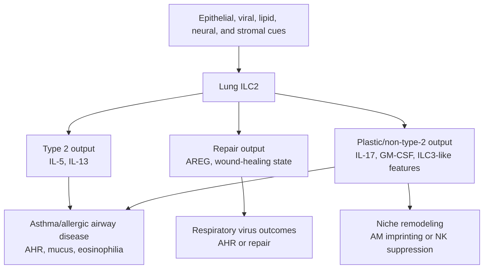

# ILC2 Roles In Pulmonary Disease

## Scope

This topic page describes how `ILC2s` are represented in the current `ILC_in_lung` wiki as disease-relevant cells in lung and airway contexts. It focuses on asthma/allergic airway inflammation, respiratory viral infection, post-viral repair, airway hyperreactivity, macrophage niche effects, and plastic or non-type-2 ILC2-like states.

This page is more detailed than the [ILC2 Working Model](../digests/2026-04-20_ILC2_working_model.md), but it is still a working synthesis. Claims should be checked against the linked source pages before use in manuscripts or figures.

## Evidence tags

#cell/ILC2 #tissue/lung #outcome/airway_hyperresponsiveness #outcome/infection #outcome/repair #outcome/inflammation #axis/ILC_lung_infection #axis/ILC_airway_inflammation #axis/ILC_plasticity

## Confidence snapshot

- High confidence:
  the local source set supports ILC2s as major contributors to type 2 airway inflammation, allergic asthma-like responses, and airway hyperresponsiveness.
- High confidence:
  the source set also supports reparative or tissue-protective ILC2 roles after respiratory viral injury.
- Medium confidence:
  ILC2 disease function is shaped by memory-like behavior, metabolic state, neuroimmune inputs, epithelial alarmins, and macrophage/niche interactions.
- Medium confidence:
  ILC2s can deviate from canonical type 2 output toward IL-17-producing or ILC3-like states in selected inflammatory contexts.
- Low confidence:
  the exact equivalence between mouse lung ILC2 states and human asthma or nasal-polyp ILC2 states remains unresolved in this wiki.

## Established observations

### Asthma and allergic airway inflammation

- In the local source set, asthma is the dominant disease setting for pathogenic ILC2 activity.
- ILC2s are linked to rapid type 2 cytokine output, especially IL-5 and IL-13, and to airway hyperresponsiveness and mucus-related pathology in multiple asthma/allergic airway sources, including [Decoding innate lymphoid cells and innate-like lymphocytes in asthma pathways to mechanisms and therapies](../sources/2025_decoding_innate_lymphoid_cells_and_innate_like_lymphocytes_in_asthma_pathways_to_mech.md), [Innate lymphoid cells and asthma](../sources/2014_innate_lymphoid_cells_and_asthma.md), and [Innate lymphoid cells in asthma pathophysiological insights from murine models to human asthma phenotypes](../sources/2019_innate_lymphoid_cells_in_asthma_pathophysiological_insights_from_murine_models_to_human_asthma_phenotypes.md).
- [Allergen-Experienced Group 2 Innate Lymphoid Cells Acquire Memory-like Properties and Enhance Allergic Lung Inflammation](../sources/2016_allergen_experienced_group_2_innate_lymphoid_cells_acquire_memory_like_properties_and.md) supports a disease-amplifying memory-like ILC2 branch in allergic lung inflammation.
- [Innate lymphoid cells contribute to allergic airway disease exacerbation by obesity](../sources/2016_innate_lymphoid_cells_contribute_to_allergic_airway_disease_exacerbation_by_obesity.md) supports obesity as a mouse-model context in which allergic airway disease is exacerbated and both ILC2 and ILC3 responses can be altered; it should not be generalized to all human obesity-asthma phenotypes without direct human evidence.
- [Kinetics of the accumulation of group 2 innate lymphoid cells in IL-33-induced and IL-25-induced murine models of asthma a potential role for the chemokine CXCL16](../sources/2019_kinetics_of_the_accumulation_of_group_2_innate_lymphoid_cells_in_il_33_induced_and_il_25_induced_murine_models_o.md) places ILC2 accumulation within IL-33/IL-25 airway models and links the process to CXCL16 as a candidate recruitment or positioning cue.
- Lipid mediator sources such as [Lung type 2 innate lymphoid cells express cysteinyl leukotriene receptor 1 which regulates TH2 cytokine production](../sources/2013_lung_type_2_innate_lymphoid_cells_express_cysteinyl_leukotriene_receptor_1_which_regu.md) and [Cysteinyl leukotriene E(4) activates human group 2 innate lymphoid cells and enhances the effect of prostaglandin D(2) and epithelial cytokines](../sources/2017_cysteinyl_leukotriene_e4_activates_human_group_2_innate_lymphoid_cells_and_enhances_the_effect_of_prostaglandin.md) support a lipid-amplified ILC2 activation branch.

### Respiratory viral infection and repair

- [Innate lymphoid cells mediate influenza-induced airway hyper-reactivity independently of adaptive immunity](../sources/2011_innate_lymphoid_cells_mediate_influenza_induced_airway_hyper_reactivity_independently.md) supports a viral-triggered ILC axis that can drive airway hyperreactivity independently of adaptive immunity.
- [Innate lymphoid cells promote lung-tissue homeostasis after infection with influenza virus](../sources/2011_innate_lymphoid_cells_promote_lung_tissue_homeostasis_after_infection_with_influenza.md) supports the complementary idea that lung ILCs can promote tissue homeostasis and repair after influenza injury.
- [BATF promotes group 2 innate lymphoid cell-mediated lung tissue protection during acute respiratory virus infection](../sources/2022_batf_promotes_group_2_innate_lymphoid_cell_mediated_lung_tissue_protection_during_acu.md) refines the repair branch by connecting BATF, wound-healing-enriched ILC2 states, and tissue protection during acute respiratory viral infection.
- [Pulmonary IL-33 orchestrates innate immune cells to mediate respiratory syncytial virus-evoked airway hyperreactivity and eosinophilia](../sources/2020_pulmonary_il_33_orchestrates_innate_immune_cells_to_mediate_respiratory_syncytial_virus_evoked_airway_hyperreact.md) supports an RSV-associated IL-33-ILC2-IL-13 airway hyperreactivity branch that should be curated separately from influenza repair biology.
- [IL-1beta prevents ILC2 expansion, type 2 cytokine secretion, and mucus metaplasia in response to early-life rhinovirus infection in mice](../sources/2020_il_1beta_prevents_ilc2_expansion_type_2_cytokine_secretion_and_mucus_metaplasia_in_response_to_early_life_rhinov.md) shows that early-life viral airway disease can include ILC2-dependent type 2 pathology but also cytokine brakes that restrain ILC2 expansion and mucus outcomes.
- [Dampening type 2 properties of group 2 innate lymphoid cells by a gammaherpesvirus infection reprograms alveolar macrophages](../sources/2023_dampening_type_2_properties_of_group_2_innate_lymphoid_cells_by_a_gammaherpesvirus_in.md) supports a non-canonical infection-conditioned ILC2 role: reduced type 2 output but increased GM-CSF-dependent imprinting of monocyte-derived alveolar macrophages.

### Non-type-2 and plastic disease states

- [IL-17-producing ST2(+) group 2 innate lymphoid cells play a pathogenic role in lung inflammation](../sources/2019_il_17_producing_st2_group_2_innate_lymphoid_cells_play_a_pathogenic_role_in_lung_inflammation.md) supports an IL-17-producing ST2+ ILC2-like pathogenic branch in lung inflammation.
- [IL-1beta, IL-23, and TGF-beta drive plasticity of human ILC2s towards IL-17-producing ILCs in nasal inflammation](../sources/2019_il_1beta_il_23_and_tgf_beta_drive_plasticity_of_human_ilc2s_towards_il_17_producing_ilcs_in_nasal_inflammation.md) supports the broader concept that inflammatory cytokine combinations can shift human ILC2s toward IL-17-producing programs, although nasal inflammation should not be treated as direct lung evidence.
- [c-Kit-positive ILC2s exhibit an ILC3-like signature that may contribute to IL-17-mediated pathologies](../sources/2019_c_kit_positive_ilc2s_exhibit_an_ilc3_like_signature_that_may_contribute_to_il_17_medi.md) supports a c-Kit+ ILC2/ILC3-like interface that may matter for IL-17-linked pathology.
- [Mechanics-activated fibroblasts promote pulmonary group 2 innate lymphoid cell plasticity propelling silicosis progression](../sources/2024_mechanics_activated_fibroblasts_promote_pulmonary_group_2_innate_lymphoid_cell_plasti.md) supports a silicosis branch in which mechanically activated fibroblasts promote ILC2 plasticity toward ILC1-like inflammatory output; this should not be merged into allergic asthma without the silicosis/fibrosis label.

### Niche-positioned and interferon-regulated disease roles

- [Adventitial Stromal Cells Define Group 2 Innate Lymphoid Cell Tissue Niches](../sources/2019_adventitial_stromal_cells_define_group_2_innate_lymphoid_cell_tissue_niches.md) reframes lung ILC2 disease activity as niche-positioned: ILC2s sit near ASCs that provide IL-33/TSLP and receive reciprocal IL-13-linked feedback.
- [Chitin activates parallel immune modules that direct distinct inflammatory responses via innate lymphoid type 2 and gamma delta T cells](../sources/2014_chitin_activates_parallel_immune_modules_that_direct_distinct_inflammatory_responses_via_innate_lymphoid_type_2.md) supports a model in which ILC2s drive eosinophil/AAM type 2 inflammation while restraining a parallel IL-17A/neutrophil module.
- [IFN-gamma increases susceptibility to influenza A infection through suppression of group II innate lymphoid cells](../sources/2018_ifn_gamma_increases_susceptibility_to_influenza_a_infection_through_suppression_of_group_ii_innate_lymphoid_cell.md) adds a viral-protection branch: IFN-gamma can suppress protective ILC2 IL-5/amphiregulin output during H1N1 infection without changing viral clearance in the reported mouse model.
- [Interferon gamma constrains type 2 lymphocyte niche boundaries during mixed inflammation](../sources/2022_interferon_gamma_constrains_type_2_lymphocyte_niche_boundaries_during_mixed_inflammation.md) adds a mixed-inflammation branch in which IFN-gamma confines ILC2/Th2 cells to adventitial niches and limits pathogen-associated mortality.

### Tumor and innate checkpoint context

- [ILC2-driven innate immune checkpoint mechanism antagonizes NK cell antimetastatic function in the lung](../sources/2020_ilc2_driven_innate_immune_checkpoint_mechanism_antagonizes_nk_cell_antimetastatic_fun.md) adds a non-asthma pulmonary disease branch where ILC2-associated checkpoint biology can suppress NK-cell antimetastatic function in the lung.

## Interpretation

The safest disease-level model is that ILC2s are lung tissue-response amplifiers whose role depends on the type of epithelial injury, inflammatory context, and timing. In allergic asthma, ILC2s are usually disease-amplifying through IL-5/IL-13, mucus, eosinophilia, and airway hyperresponsiveness. In respiratory viral infection, ILC2s are context-dependent: they can contribute to airway hyperreactivity, but they can also promote tissue repair and protective resolution programs.

The disease interpretation should separate three layers:

- `cell abundance`:
  whether ILC2s expand or accumulate in lung, airway, sputum, blood, or tissue.
- `effector output`:
  whether ILC2s produce IL-5, IL-13, amphiregulin, IL-17, GM-CSF, or other mediators.
- `disease outcome`:
  whether the measured result is airway hyperresponsiveness, mucus metaplasia, eosinophilia, neutrophilia, lung injury, repair, or tumor control.

Treating these layers as interchangeable would overstate the evidence.

## Contradiction and supersession

- Contradiction:
  ILC2s can worsen airway inflammation in asthma models but support repair after viral injury. These are context-specific roles, not mutually exclusive claims.
- Contradiction:
  ILC2s are commonly type 2 cytokine producers, but multiple sources point to plastic IL-17-producing or ILC3-like disease states.
- Contradiction:
  viral infection can either trigger ILC-associated airway hyperreactivity or dampen type 2 ILC2 properties depending on viral model and timing.
- Supersession:
  no current source supersedes the full ILC2 disease model. The working strategy is to partition by disease, species, model, and timepoint.

## Open questions

- Which ILC2 disease branch is most relevant to the user's current project: allergic asthma, respiratory virus infection, repair, or macrophage/niche reprogramming?
- In the project data, are ILC2s measured by flow phenotype, scRNA-seq cluster, cytokine protein, or inferred marker score?
- Are the project-relevant ILC2s canonical type 2 cells, memory-like cells, repair-like cells, or IL-17/ILC3-like plastic cells?
- Does the local dataset distinguish resident lung ILC2s from recruited or tissue-conditioned ILC2s?
- Which disease endpoint matters most: AHR, mucus, eosinophilia, neutrophilia, epithelial repair, macrophage state, or tissue damage?

## Related pages

- [ILC2 Working Model](../digests/2026-04-20_ILC2_working_model.md)
- [Role Of ILC In Pulmonary Diseases](../digests/2026-04-20_ILC_pulmonary_disease_roles.md)
- [ILC2 Functional Regulation Mechanisms](./ILC2_functional_regulation_mechanisms.md)
- [ILC In Lung](./ILC_in_lung.md)

## Next ingest targets

- Manually review the core ILC2 asthma papers and separate mouse perturbation evidence from human association evidence.
- Manually review respiratory virus ILC2 papers by timepoint: acute AHR, tissue repair, and post-infection macrophage/niche imprinting.
- Build an `ILC2` entity page after source-level review of the main disease and mechanism branches.
