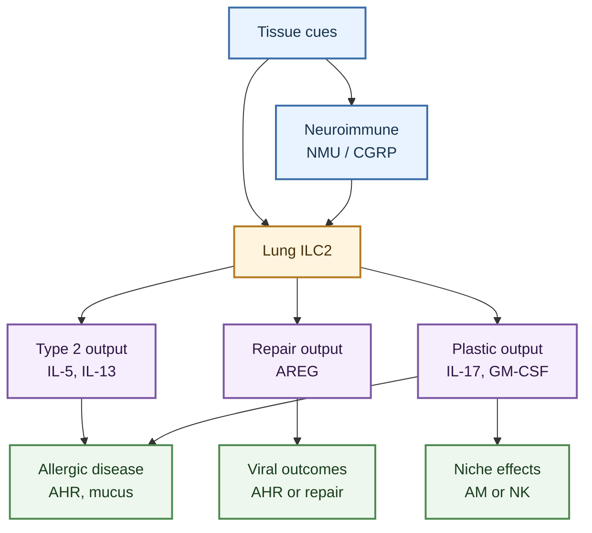

---
tags:
  - cell/ILC2
  - tissue/lung
  - outcome/airway_hyperresponsiveness
  - outcome/infection
  - outcome/repair
  - outcome/inflammation
  - axis/ILC_lung_infection
  - axis/ILC_airway_inflammation
  - axis/ILC_plasticity
---

# ILC2 Roles In Pulmonary Disease

## Scope

This topic page describes how `ILC2s` are represented in the current `ILC_in_lung` wiki as disease-relevant cells in lung and airway contexts. It focuses on asthma/allergic airway inflammation, respiratory viral infection, post-viral repair, airway hyperreactivity, macrophage niche effects, and plastic or non-type-2 ILC2-like states.

This page expands the disease branch of [ILC2](../entities/ILC2.md). Use the entity page for the canonical cell-level model, then use this topic when the question is specifically about disease context and pathology.

## Evidence tags

`#cell/ILC2` `#tissue/lung` `#outcome/airway_hyperresponsiveness` `#outcome/infection` `#outcome/repair` `#outcome/inflammation` `#axis/ILC_lung_infection` `#axis/ILC_airway_inflammation` `#axis/ILC_plasticity`

## Confidence snapshot

- High confidence:
  the local source set supports ILC2s as major contributors to type 2 airway inflammation, allergic asthma-like responses, and airway hyperresponsiveness.
- High confidence:
  the source set also supports reparative or tissue-protective ILC2 roles after respiratory viral injury.
- Medium confidence:
  ILC2 disease function is shaped by memory-like behavior, metabolic state, neuroimmune inputs, epithelial alarmins, and macrophage/niche interactions.
- Medium confidence:
  ILC2s can deviate from canonical type 2 output toward IL-17-producing or ILC3-like states in selected inflammatory contexts.
- Low confidence:
  the exact equivalence between mouse lung ILC2 states and human asthma or nasal-polyp ILC2 states remains unresolved in this wiki.

## Established observations

### Asthma and allergic airway inflammation

- In the local source set, asthma is the dominant disease setting for pathogenic ILC2 activity.
- ILC2s are linked to rapid type 2 cytokine output, especially IL-5 and IL-13, and to airway hyperresponsiveness and mucus-related pathology in multiple asthma/allergic airway sources, including [Decoding innate lymphoid cells and innate-like lymphocytes in asthma pathways to mechanisms and therapies](../sources/2025_decoding_innate_lymphoid_cells_and_innate_like_lymphocytes_in_asthma_pathways_to_mech.md), [Innate lymphoid cells and asthma](../sources/2014_innate_lymphoid_cells_and_asthma.md), [Innate lymphoid cells in asthma pathophysiological insights from murine models to human asthma phenotypes](../sources/2019_innate_lymphoid_cells_in_asthma_pathophysiological_insights_from_murine_models_to_human_asthma_phenotypes.md), and the review-level asthma regulation map [Group 2 Innate Lymphoid Cells: Team Players in Regulating Asthma](../sources/2021_group_2_innate_lymphoid_cells_team_players_in_regulating_asthma.md).
- [Allergen-Experienced Group 2 Innate Lymphoid Cells Acquire Memory-like Properties and Enhance Allergic Lung Inflammation](../sources/2016_allergen_experienced_group_2_innate_lymphoid_cells_acquire_memory_like_properties_and.md) supports a disease-amplifying memory-like ILC2 branch in allergic lung inflammation.
- [Innate lymphoid cells contribute to allergic airway disease exacerbation by obesity](../sources/2016_innate_lymphoid_cells_contribute_to_allergic_airway_disease_exacerbation_by_obesity.md) supports obesity as a mouse-model context in which allergic airway disease is exacerbated and both ILC2 and ILC3 responses can be altered; it should not be generalized to all human obesity-asthma phenotypes without direct human evidence.
- [Kinetics of the accumulation of group 2 innate lymphoid cells in IL-33-induced and IL-25-induced murine models of asthma a potential role for the chemokine CXCL16](../sources/2019_kinetics_of_the_accumulation_of_group_2_innate_lymphoid_cells_in_il_33_induced_and_il_25_induced_murine_models_o.md) places ILC2 accumulation within IL-33/IL-25 airway models and links the process to CXCL16 as a candidate recruitment or positioning cue.
- Lipid mediator sources such as [Lung type 2 innate lymphoid cells express cysteinyl leukotriene receptor 1 which regulates TH2 cytokine production](../sources/2013_lung_type_2_innate_lymphoid_cells_express_cysteinyl_leukotriene_receptor_1_which_regu.md) and [Cysteinyl leukotriene E(4) activates human group 2 innate lymphoid cells and enhances the effect of prostaglandin D(2) and epithelial cytokines](../sources/2017_cysteinyl_leukotriene_e4_activates_human_group_2_innate_lymphoid_cells_and_enhances_the_effect_of_prostaglandin.md) support a lipid-amplified ILC2 activation branch.
- Human and therapeutic asthma comparators sharpen this branch: [ICOS-ligand interaction is required for type 2 innate lymphoid cell function, homeostasis, and induction of airway hyperreactivity](../sources/2015_icos_icos_ligand_interaction_is_required_for_type_2_innate_lymphoid_cell_function_homeostasis_and_induction_of_a.md) adds an ILC2 costimulatory and homeostatic amplifier of airway disease, [The Role of the TL1A/DR3 Axis in the Activation of Group 2 Innate Lymphoid Cells in Subjects with Eosinophilic Asthma](../sources/2020_the_role_of_the_tl1a_dr3_axis_in_the_activation_of_group_2_innate_lymphoid_cells_in_subjects_with_eosinophilic_a.md) links airway eosinophilic asthma to a TL1A/DR3 activation axis, [Fevipiprant, a selective prostaglandin D2 receptor 2 antagonist, inhibits human group 2 innate lymphoid cell aggregation and function](../sources/2019_fevipiprant_a_selective_prostaglandin_d2_receptor_2_antagonist_inhibits_human_group_2_innate_lymphoid_cell_aggre.md) defines a human DP2-blockade branch, and [Lipid-Droplet Formation Drives Pathogenic Group 2 Innate Lymphoid Cells in Airway Inflammation](../sources/2020_lipid_droplet_formation_drives_pathogenic_group_2_innate_lymphoid_cells_in_airway_inf.md) shows that pathogenic airway ILC2 states are metabolically specialized rather than generic.
- [Pulmonary environmental cues drive group 2 innate lymphoid cell dynamics in mice and humans](../sources/2019_pulmonary_environmental_cues_drive_group_2_innate_lymphoid_cell_dynamics_in_mice_and_human.md) adds a disease-positioning layer in which activated pulmonary ILC2s navigate peribronchial and perivascular niches through CCR8-CCL8 and collagen-I-dependent guidance.

- [A population of c-kit+ IL-17A+ ILC2s in sputum from individuals with severe asthma supports ILC2 to ILC3 trans-differentiation](../sources/2025_a_population_of_c_kit_il_17a_ilc2s_in_sputum_from_individuals_with_severe_asthma_supp.md) adds human severe-asthma sputum evidence that intermediate ILC2s with c-kit and IL-17A features are enriched in mixed granulocytic airway inflammation and associate with neutrophilia.
- [The molecular and epigenetic mechanisms of innate lymphoid cell (ILC) memory and its relevance for asthma](../sources/2021_the_molecular_and_epigenetic_mechanisms_of_innate_lymphoid_cell_ilc_memory_and_its_re.md) strengthens the allergen-memory branch by linking mouse memory-like ILC2 recall responses to chromatin accessibility and transcriptional preparedness programs.
- [Tissue-Restricted Adaptive Type 2 Immunity Is Orchestrated by Expression of the Costimulatory Molecule OX40L on Group 2 Innate Lymphoid Cells](../sources/2018_tissue_restricted_adaptive_type_2_immunity_is_orchestrated_by_expression_of_the_costimulatory_molecule_ox40l_on.md) adds a mouse ILC2-OX40L branch in which IL-33-activated ILC2s license tissue-restricted Th2/Treg responses during pulmonary type 2 inflammation.
- [ILC2s regulate adaptive Th2 cell functions via PD-L1 checkpoint control](../sources/2017_ilc2s_regulate_adaptive_th2_cell_functions_via_pd_l1_checkpoint_control.md) adds a mouse lung ILC2-PD-L1 branch in which activated ILC2s promote CD4 T-cell GATA3/IL-13 and primary helminth-associated type 2 immunity; this is a disease-relevant adaptive interface, not direct human asthma proof.
- [Cross-talk between ILC2 and Gata3high Tregs locally constrains adaptive type 2 immunity](../sources/2024_cross_talk_between_ilc2_and_gata3high_tregs_locally_constrains_adaptive_type_2_immuni.md) adds a lung type 2 restraint branch in which ILC2-supported Gata3high Tregs limit effector-memory Th2 expansion and allergic inflammation by tuning OX40L bioavailability on ILC2s.

- [IL-9 and Blimp-1 protect the transcriptional identity of group 2 innate lymphocytes in allergic asthma](../sources/2026_il_9_and_blimp_1_protect_the_transcriptional_identity_of_group_2_innate_lymphocytes_in_allergic_asthma.md) adds a mouse allergic-asthma ILC2 identity branch: IL-9-induced Blimp-1 supports IL-5/IL-13 type 2 output and limits type 1 cytokine deviation, while Blimp-1 loss also increases IL-9 and mast-cell recruitment.
- [Severe asthma is characterized by a sex-specific ILC landscape and aberrant airway profile that is suppressed by anti-IL-5/5Ralpha biologics](../sources/2025_severe_asthma_is_characterized_by_a_sex_specific_ilc_landscape_and_aberrant_airway_pr.md) adds human severe-asthma blood/sputum evidence that airway ILC2 signatures, more than blood ILC2 signatures, align with reduced lung function; anti-IL-5/5Ralpha biologics selectively reduce IL-5+/IL-13+ airway ILCs without reducing core airway ILC2 abundance.
### Respiratory viral infection and repair

- [Innate lymphoid cells mediate influenza-induced airway hyper-reactivity independently of adaptive immunity](../sources/2011_innate_lymphoid_cells_mediate_influenza_induced_airway_hyper_reactivity_independently.md) supports a viral-triggered ILC axis that can drive airway hyperreactivity independently of adaptive immunity.
- [Innate lymphoid cells promote lung-tissue homeostasis after infection with influenza virus](../sources/2011_innate_lymphoid_cells_promote_lung_tissue_homeostasis_after_infection_with_influenza.md) supports the complementary idea that lung ILCs can promote tissue homeostasis and repair after influenza injury.
- [Innate lymphoid cells in lung infection and immunity](../sources/2018_innate_lymphoid_cells_in_lung_infection_and_immunity.md) is useful as a review-level route across viral, bacterial, fungal, and helminth lung-infection contexts, but primary infection sources should anchor mediator-specific claims.
- [Innate lymphoid cells integrate sensing and plasticity to control fungal infections](../sources/2026_innate_lymphoid_cells_integrate_sensing_and_plasticity_to_control_fungal_infections.md) provides primary mouse pulmonary fungal-infection evidence for ILC sensing, antifungal response modulation, and cytokine-driven ILC plasticity.
- [BATF promotes group 2 innate lymphoid cell-mediated lung tissue protection during acute respiratory virus infection](../sources/2022_batf_promotes_group_2_innate_lymphoid_cell_mediated_lung_tissue_protection_during_acu.md) refines the repair branch by connecting BATF, wound-healing-enriched ILC2 states, and tissue protection during acute respiratory viral infection.
- [Pulmonary IL-33 orchestrates innate immune cells to mediate respiratory syncytial virus-evoked airway hyperreactivity and eosinophilia](../sources/2020_pulmonary_il_33_orchestrates_innate_immune_cells_to_mediate_respiratory_syncytial_virus_evoked_airway_hyperreact.md) supports an RSV-associated IL-33-ILC2-IL-13 airway hyperreactivity branch that should be interpreted separately from influenza repair biology.
- [IL-1beta prevents ILC2 expansion, type 2 cytokine secretion, and mucus metaplasia in response to early-life rhinovirus infection in mice](../sources/2020_il_1beta_prevents_ilc2_expansion_type_2_cytokine_secretion_and_mucus_metaplasia_in_response_to_early_life_rhinov.md) shows that early-life viral airway disease can include ILC2-dependent type 2 pathology but also cytokine brakes that restrain ILC2 expansion and mucus outcomes.
- [Dampening type 2 properties of group 2 innate lymphoid cells by a gammaherpesvirus infection reprograms alveolar macrophages](../sources/2023_dampening_type_2_properties_of_group_2_innate_lymphoid_cells_by_a_gammaherpesvirus_in.md) supports a non-canonical infection-conditioned ILC2 role: reduced type 2 output but increased GM-CSF-dependent imprinting of monocyte-derived alveolar macrophages.
- [Innate type 2 lymphocytes trigger an inflammatory switch in alveolar macrophages](../sources/2026_innate_type_2_lymphocytes_trigger_an_inflammatory_switch_in_alveolar_macrophages.md) adds a distinct lung niche-remodeling branch in which IL-33-activated ILC2-derived IL-13 reprograms tissue-resident alveolar macrophages toward an IRF4-driven inflammatory state.

### Non-type-2 and plastic disease states

- [IL-17-producing ST2(+) group 2 innate lymphoid cells play a pathogenic role in lung inflammation](../sources/2019_il_17_producing_st2_group_2_innate_lymphoid_cells_play_a_pathogenic_role_in_lung_inflammation.md) supports an IL-17-producing ST2+ ILC2-like pathogenic branch in lung inflammation.
- [IL-1beta, IL-23, and TGF-beta drive plasticity of human ILC2s towards IL-17-producing ILCs in nasal inflammation](../sources/2019_il_1beta_il_23_and_tgf_beta_drive_plasticity_of_human_ilc2s_towards_il_17_producing_ilcs_in_nasal_inflammation.md) supports the broader concept that inflammatory cytokine combinations can shift human ILC2s toward IL-17-producing programs, although nasal inflammation should not be treated as direct lung evidence.
- [c-Kit-positive ILC2s exhibit an ILC3-like signature that may contribute to IL-17-mediated pathologies](../sources/2019_c_kit_positive_ilc2s_exhibit_an_ilc3_like_signature_that_may_contribute_to_il_17_medi.md) supports a c-Kit+ ILC2/ILC3-like interface that may matter for IL-17-linked pathology.
- [Mechanics-activated fibroblasts promote pulmonary group 2 innate lymphoid cell plasticity propelling silicosis progression](../sources/2024_mechanics_activated_fibroblasts_promote_pulmonary_group_2_innate_lymphoid_cell_plasti.md) supports a silicosis branch in which mechanically activated fibroblasts promote ILC2 plasticity toward ILC1-like inflammatory output; this should not be merged into allergic asthma without the silicosis/fibrosis label.

- [ILC2-derived LIF licences progress from tissue to systemic immunity](../sources/2024_ilc2_derived_lif_licences_progress_from_tissue_to_systemic_immunity.md) adds a lung immune-egress branch in which ILC2-derived LIF controls pulmonary lymphatic CCL21 and CCR7+ immune-cell migration to lymph nodes, with different consequences in viral infection versus chronic allergen challenge.
- [S1P-dependent interorgan trafficking of group 2 innate lymphoid cells supports host defense](../sources/2018_s1p_dependent_interorgan_trafficking_of_group_2_innate_lymphoid_cells_supports_host_d.md) adds mouse evidence that inflammatory ILC2s can reach lung from intestinal tissue through S1P-dependent trafficking during type 2 challenge.
### Niche-positioned and interferon-regulated disease roles

- [Adventitial Stromal Cells Define Group 2 Innate Lymphoid Cell Tissue Niches](../sources/2019_adventitial_stromal_cells_define_group_2_innate_lymphoid_cell_tissue_niches.md) reframes lung ILC2 disease activity as niche-positioned: ILC2s sit near ASCs that provide IL-33/TSLP and receive reciprocal IL-13-linked feedback.
- [Pulmonary environmental cues drive group 2 innate lymphoid cell dynamics in mice and humans](../sources/2019_pulmonary_environmental_cues_drive_group_2_innate_lymphoid_cell_dynamics_in_mice_and_human.md) adds that activated pulmonary ILC2s are not only niche-positioned but dynamically guided by chemokine and extracellular-matrix cues.
- [Innate type 2 lymphocytes trigger an inflammatory switch in alveolar macrophages](../sources/2026_innate_type_2_lymphocytes_trigger_an_inflammatory_switch_in_alveolar_macrophages.md) shows that niche consequences can extend beyond cell positioning: activated ILC2s can directly reprogram tissue-resident alveolar macrophage state and thereby remodel the inflammatory alveolar compartment.
- [Chitin activates parallel immune modules that direct distinct inflammatory responses via innate lymphoid type 2 and gamma delta T cells](../sources/2014_chitin_activates_parallel_immune_modules_that_direct_distinct_inflammatory_responses_via_innate_lymphoid_type_2.md) supports a model in which ILC2s drive eosinophil/AAM type 2 inflammation while restraining a parallel IL-17A/neutrophil module.
- [IFN-gamma increases susceptibility to influenza A infection through suppression of group II innate lymphoid cells](../sources/2018_ifn_gamma_increases_susceptibility_to_influenza_a_infection_through_suppression_of_group_ii_innate_lymphoid_cell.md) adds a viral-protection branch: IFN-gamma can suppress protective ILC2 IL-5/amphiregulin output during H1N1 infection without changing viral clearance in the reported mouse model.
- [Interferon gamma constrains type 2 lymphocyte niche boundaries during mixed inflammation](../sources/2022_interferon_gamma_constrains_type_2_lymphocyte_niche_boundaries_during_mixed_inflammation.md) adds a mixed-inflammation branch in which IFN-gamma confines ILC2/Th2 cells to adventitial niches and limits pathogen-associated mortality.

### Tumor and innate checkpoint context

- [ILC2-driven innate immune checkpoint mechanism antagonizes NK cell antimetastatic function in the lung](../sources/2020_ilc2_driven_innate_immune_checkpoint_mechanism_antagonizes_nk_cell_antimetastatic_fun.md) adds a non-asthma pulmonary disease branch where ILC2-associated checkpoint biology can suppress NK-cell antimetastatic function in the lung.
- [Long-acting muscarinic antagonist regulates group 2 innate lymphoid cell-dependent airway eosinophilic inflammation](../sources/2021_long_acting_muscarinic_antagonist_regulates_group_2_innate_lymphoid_cell_dependent_ai.md) and [Cannabinoid receptor 2 engagement promotes group 2 innate lymphoid cell expansion and enhances airway hyperreactivity](../sources/2022_cannabinoid_receptor_2_engagement_promotes_group_2_innate_lymphoid_cell_expansion_and_enhances_airway_hyperreact.md) show that airway ILC2 disease can also be modulated by therapeutic cholinergic blockade or receptor-level cannabinoid amplification.

- [Mesenchymal Stem Cells Suppress Severe Asthma by Directly Regulating Th2 Cells and Type 2 Innate Lymphoid Cells](../sources/2021_mesenchymal_stem_cells_suppress_severe_asthma_by_directly_regulating_th2_cells_and_ty.md) and [Vitamin D3 resolved human and experimental asthma via B lymphocyte-induced maturation protein 1 in T cells and innate lymphoid cells](../sources/2023_vitamin_d3_resolved_human_and_experimental_asthma_via_b_lymphocyte_induced_maturation_protein_1_in_t_cells_and_i.md) add restraint branches for type 2 asthma, but neither should be treated as ILC2-exclusive clinical proof.
## Therapy and Extrapulmonary Mechanism Context

- [Immunotherapy for asthma](../sources/2025_immunotherapy_for_asthma.md) supports endotype-aware therapy framing for asthma, but it should not be treated as primary evidence for a specific ILC2 mechanism.
- Gut ILC2 sources now add AHR, RXRgamma, ADM2, and tuft-cell IL-17RB/IL-25 regulatory branches. These are useful comparators for type 2 restraint, repair, and alarmin bioavailability, but direct pulmonary disease claims require lung, airway, sputum, BAL, or bronchial evidence.

## Interpretation

The safest disease-level model is that ILC2s are lung tissue-response amplifiers whose role depends on the type of epithelial injury, inflammatory context, and timing. In allergic asthma, ILC2s are usually disease-amplifying through IL-5/IL-13, mucus, eosinophilia, and airway hyperresponsiveness. In respiratory viral infection, ILC2s are context-dependent: they can contribute to airway hyperreactivity, but they can also promote tissue repair and protective resolution programs.

The disease interpretation should separate three layers:

- `cell abundance`:
  whether ILC2s expand or accumulate in lung, airway, sputum, blood, or tissue.
- `effector output`:
  whether ILC2s produce IL-5, IL-13, amphiregulin, IL-17, GM-CSF, or other mediators.
- `disease outcome`:
  whether the measured result is airway hyperresponsiveness, mucus metaplasia, eosinophilia, neutrophilia, lung injury, repair, or tumor control.

Treating these layers as interchangeable would overstate the evidence.

## Contradiction and supersession

- Contradiction:
  ILC2s can worsen airway inflammation in asthma models but support repair after viral injury. These are context-specific roles, not mutually exclusive claims.
- Contradiction:
  ILC2s are commonly type 2 cytokine producers, but multiple sources point to plastic IL-17-producing or ILC3-like disease states.
- Contradiction:
  viral infection can either trigger ILC-associated airway hyperreactivity or dampen type 2 ILC2 properties depending on viral model and timing.
- Supersession:
  no current source supersedes the full ILC2 disease model. The working strategy is to partition by disease, species, model, and timepoint.

## Open questions

- Which ILC2 disease branch is most relevant to the user's current project: allergic asthma, respiratory virus infection, repair, or macrophage/niche reprogramming?
- In the project data, are ILC2s measured by flow phenotype, scRNA-seq cluster, cytokine protein, or inferred marker score?
- Are the project-relevant ILC2s canonical type 2 cells, memory-like cells, repair-like cells, or IL-17/ILC3-like plastic cells?
- Does the local dataset distinguish resident lung ILC2s from recruited or tissue-conditioned ILC2s?
- Which disease endpoint matters most: AHR, mucus, eosinophilia, neutrophilia, epithelial repair, macrophage state, or tissue damage?

## Related pages

- [ILC2](../entities/ILC2.md)
- [Lung ILC Disease Roles Companion](../digests/2026-04-20_ILC_pulmonary_disease_roles.md)
- [ILC2 Functional Regulation Mechanisms](./ILC2_functional_regulation_mechanisms.md)
- [ILC In Lung](./ILC_in_lung.md)

## Future Expansion Directions

This short appendix highlights future literature directions rather than current disease conclusions. The most useful additions for later versions of this page would be:

- Primary asthma sources that cleanly separate mouse perturbation evidence from human association evidence.
- Respiratory-virus ILC2 studies resolved by timepoint, especially acute AHR, tissue repair, and post-infection macrophage or niche imprinting.
- Additional lung-compartment studies that sharpen human airway subsets, steroid-resistant asthma, and plastic IL-17 boundary states within [ILC2](../entities/ILC2.md).
