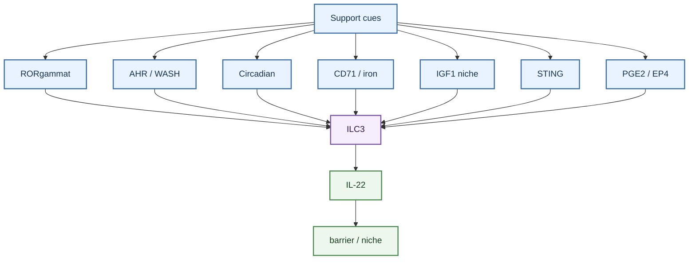
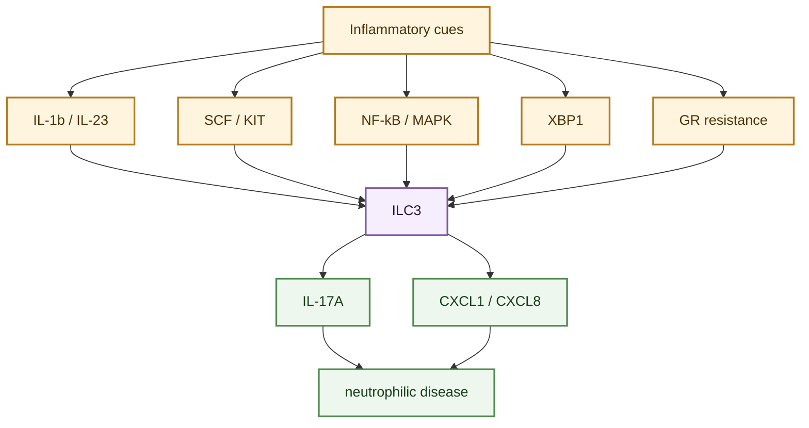
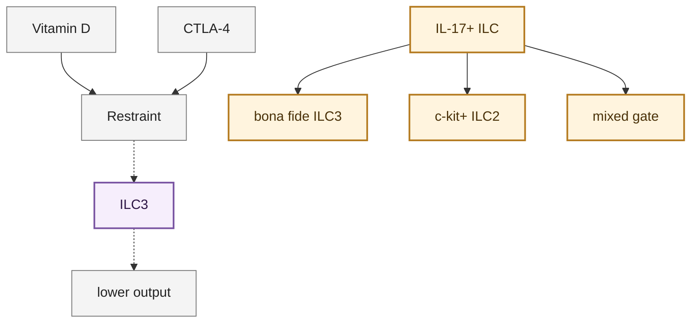

---
tags:
  - cell/ILC3
  - tissue/lung
  - tissue/gut
  - assay/flow
  - assay/RNAseq
  - assay/scRNAseq
  - assay/in_vivo
  - assay/in_vitro
  - outcome/infection
  - outcome/inflammation
  - outcome/airway_hyperresponsiveness
  - axis/ILC_lung_homeostasis
  - axis/ILC_airway_inflammation
  - axis/ILC_plasticity
---

# ILC3 Functional Regulation Mechanisms

## Scope

This topic page organizes mechanisms that regulate `ILC3` function in the current `ILC_in_lung` wiki. It focuses on cytokine activation, stromal niche control, transcriptional identity, circadian and metabolic regulation, vitamin D/IL-23 signaling, AHR, STING, ER stress, glucocorticoid resistance, and tissue-context boundaries.

For disease outcomes, see [ILC3 Roles In Pulmonary Disease](./ILC3_roles_in_pulmonary_disease.md).

## Evidence tags

`#cell/ILC3` `#tissue/lung` `#tissue/gut` `#assay/flow` `#assay/RNAseq` `#assay/scRNAseq` `#assay/in_vivo` `#assay/in_vitro` `#outcome/infection` `#outcome/inflammation` `#outcome/airway_hyperresponsiveness` `#axis/ILC_lung_homeostasis` `#axis/ILC_airway_inflammation` `#axis/ILC_plasticity`

## Confidence snapshot

- High confidence:
  IL-1beta, IL-23, RORgammat-associated identity, IL-22, and IL-17A are central organizing concepts for ILC3 regulation in the source set.
- High confidence:
  pulmonary ILC3 function can be shaped by stromal niches, including IGF1 in newborn lung and SCF/KIT signaling in neutrophilic asthma.
- Medium confidence:
  circadian control, vitamin D, AHR, STING, nutrition/iron, and ER-stress pathways are important cross-tissue ILC3 regulatory mechanisms.
- Medium confidence:
  gut/mucosal ILC3 regulation also includes RANKL/RANK restraint, FFAR2 metabolite sensing, VIP neuroimmune circuits, trained ILC3 defense states, and HB-EGF tissue-protection output; these are mechanism context unless matched lung evidence is present.
- Medium-high confidence:
  BACH2-PPARgamma and LINGO4-linked pathways support metabolic/homeostatic control of gut ILC3s, while dysbiosis and fungal-infection sources support lung-relevant type 3 inflammatory and plasticity branches ([BACH2 controls ILC3 function via PPARgamma-dependent mitochondrial metabolism](../sources/2026_bach2_controls_ilc3_function_via_ppargamma_dependent_mitochondrial_metabolism.md); [LINGO4 coordinates ILC3-intrinsic IL-22 production and microbiota-mediated ILC3 homeostasis](../sources/2026_lingo4_coordinates_ilc3_intrinsic_il_22_production_and_microbiota_mediated_ilc3_homeostasis.md); [Microbial dysbiosis sculpts a systemic ILC3/IL-17 axis governing lung inflammatory responses and central hematopoiesis](../sources/2025_microbial_dysbiosis_sculpts_a_systemic_ilc3_il_17_axis_governing_lung_inflammatory_re.md); [Innate lymphoid cells integrate sensing and plasticity to control fungal infections](../sources/2026_innate_lymphoid_cells_integrate_sensing_and_plasticity_to_control_fungal_infections.md)).

- Medium-high confidence:
  gut eosinophil-derived COX-2/PGE2 can enhance colonic ILC3 IL-22 through EP4 and protect epithelial barrier function in mouse colitis, adding a lipid-mediator crosstalk branch that remains gut-labeled ([Eosinophil-derived COX-2 protects against experimental colitis through the PGE2-IL-22 axis](../sources/2026_eosinophil_derived_cox_2_protects_against_experimental_colitis_through_the_pge2_il_22.md)).
- Medium-high confidence:
  activated peripheral/splenic ILC3s can promote CD4 T-cell and T-dependent B-cell responses through MHCII/costimulatory antigen presentation, contrasting with gut tolerogenic ILC3-MHCII outputs ([Activated group 3 innate lymphoid cells promote T-cell-mediated immune responses](../sources/2014_activated_group_3_innate_lymphoid_cells_promote_t_cell_mediated_immune_responses.md)).

- Medium confidence:
  glucocorticoid resistance in ILC3s is a disease-relevant regulatory mechanism for non-eosinophilic or steroid-resistant asthma.
- Low confidence:
  many detailed ILC3 regulatory mechanisms come from gut or mucosal sources and require explicit tissue labels before being applied to lung.

## Established observations

### Cytokine activation and effector output

- ILC3s are generally organized around RORgammat-associated identity and production of IL-22 and/or IL-17-family cytokines.
- [Activation of Type 3 innate lymphoid cells and interleukin 22 secretion in the lungs during Streptococcus pneumoniae infection](../sources/2014_activation_of_type_3_innate_lymphoid_cells_and_interleukin_22_secretion_in_the_lungs.md) supports IL-23-responsive lung ILC3 IL-22 production during bacterial infection.
- [Pulmonary fibroblast-derived stem cell factor promotes neutrophilic asthma by augmenting IL-17A production from ILC3s](../sources/2025_pulmonary_fibroblast_derived_stem_cell_factor_promotes_neutrophilic_asthma_by_augment.md) frames ILC3s as IL-1beta/IL-23-responsive cells capable of IL-17 and IL-22 production, with IL-17A linked to neutrophilic asthma outcomes.
- [Group 3 innate lymphoid cells secret neutrophil chemoattractants and are insensitive to glucocorticoid via aberrant GR phosphorylation](../sources/2023_group_3_innate_lymphoid_cells_secret_neutrophil_chemoattractants_and_are_insensitive.md) supports IL-1beta-induced CXCL8/CXCL1 production from ILC3s through NF-kappaB and MAPK-linked pathways.
- [Interleukin-17-producing innate lymphoid cells and the NLRP3 inflammasome facilitate obesity-associated airway hyperreactivity](../sources/2014_interleukin_17_producing_innate_lymphoid_cells_and_the_nlrp3_inflammasome_facilitate.md) adds an upstream macrophage-NLRP3-IL-1beta licensing branch for CCR6-positive IL-17-producing innate lymphoid cells in obesity-associated airway disease.

### Stromal and developmental niche regulation

- [Insulin-like Growth Factor 1 Supports a Pulmonary Niche that Promotes Type 3 Innate Lymphoid Cell Development in Newborn Lungs](../sources/2020_insulin_like_growth_factor_1_supports_a_pulmonary_niche_that_promotes_type_3_innate_lymphoid_cell_development_in.md) supports a pulmonary stromal niche mechanism in which alveolar fibroblast-derived IGF1 promotes postnatal lung ILC3 development.
- [Pulmonary fibroblast-derived stem cell factor promotes neutrophilic asthma by augmenting IL-17A production from ILC3s](../sources/2025_pulmonary_fibroblast_derived_stem_cell_factor_promotes_neutrophilic_asthma_by_augment.md) supports a disease-associated stromal mechanism in which pulmonary fibroblast-derived SCF augments ILC3 IL-17A production.
- Together, these sources suggest that stromal cells can support either development/homeostasis or inflammatory output depending on context.

- [Divergent ILC3 responses to PDGF-D control mucosal immunity](../sources/2026_divergent_ilc3_responses_to_pdgf_d_control_mucosal_immunity.md) reinforces species-aware ILC3 interpretation: PDGF-D can promote mouse IL-22/proliferation through PDGFRbeta but type 1-like TNF-alpha/IFN-gamma output through NKp44 engagement in humanized receptor context.
### Transcriptional identity and plasticity

- [Reciprocal transcription factor networks govern tissue-resident ILC3 subset function and identity](../sources/2021_reciprocal_transcription_factor_networks_govern_tissue_resident_ilc3_subset_function.md) supports transcription-factor-network control of ILC3 subset function and identity.
- [Circadian circuits control plasticity of group 3 innate lymphoid cells by sustaining epigenetic configuration of RORgammat](../sources/2025_circadian_circuits_control_plasticity_of_group_3_innate_lymphoid_cells_by_sustaining_epigenetic_configuration_of.md) supports circadian control of ILC3 identity through maintenance of RORgammat-associated epigenetic configuration, though this is primarily gut-context evidence.
- [WASH maintains NKp46+ ILC3 cells by promoting AHR expression](../sources/2017_wash_maintains_nkp46_ilc3_cells_by_promoting_ahr_expression.md) supports AHR-linked maintenance of an NKp46+ ILC3 branch.

### Taxonomy and IL-17 classification boundaries

- [Differentiation of type 1 ILCs from a common progenitor to all helper-like innate lymphoid cell lineages](../sources/2014_differentiation_of_type_1_ilcs_from_a_common_progenitor_to_all_helper_like_innate_lymphoid_cell_lineages.md) supports conservative separation of helper-like ILC lineages from conventional NK cells when interpreting ILC1-like, ILC2, and ILC3 states.
- [Tissue residency of innate lymphoid cells in lymphoid and nonlymphoid organs](../sources/2015_tissue_residency_of_innate_lymphoid_cells_in_lymphoid_and_nonlymphoid_organs.md) supports tissue residency as an organizing concept for ILC interpretation rather than assuming all ILC-like signals reflect circulating contamination.
- [c-Kit-positive ILC2s exhibit an ILC3-like signature that may contribute to IL-17-mediated pathologies](../sources/2019_c_kit_positive_ilc2s_exhibit_an_ilc3_like_signature_that_may_contribute_to_il_17_medi.md) is a classification warning: IL-17-producing ILC-like states can include ILC2/ILC3-like boundary populations and should not automatically be called bona fide ILC3s without marker and context support.

- [Interleukin-17D regulates group 3 innate lymphoid cell function through its receptor CD93](../sources/2021_interleukin_17d_regulates_group_3_innate_lymphoid_cell_function_through_its_receptor.md) supports a gut epithelial IL-17D/CD93 branch that promotes ILC3 IL-22 and antimicrobial peptide programs.
- [Nucleophosmin 1 promotes mucosal immunity by supporting mitochondrial oxidative phosphorylation and ILC3 activity](../sources/2024_nucleophosmin_1_promotes_mucosal_immunity_by_supporting_mitochondrial_oxidative_phosphorylation_and_ilc3_activit.md) supports a gut-labeled NPM1-p65-TFAM mitochondrial OXPHOS branch for ILC3 IL-22 activity.
### Vitamin D, AHR, STING, nutrition, and ER stress

- [Vitamin D downregulates the IL-23 receptor pathway in human mucosal group 3 innate lymphoid cells](../sources/2018_vitamin_d_downregulates_the_il_23_receptor_pathway_in_human_mucosal_group_3_innate_lymphoid_cells.md) supports vitamin D-mediated suppression of IL-23 pathway responses and ILC3 cytokine production in human mucosal ILC3s.
- [AHR drives the development of gut ILC22 cells and postnatal lymphoid tissues via pathways dependent on and independent of Notch](../sources/2012_ahr_drives_the_development_of_gut_ilc22_cells_and_postnatal_lymphoid_tissues_via_path.md) and [WASH maintains NKp46+ ILC3 cells by promoting AHR expression](../sources/2017_wash_maintains_nkp46_ilc3_cells_by_promoting_ahr_expression.md) support AHR as a recurring ILC3/ILC22 regulatory axis.
- [ILC3s sense gut microbiota through STING to initiate immune tolerance](../sources/2025_ilc3s_sense_gut_microbiota_through_sting_to_initiate_immune_tolerance.md) supports STING as a gut ILC3 microbiota-sensing/tolerance mechanism.
- [Nutrition impact on ILC3 maintenance and function centers on a cell-intrinsic CD71-iron axis](../sources/2023_nutrition_impact_on_ilc3_maintenance_and_function_centers_on_a_cell_intrinsic_cd71_iron_axis.md) supports a nutrition/iron-linked ILC3 maintenance branch.
- [The IRE1alphaXBP1 pathway sustains cytokine responses of group 3 innate lymphoid cells in inflammatory bowel disease](../sources/2024_the_ire1alpha_xbp1_pathway_sustains_cytokine_responses_of_group_3_innate_lymphoid_cells_in_inflammatory_bowel_di.md) supports an ER-stress/UPR-linked mechanism for ILC3 cytokine responses in IBD.
- [BACH2 controls ILC3 function via PPARgamma-dependent mitochondrial metabolism](../sources/2026_bach2_controls_ilc3_function_via_ppargamma_dependent_mitochondrial_metabolism.md) supports a gut ILC3 BACH2-PPARgamma-OXPHOS branch that sustains ILC3 function and colitis restraint in the reported systems.
- [LINGO4 coordinates ILC3-intrinsic IL-22 production and microbiota-mediated ILC3 homeostasis](../sources/2026_lingo4_coordinates_ilc3_intrinsic_il_22_production_and_microbiota_mediated_ilc3_homeostasis.md) supports a gut ILC3 LINGO4-STAT3/mitochondrial-fitness branch that coordinates IL-22 production and microbiota-dependent ILC3 homeostasis.

- [Eosinophil-derived COX-2 protects against experimental colitis through the PGE2-IL-22 axis](../sources/2026_eosinophil_derived_cox_2_protects_against_experimental_colitis_through_the_pge2_il_22.md) adds a gut lipid-mediator crosstalk branch in which eosinophil COX-2-derived PGE2 enhances EP4-dependent colonic ILC3 IL-22 output during experimental colitis.

### Gut/mucosal timing, metabolite, neuroimmune, and repair circuits

- [The Tumor Necrosis Factor Superfamily Member RANKL Suppresses Effector Cytokine Production in Group 3 Innate Lymphoid Cells](../sources/2018_the_tumor_necrosis_factor_superfamily_member_rankl_suppresses_effector_cytokine_production_in_group_3_innate_lym.md) supports a gut CCR6-positive ILC3 RANKL/RANK restraint branch that limits IL-17A and IL-22 output.
- [A circadian clock is essential for homeostasis of group 3 innate lymphoid cells in the gut](../sources/2019_a_circadian_clock_is_essential_for_homeostasis_of_group_3_innate_lymphoid_cells_in_th.md) and [Light-entrained and brain-tuned circadian circuits regulate ILC3s and gut homeostasis](../sources/2019_light_entrained_and_brain_tuned_circadian_circuits_regulate_ilc3s_and_gut_homeostasis.md) support circadian and organism-level timing control of intestinal ILC3 homeostasis.
- [Metabolite-Sensing Receptor Ffar2 Regulates Colonic Group 3 Innate Lymphoid Cells and Gut Immunity](../sources/2019_metabolite_sensing_receptor_ffar2_regulates_colonic_group_3_innate_lymphoid_cells_and.md) supports microbial-metabolite sensing through FFAR2 as a colonic ILC3 expansion and IL-22-output mechanism.
- [Feeding-dependent VIP neuron-ILC3 circuit regulates the intestinal barrier](../sources/2020_feeding_dependent_vip_neuron_ilc3_circuit_regulates_the_intestinal_barrier.md), [The neuropeptide VIP confers anticipatory mucosal immunity by regulating ILC3 activity](../sources/2020_the_neuropeptide_vip_confers_anticipatory_mucosal_immunity_by_regulating_ilc3_activit.md), and [Vasoactive intestinal peptide promotes host defense against enteric pathogens by modulating the recruitment of group 3 innate lymphoid cells](../sources/2021_vasoactive_intestinal_peptide_promotes_host_defense_against_enteric_pathogens_by_modu.md) show that VIP-linked neuroimmune control can either restrain IL-22 through VIPR2 or support ILC3 recruitment/defense through VPAC1 depending on receptor and context.
- [Trained ILC3 responses promote intestinal defense](../sources/2022_trained_ilc3_responses_promote_intestinal_defense.md) supports durable trained ILC3 defense after enteric challenge, while [Group 3 innate lymphoid cells produce the growth factor HB-EGF to protect the intestine from TNF-mediated inflammation](../sources/2022_group_3_innate_lymphoid_cells_produce_the_growth_factor_hb_egf_to_protect_the_intestine_from_tnf_mediated_inflam.md) adds an ILC3 growth-factor tissue-protection branch.
- [Activation and Suppression of Group 3 Innate Lymphoid Cells in the Gut](../sources/2020_activation_and_suppression_of_group_3_innate_lymphoid_cells_in_the_gut.md) is useful as review-level orientation for gut ILC3 regulatory inputs and brakes.
- [ZBTB46 defines and regulates ILC3s that protect the intestine](../sources/2022_zbtb46_defines_and_regulates_ilc3s_that_protect_the_intestine.md), [Context-dependent role of group 3 innate lymphoid cells in mucosal protection](../sources/2024_context_dependent_role_of_group_3_innate_lymphoid_cells_in_mucosal_protection.md), [Circadian circuits control plasticity of group 3 innate lymphoid cells by sustaining epigenetic configuration of RORgammat](../sources/2025_circadian_circuits_control_plasticity_of_group_3_innate_lymphoid_cells_by_sustaining_epigenetic_configuration_of.md), [Enteric GABAergic neuron-derived gamma-aminobutyric acid initiates expression of Igfbp7 to sustain ILC3 homeostasis](../sources/2025_enteric_gabaergic_neuron_derived_gamma_aminobutyric_acid_initiates_expression_of_igfbp7_to_sustain_ilc3_homeosta.md), and [ILC3s promote intestinal tuft cell hyperplasia and anthelmintic immunity through RANK signaling](../sources/2025_ilc3s_promote_intestinal_tuft_cell_hyperplasia_and_anthelmintic_immunity_through_rank.md) extend the gut ILC3 context around identity, timing, neuroimmune homeostasis, and epithelial crosstalk.

### Glucocorticoid resistance and inflammatory signaling

- [Group 3 innate lymphoid cells secret neutrophil chemoattractants and are insensitive to glucocorticoid via aberrant GR phosphorylation](../sources/2023_group_3_innate_lymphoid_cells_secret_neutrophil_chemoattractants_and_are_insensitive.md) supports a mechanism where ILC3 neutrophil chemoattractant production is glucocorticoid-insensitive and linked to altered glucocorticoid receptor phosphorylation.
- This source is especially important for steroid-resistant or non-eosinophilic asthma because it links cell function, inflammatory mediator production, and drug-response biology.

### Adaptive-immunity regulation

- [Innate lymphoid cells regulate CD4+ T-cell responses to intestinal commensal bacteria](../sources/2013_innate_lymphoid_cells_regulate_cd4_t_cell_responses_to_intestinal_commensal_bacteria.md) and [Group 3 innate lymphoid cells mediate intestinal selection of commensal bacteria-specific CD4+ T cells](../sources/2015_group_3_innate_lymphoid_cells_mediate_intestinal_selection_of_commensal_bacteria_specific_cd4_t_cells.md) support a gut ILC3-MHCII branch that restrains commensal-specific CD4 T-cell responses.
- [Innate lymphoid cells support regulatory T cells in the intestine through interleukin-2](../sources/2019_innate_lymphoid_cells_support_regulatory_t_cells_in_the_intestine_through_interleukin.md) and [ILC3s select microbiota-specific regulatory T cells to establish tolerance in the gut](../sources/2022_ilc3s_select_microbiota_specific_regulatory_t_cells_to_establish_tolerance_in_the_gut.md) support intestinal ILC3-Treg maintenance and selection branches.
- [Human CD40 ligand-expressing type 3 innate lymphoid cells induce IL-10-producing immature transitional regulatory B cells](../sources/2018_human_cd40_ligand_expressing_type_3_innate_lymphoid_cells_induce_il_10_producing_immature_transitional_regulator.md) supports a human tonsil/blood ILC3-CD40L/BAFF/IL-15 regulatory B-cell branch.

- [Activated group 3 innate lymphoid cells promote T-cell-mediated immune responses](../sources/2014_activated_group_3_innate_lymphoid_cells_promote_t_cell_mediated_immune_responses.md) adds an activating peripheral/splenic branch in which IL-1beta-activated NCR- ILC3s process antigen, express MHCII/costimulatory molecules, promote CD4 T-cell proliferation, and support T-dependent B-cell responses.
- These mechanisms are central to ILC3 adaptive-immunity regulation but should stay gut/tonsil/blood-labeled unless direct lung evidence is added; see [ILC Regulation Of Adaptive Immunity](./ILC_regulation_of_adaptive_immunity.md).
- Additional source-reviewed context now separates indirect ILC3-myeloid-Treg support, STING-linked microbiota sensing, CNS inflammatory antigen presentation, colon-cancer immunotherapy biology, and RORgammat-positive DC lineage boundaries ([Microbiota-dependent crosstalk between macrophages and ILC3 promotes intestinal homeostasis](../sources/2014_microbiota_dependent_crosstalk_between_macrophages_and_ilc3_promotes_intestinal_homeo.md); [ILC3s sense gut microbiota through STING to initiate immune tolerance](../sources/2025_ilc3s_sense_gut_microbiota_through_sting_to_initiate_immune_tolerance.md); [Antigen-presenting innate lymphoid cells orchestrate neuroinflammation](../sources/2021_antigen_presenting_innate_lymphoid_cells_orchestrate_neuroinflammation.md); [Dysregulation of ILC3s unleashes progression and immunotherapy resistance in colon cancer](../sources/2021_dysregulation_of_ilc3s_unleashes_progression_and_immunotherapy_resistance_in_colon_cancer.md); [RORgammat+ dendritic cells are a distinct lymphoid-derived lineage](../sources/2026_rorgammat_dendritic_cells_are_a_distinct_lymphoid_derived_lineage.md)).

### Checkpoint restraint and IL-23 counter-regulation

- [CTLA-4-expressing ILC3s restrain interleukin-23-mediated inflammation](../sources/2024_ctla_4_expressing_ilc3s_restrain_interleukin_23_mediated_inflammation.md) supports an extrapulmonary checkpoint branch in which IL-23 can induce CTLA-4-positive ILC3s that restrain inflammatory T-cell programs; in this wiki it should be used as gut-labeled mechanism context rather than direct pulmonary proof.

### Pulmonary infection and severe-asthma boundary branches

- Mtb infection adds a protective IL-17/IL-22-CXCL13 regulatory branch for ILC3s in early pulmonary granuloma organization, distinct from IL-17-associated asthma or ARDS pathology ([Group 3 innate lymphoid cells mediate early protective immunity against tuberculosis](../sources/2019_group_3_innate_lymphoid_cells_mediate_early_protective_immunity_against_tuberculosis.md)).
- Human severe-asthma sputum reinforces the classification problem for IL-17+ ILCs: bona fide ILC3s, c-kit+ IL-17A+ intermediate ILC2s, and mixed inflammatory airway states require separate marker and compartment labels ([A population of c-kit+ IL-17A+ ILC2s in sputum from individuals with severe asthma supports ILC2 to ILC3 trans-differentiation](../sources/2025_a_population_of_c_kit_il_17a_ilc2s_in_sputum_from_individuals_with_severe_asthma_supp.md)).
- [Innate lymphoid cells integrate sensing and plasticity to control fungal infections](../sources/2026_innate_lymphoid_cells_integrate_sensing_and_plasticity_to_control_fungal_infections.md) adds direct mouse lung fungal-infection evidence in which fungal sensing and inflammatory cytokines promote ILC activation and ILC3-like skewing; lineage and transfer context should remain explicit.
- [Microbial dysbiosis sculpts a systemic ILC3/IL-17 axis governing lung inflammatory responses and central hematopoiesis](../sources/2025_microbial_dysbiosis_sculpts_a_systemic_ilc3_il_17_axis_governing_lung_inflammatory_re.md) adds a mouse gut-lung type 3 inflammation branch in which streptomycin dysbiosis primes IL-23-linked lung ILC3/Th17 responses during hypersensitivity pneumonitis.

## Interpretation

ILC3 regulation should be interpreted as a balance between identity-maintaining programs and inflammatory activation programs. RORgammat, AHR, circadian regulation, nutrition/iron, and stromal survival cues support identity and maintenance. IL-1beta, IL-23, SCF/KIT, NF-kappaB/MAPK, and disease-associated stromal signals can push ILC3s toward IL-17A, neutrophil chemoattractants, and inflammatory pathology. Vitamin D and CTLA-4-like restraint mechanisms may counter inflammatory IL-23-linked activity in some mucosal contexts. The map below separates maintenance-supporting, inflammatory, and restraining branches so positive and negative regulation are both explicit.

### Identity and maintenance

### Inflammatory activation

### Restraint and classification

## Contradiction and supersession

- Contradiction:
  IL-23/IL-1beta pathways can support protective mucosal responses but can also drive neutrophilic inflammation and steroid-resistant asthma.
- Contradiction:
  AHR and circadian/RORgammat mechanisms are strong ILC3 identity regulators, but much of this evidence is gut or mucosal rather than lung-specific.
- Contradiction:
  stromal signals can support newborn lung ILC3 development or augment pathogenic IL-17A production depending on the stromal signal and disease context.
- Supersession:
  no current source supersedes the full ILC3 regulatory map. The correct approach is to annotate mechanism by tissue, species, and outcome.

## Open questions

- Which ILC3 regulatory mechanism is most relevant to the user's lung dataset: IL-23/IL-1beta, SCF/KIT, IGF1, AHR, RORgammat, vitamin D, STING, or glucocorticoid resistance?
- Are ILC3 outputs measured as cytokine transcripts, intracellular cytokine staining, secreted protein, or downstream neutrophil recruitment?
- Are apparent ILC3s distinguished from Th17, gamma-delta T, NK, ILC1, and ILC2/ILC3-like plastic states?
- Does the project have stromal, epithelial, or macrophage ligand data that could explain ILC3 activation?
- Is the disease model eosinophilic, neutrophilic, mixed, infection-driven, or injury-driven?

## Related pages

- [ILC3](../entities/ILC3.md)
- [ILC3 Roles In Pulmonary Disease](./ILC3_roles_in_pulmonary_disease.md)
- [Lung ILC Disease Roles Companion](../digests/2026-04-20_ILC_pulmonary_disease_roles.md)
- [ILC In Lung](./ILC_in_lung.md)

## Future Expansion Directions

This short appendix highlights future literature directions rather than current mechanistic conclusions. The most useful additions for later versions of this page would be:

- Additional ILC3 mechanism papers labeled as lung-specific, gut-specific, mucosal-general, or review-level evidence.
- A tighter regulatory table mapping mechanism to output: IL-22, IL-17A, CXCL1/CXCL8, GM-CSF, IFNG, or tissue-maintenance programs.
- More direct source coverage connecting the mechanism map back to the existing [ILC3](../entities/ILC3.md) hub, especially where extrapulmonary mechanism context is being used to frame pulmonary interpretation.
