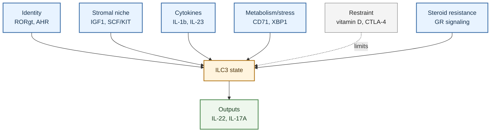

---
tags:
  - cell/ILC3
  - tissue/lung
  - tissue/gut
  - assay/flow
  - assay/RNAseq
  - assay/scRNAseq
  - assay/in_vivo
  - assay/in_vitro
  - outcome/infection
  - outcome/inflammation
  - outcome/airway_hyperresponsiveness
  - axis/ILC_lung_homeostasis
  - axis/ILC_airway_inflammation
  - axis/ILC_plasticity
---

# ILC3 Functional Regulation Mechanisms

## Scope

This topic page organizes mechanisms that regulate `ILC3` function in the current `ILC_in_lung` wiki. It focuses on cytokine activation, stromal niche control, transcriptional identity, circadian and metabolic regulation, vitamin D/IL-23 signaling, AHR, STING, ER stress, glucocorticoid resistance, and tissue-context boundaries.

For disease outcomes, see [ILC3 Roles In Pulmonary Disease](./ILC3_roles_in_pulmonary_disease.md).

## Evidence tags

`#cell/ILC3` `#tissue/lung` `#tissue/gut` `#assay/flow` `#assay/RNAseq` `#assay/scRNAseq` `#assay/in_vivo` `#assay/in_vitro` `#outcome/infection` `#outcome/inflammation` `#outcome/airway_hyperresponsiveness` `#axis/ILC_lung_homeostasis` `#axis/ILC_airway_inflammation` `#axis/ILC_plasticity`

## Confidence snapshot

- High confidence:
  IL-1beta, IL-23, RORgammat-associated identity, IL-22, and IL-17A are central organizing concepts for ILC3 regulation in the source set.
- High confidence:
  pulmonary ILC3 function can be shaped by stromal niches, including IGF1 in newborn lung and SCF/KIT signaling in neutrophilic asthma.
- Medium confidence:
  circadian control, vitamin D, AHR, STING, nutrition/iron, and ER-stress pathways are important cross-tissue ILC3 regulatory mechanisms.
- Medium confidence:
  glucocorticoid resistance in ILC3s is a disease-relevant regulatory mechanism for non-eosinophilic or steroid-resistant asthma.
- Low confidence:
  many detailed ILC3 regulatory mechanisms come from gut or mucosal sources and require explicit tissue labels before being applied to lung.

## Established observations

### Cytokine activation and effector output

- ILC3s are generally organized around RORgammat-associated identity and production of IL-22 and/or IL-17-family cytokines.
- [Activation of Type 3 innate lymphoid cells and interleukin 22 secretion in the lungs during Streptococcus pneumoniae infection](../sources/2014_activation_of_type_3_innate_lymphoid_cells_and_interleukin_22_secretion_in_the_lungs.md) supports IL-23-responsive lung ILC3 IL-22 production during bacterial infection.
- [Pulmonary fibroblast-derived stem cell factor promotes neutrophilic asthma by augmenting IL-17A production from ILC3s](../sources/2025_pulmonary_fibroblast_derived_stem_cell_factor_promotes_neutrophilic_asthma_by_augment.md) frames ILC3s as IL-1beta/IL-23-responsive cells capable of IL-17 and IL-22 production, with IL-17A linked to neutrophilic asthma outcomes.
- [Group 3 innate lymphoid cells secret neutrophil chemoattractants and are insensitive to glucocorticoid via aberrant GR phosphorylation](../sources/2023_group_3_innate_lymphoid_cells_secret_neutrophil_chemoattractants_and_are_insensitive.md) supports IL-1beta-induced CXCL8/CXCL1 production from ILC3s through NF-kappaB and MAPK-linked pathways.

### Stromal and developmental niche regulation

- [Insulin-like Growth Factor 1 Supports a Pulmonary Niche that Promotes Type 3 Innate Lymphoid Cell Development in Newborn Lungs](../sources/2020_insulin_like_growth_factor_1_supports_a_pulmonary_niche_that_promotes_type_3_innate_lymphoid_cell_development_in.md) supports a pulmonary stromal niche mechanism in which alveolar fibroblast-derived IGF1 promotes postnatal lung ILC3 development.
- [Pulmonary fibroblast-derived stem cell factor promotes neutrophilic asthma by augmenting IL-17A production from ILC3s](../sources/2025_pulmonary_fibroblast_derived_stem_cell_factor_promotes_neutrophilic_asthma_by_augment.md) supports a disease-associated stromal mechanism in which pulmonary fibroblast-derived SCF augments ILC3 IL-17A production.
- Together, these sources suggest that stromal cells can support either development/homeostasis or inflammatory output depending on context.

### Transcriptional identity and plasticity

- [Reciprocal transcription factor networks govern tissue-resident ILC3 subset function and identity](../sources/2021_reciprocal_transcription_factor_networks_govern_tissue_resident_ilc3_subset_function.md) supports transcription-factor-network control of ILC3 subset function and identity.
- [Circadian circuits control plasticity of group 3 innate lymphoid cells by sustaining epigenetic configuration of RORgammat](../sources/2025_circadian_circuits_control_plasticity_of_group_3_innate_lymphoid_cells_by_sustaining_epigenetic_configuration_of.md) supports circadian control of ILC3 identity through maintenance of RORgammat-associated epigenetic configuration, though this is primarily gut-context evidence.
- [WASH maintains NKp46+ ILC3 cells by promoting AHR expression](../sources/2017_wash_maintains_nkp46_ilc3_cells_by_promoting_ahr_expression.md) supports AHR-linked maintenance of an NKp46+ ILC3 branch.

### Taxonomy and IL-17 classification boundaries

- [Differentiation of type 1 ILCs from a common progenitor to all helper-like innate lymphoid cell lineages](../sources/2014_differentiation_of_type_1_ilcs_from_a_common_progenitor_to_all_helper_like_innate_lymphoid_cell_lineages.md) supports conservative separation of helper-like ILC lineages from conventional NK cells when interpreting ILC1-like, ILC2, and ILC3 states.
- [Tissue residency of innate lymphoid cells in lymphoid and nonlymphoid organs](../sources/2015_tissue_residency_of_innate_lymphoid_cells_in_lymphoid_and_nonlymphoid_organs.md) supports tissue residency as an organizing concept for ILC interpretation rather than assuming all ILC-like signals reflect circulating contamination.
- [c-Kit-positive ILC2s exhibit an ILC3-like signature that may contribute to IL-17-mediated pathologies](../sources/2019_c_kit_positive_ilc2s_exhibit_an_ilc3_like_signature_that_may_contribute_to_il_17_medi.md) is a classification warning: IL-17-producing ILC-like states can include ILC2/ILC3-like boundary populations and should not automatically be called bona fide ILC3s without marker and context support.

### Vitamin D, AHR, STING, nutrition, and ER stress

- [Vitamin D downregulates the IL-23 receptor pathway in human mucosal group 3 innate lymphoid cells](../sources/2018_vitamin_d_downregulates_the_il_23_receptor_pathway_in_human_mucosal_group_3_innate_lymphoid_cells.md) supports vitamin D-mediated suppression of IL-23 pathway responses and ILC3 cytokine production in human mucosal ILC3s.
- [AHR drives the development of gut ILC22 cells and postnatal lymphoid tissues via pathways dependent on and independent of Notch](../sources/2012_ahr_drives_the_development_of_gut_ilc22_cells_and_postnatal_lymphoid_tissues_via_path.md) and [WASH maintains NKp46+ ILC3 cells by promoting AHR expression](../sources/2017_wash_maintains_nkp46_ilc3_cells_by_promoting_ahr_expression.md) support AHR as a recurring ILC3/ILC22 regulatory axis.
- [ILC3s sense gut microbiota through STING to initiate immune tolerance](../sources/2025_ilc3s_sense_gut_microbiota_through_sting_to_initiate_immune_tolerance.md) supports STING as a gut ILC3 microbiota-sensing/tolerance mechanism.
- [Nutrition impact on ILC3 maintenance and function centers on a cell-intrinsic CD71-iron axis](../sources/2023_nutrition_impact_on_ilc3_maintenance_and_function_centers_on_a_cell_intrinsic_cd71_iron_axis.md) supports a nutrition/iron-linked ILC3 maintenance branch.
- [The IRE1alphaXBP1 pathway sustains cytokine responses of group 3 innate lymphoid cells in inflammatory bowel disease](../sources/2024_the_ire1alpha_xbp1_pathway_sustains_cytokine_responses_of_group_3_innate_lymphoid_cells_in_inflammatory_bowel_di.md) supports an ER-stress/UPR-linked mechanism for ILC3 cytokine responses in IBD.

### Glucocorticoid resistance and inflammatory signaling

- [Group 3 innate lymphoid cells secret neutrophil chemoattractants and are insensitive to glucocorticoid via aberrant GR phosphorylation](../sources/2023_group_3_innate_lymphoid_cells_secret_neutrophil_chemoattractants_and_are_insensitive.md) supports a mechanism where ILC3 neutrophil chemoattractant production is glucocorticoid-insensitive and linked to altered glucocorticoid receptor phosphorylation.
- This source is especially important for steroid-resistant or non-eosinophilic asthma because it links cell function, inflammatory mediator production, and drug-response biology.

## Interpretation

ILC3 regulation should be interpreted as a balance between identity-maintaining programs and inflammatory activation programs. RORgammat, AHR, circadian regulation, nutrition/iron, and stromal survival cues support identity and maintenance. IL-1beta, IL-23, SCF/KIT, NF-kappaB/MAPK, and disease-associated stromal signals can push ILC3s toward IL-17A, neutrophil chemoattractants, and inflammatory pathology. Vitamin D and CTLA-4-like restraint mechanisms may counter inflammatory IL-23-linked activity in some mucosal contexts.

## Contradiction and supersession

- Contradiction:
  IL-23/IL-1beta pathways can support protective mucosal responses but can also drive neutrophilic inflammation and steroid-resistant asthma.
- Contradiction:
  AHR and circadian/RORgammat mechanisms are strong ILC3 identity regulators, but much of this evidence is gut or mucosal rather than lung-specific.
- Contradiction:
  stromal signals can support newborn lung ILC3 development or augment pathogenic IL-17A production depending on the stromal signal and disease context.
- Supersession:
  no current source supersedes the full ILC3 regulatory map. The correct approach is to annotate mechanism by tissue, species, and outcome.

## Open questions

- Which ILC3 regulatory mechanism is most relevant to the user's lung dataset: IL-23/IL-1beta, SCF/KIT, IGF1, AHR, RORgammat, vitamin D, STING, or glucocorticoid resistance?
- Are ILC3 outputs measured as cytokine transcripts, intracellular cytokine staining, secreted protein, or downstream neutrophil recruitment?
- Are apparent ILC3s distinguished from Th17, gamma-delta T, NK, ILC1, and ILC2/ILC3-like plastic states?
- Does the project have stromal, epithelial, or macrophage ligand data that could explain ILC3 activation?
- Is the disease model eosinophilic, neutrophilic, mixed, infection-driven, or injury-driven?

## Related pages

- [ILC3 Roles In Pulmonary Disease](./ILC3_roles_in_pulmonary_disease.md)
- [ILC3 Working Model](../digests/2026-04-20_ILC3_working_model.md)
- [Role Of ILC In Pulmonary Diseases](../digests/2026-04-20_ILC_pulmonary_disease_roles.md)
- [ILC In Lung](./ILC_in_lung.md)

## Next ingest targets

- Manually review ILC3 mechanism papers and label each as lung-specific, gut-specific, mucosal-general, or review-level evidence.
- Build a regulatory table mapping mechanism to output: IL-22, IL-17A, CXCL1/CXCL8, GM-CSF, IFNG, or tissue maintenance.
- Build an `ILC3` entity page after the mechanism map is checked against source text.
