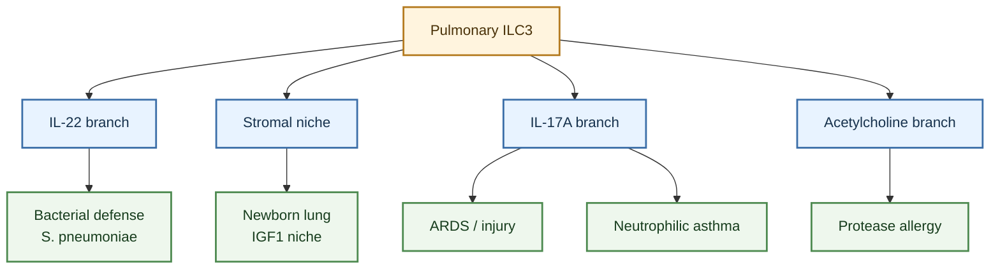

---
tags:
  - cell/ILC3
  - tissue/lung
  - tissue/gut
  - outcome/infection
  - outcome/homeostasis
  - outcome/inflammation
  - outcome/airway_hyperresponsiveness
  - axis/ILC_lung_homeostasis
  - axis/ILC_airway_inflammation
  - axis/ILC_plasticity
---

# ILC3 Roles In Pulmonary Disease

## Scope

This topic page describes how `ILC3s` are represented in the current `ILC_in_lung` wiki as disease-relevant cells in lung and airway contexts. It focuses on bacterial host defense, neonatal lung development, acute lung injury/ARDS, neutrophilic asthma, steroid-resistant asthma, cigarette-smoke-associated asthma, and allergic lung pathology.

This page expands the disease branch of [ILC3](../entities/ILC3.md). Use the entity page for the canonical cell-level model, then use this topic when the question is specifically about disease context and pathology.

## Evidence tags

`#cell/ILC3` `#tissue/lung` `#tissue/gut` `#outcome/infection` `#outcome/homeostasis` `#outcome/inflammation` `#outcome/airway_hyperresponsiveness` `#axis/ILC_lung_homeostasis` `#axis/ILC_airway_inflammation` `#axis/ILC_plasticity`

## Confidence snapshot

- High confidence:
  the local source set supports lung ILC3 roles in bacterial IL-22 host defense and neonatal pulmonary niche biology.
- High confidence:
  the source set supports an ILC3/IL-17A/neutrophil branch in ARDS, neutrophilic asthma, and steroid-resistant asthma.
- Medium confidence:
  cigarette smoke, airway epithelial/fibroblast cues, and glucocorticoid-resistance mechanisms are important disease regulators for ILC3-associated airway inflammation.
- Medium confidence:
  ILC3-derived mediators can be protective or pathogenic depending on cytokine output and disease context.
- Low confidence:
  extrapolating gut ILC3 regulatory programs into lung disease should remain hypothesis-level unless pulmonary evidence is present.

## Established observations

### Bacterial infection and mucosal defense

- [Activation of Type 3 innate lymphoid cells and interleukin 22 secretion in the lungs during Streptococcus pneumoniae infection](../sources/2014_activation_of_type_3_innate_lymphoid_cells_and_interleukin_22_secretion_in_the_lungs.md) supports a lung ILC3 branch in which ILC3s accumulate during Streptococcus pneumoniae infection and produce IL-22.
- In that source, ILC3 IL-22 production is linked to innate immune stimulation and is framed as protective during bacterial respiratory infection.
- This branch should be interpreted separately from IL-17A/neutrophil-dominant inflammatory disease because IL-22 host defense and IL-17A pathology are not the same outcome.
- [Innate lymphoid cells integrate sensing and plasticity to control fungal infections](../sources/2026_innate_lymphoid_cells_integrate_sensing_and_plasticity_to_control_fungal_infections.md) adds a direct pulmonary fungal-infection branch: ILCs can sense fungal components, participate in Aspergillus lung infection outcomes, and shift toward ILC3-like programs under inflammatory cytokine pressure.

### Neonatal lung development and homeostatic niche

- [Insulin-like Growth Factor 1 Supports a Pulmonary Niche that Promotes Type 3 Innate Lymphoid Cell Development in Newborn Lungs](../sources/2020_insulin_like_growth_factor_1_supports_a_pulmonary_niche_that_promotes_type_3_innate_lymphoid_cell_development_in.md) supports a developmental lung ILC3 branch.
- The source links alveolar fibroblast-derived IGF1 to postnatal lung ILC3 development and notes reduced IGF1 and pulmonary ILC3s in premature infants with bronchopulmonary dysplasia.
- This makes ILC3 relevant not only to inflammation but also to lung development and mucosal defense maturation.

### ARDS and acute lung injury

- [Innate Lymphoid Cells Are the Predominant Source of IL-17A during the Early Pathogenesis of Acute Respiratory Distress Syndrome](../sources/2016_innate_lymphoid_cells_are_the_predominant_source_of_il_17a_during_the_early_pathogene.md) supports a lung injury branch in which innate lymphoid cells are an early IL-17A source in mouse lung injury models.
- This page should preserve the source's disease-model specificity: aerosolized LPS and Pseudomonas aeruginosa models are not identical to all human ARDS contexts.

### Neutrophilic and steroid-resistant asthma

- [Innate lymphoid cells contribute to allergic airway disease exacerbation by obesity](../sources/2016_innate_lymphoid_cells_contribute_to_allergic_airway_disease_exacerbation_by_obesity.md) adds a mouse metabolic-disease context in which allergic airway disease can involve altered ILC2 and ILC3 responses; this should stay separate from lean allergic asthma and from direct human obesity-asthma claims.
- [Interleukin-17-producing innate lymphoid cells and the NLRP3 inflammasome facilitate obesity-associated airway hyperreactivity](../sources/2014_interleukin_17_producing_innate_lymphoid_cells_and_the_nlrp3_inflammasome_facilitate.md) defines a distinct obesity-associated airway branch in which macrophage IL-1beta, NLRP3, and IL-17-producing innate lymphoid cells drive nonadaptive airway hyperreactivity.
- [Cigarette smoke aggravates asthma by inducing memory-like type 3 innate lymphoid cells](../sources/2022_cigarette_smoke_aggravates_asthma_by_inducing_memory_like_type_3_innate_lymphoid_cell.md) supports a smoke-associated asthma branch in which activated or memory-like ILC3s correlate with neutrophil-linked and M1 macrophage-linked features.
- [Group 3 innate lymphoid cells secret neutrophil chemoattractants and are insensitive to glucocorticoid via aberrant GR phosphorylation](../sources/2023_group_3_innate_lymphoid_cells_secret_neutrophil_chemoattractants_and_are_insensitive.md) supports an ILC3 branch in non-eosinophilic asthma where ILC3s produce neutrophil chemoattractants and show glucocorticoid resistance.
- [Group 3 Innate Lymphoid Cells A Potential Therapeutic Target for Steroid Resistant Asthma](../sources/2024_group_3_innate_lymphoid_cells_a_potential_therapeutic_target_for_steroid_resistant_asthma.md) provides a review-level frame linking ILC3s to steroid-resistant asthma.
- [Pulmonary fibroblast-derived stem cell factor promotes neutrophilic asthma by augmenting IL-17A production from ILC3s](../sources/2025_pulmonary_fibroblast_derived_stem_cell_factor_promotes_neutrophilic_asthma_by_augment.md) supports a stromal niche branch where fibroblast-derived SCF/KIT signaling augments IL-17A production from ILC3s.
- [Microbial dysbiosis sculpts a systemic ILC3/IL-17 axis governing lung inflammatory responses and central hematopoiesis](../sources/2025_microbial_dysbiosis_sculpts_a_systemic_ilc3_il_17_axis_governing_lung_inflammatory_re.md) supports a gut-lung inflammatory branch in which streptomycin-induced dysbiosis primes lung ILC3/Th17 IL-17 responses and hypersensitivity-pneumonitis pathology through IL-23, bile-acid metabolite, and mTORC1-linked mechanisms.

### Protease-driven allergic lung pathology

- [ILC3-derived acetylcholine promotes protease-driven allergic lung pathology](../sources/2021_ilc3_derived_acetylcholine_promotes_protease_driven_allergic_lung_pathology.md) supports a noncanonical ILC3 mediator branch in allergic lung pathology involving ILC3-derived acetylcholine.
- This source is useful because it shows that ILC3 disease relevance is not limited to IL-17A and IL-22.

- Several ILC3 regulatory mechanisms in this library are gut or mucosal rather than pulmonary; IL-17D/CD93, NPM1/OXPHOS, reciprocal TF-network, and PDGF-D receptor-divergence sources should be treated as regulatory context unless matched lung data are present ([Interleukin-17D regulates group 3 innate lymphoid cell function through its receptor CD93](../sources/2021_interleukin_17d_regulates_group_3_innate_lymphoid_cell_function_through_its_receptor.md); [Nucleophosmin 1 promotes mucosal immunity by supporting mitochondrial oxidative phosphorylation and ILC3 activity](../sources/2024_nucleophosmin_1_promotes_mucosal_immunity_by_supporting_mitochondrial_oxidative_phosphorylation_and_ilc3_activit.md); [Reciprocal transcription factor networks govern tissue-resident ILC3 subset function and identity](../sources/2021_reciprocal_transcription_factor_networks_govern_tissue_resident_ilc3_subset_function.md); [Divergent ILC3 responses to PDGF-D control mucosal immunity](../sources/2026_divergent_ilc3_responses_to_pdgf_d_control_mucosal_immunity.md)).
### IL-17-producing ILC classification caveat

- [c-Kit-positive ILC2s exhibit an ILC3-like signature that may contribute to IL-17-mediated pathologies](../sources/2019_c_kit_positive_ilc2s_exhibit_an_ilc3_like_signature_that_may_contribute_to_il_17_medi.md) means IL-17-producing ILC-like cells in lung disease should be interpreted with marker and lineage caution: some IL-17-producing populations may be bona fide ILC3s, while others may represent ILC2/ILC3-like boundary states.

- Tuberculosis adds a protective lung ILC3 infection branch: in mouse Mtb infection, ILC3-derived IL-17/IL-22 supports CXCL13, early alveolar macrophage accumulation, granuloma organization, and Mtb control, while human blood ILC changes provide disease relevance but not direct tissue causality ([Group 3 innate lymphoid cells mediate early protective immunity against tuberculosis](../sources/2019_group_3_innate_lymphoid_cells_mediate_early_protective_immunity_against_tuberculosis.md)).
- Severe-asthma sputum adds a human airway ILC3/neutrophilia branch and an ILC2/ILC3-like boundary-state branch; these should refine, not collapse, the existing ILC3 severe-asthma model ([A population of c-kit+ IL-17A+ ILC2s in sputum from individuals with severe asthma supports ILC2 to ILC3 trans-differentiation](../sources/2025_a_population_of_c_kit_il_17a_ilc2s_in_sputum_from_individuals_with_severe_asthma_supp.md)).
- [Severe asthma is characterized by a sex-specific ILC landscape and aberrant airway profile that is suppressed by anti-IL-5/5Ralpha biologics](../sources/2025_severe_asthma_is_characterized_by_a_sex_specific_ilc_landscape_and_aberrant_airway_pr.md) adds a broader human severe-asthma ILC landscape: sputum RORgammat+ ILC3s and IL-17A+ ILCs are increased in severe asthma, while female severe-asthma blood shows stronger ILC3/IL-17/IL-22 signals; this supports compartment- and sex-aware interpretation rather than ILC3-only causality.
### Extrapulmonary barrier-protection context

- Gut/mucosal ILC3 sources add several barrier-regulation mechanisms that may be useful comparators for lung interpretation but are not direct pulmonary disease evidence: RANKL/RANK restraint, circadian timing, FFAR2 metabolite sensing, VIP neuroimmune signaling, trained ILC3 defense, and HB-EGF-mediated tissue protection.
- These mechanisms should be used to generate careful hypotheses about lung ILC3 state control, not as direct support for asthma, ARDS, COPD, or pneumonia claims unless matching pulmonary data are added.

## Interpretation

The ILC3 disease model in this wiki is organized around a tension between barrier defense and neutrophil-rich pathology. In bacterial infection and neonatal lung development, ILC3s appear as tissue-supportive cells linked to IL-22, IGF1-responsive developmental niches, and mucosal defense. In ARDS and neutrophilic/steroid-resistant asthma, ILC3s appear as inflammatory amplifiers linked to IL-17A, neutrophil chemoattractants, glucocorticoid resistance, and stromal/fibroblast activation.

The most important interpretation rule is to record which mediator is being discussed:

- `IL-22-dominant ILC3`:
  more often framed around barrier support, epithelial defense, and bacterial host defense.
- `IL-17A/neutrophil-dominant ILC3`:
  more often framed around ARDS, severe asthma, neutrophilic inflammation, mucus, and airway hyperresponsiveness.
- `noncanonical mediator ILC3`:
  includes acetylcholine and possibly other context-specific outputs.

## Contradiction and supersession

- Contradiction:
  ILC3s can be protective in bacterial host defense but pathogenic in IL-17A/neutrophil-rich airway disease.
- Contradiction:
  IL-22 and IL-17A are both ILC3-associated outputs, but they map to different disease roles and should not be treated as equivalent.
- Contradiction:
  some disease sources may include plastic ILC2/ILC3-like states rather than stable ILC3 populations.
- Supersession:
  no current source supersedes the overall ILC3 disease model. The model should be partitioned by mediator, tissue, disease model, and species.

## Open questions

- In the user's project, are ILC3s measured in lung tissue, BAL, sputum, peripheral blood, or scRNA-seq clusters?
- Are the relevant ILC3s IL-22-dominant, IL-17A-dominant, or mixed?
- Does the project focus on bacterial infection, viral infection, neutrophilic asthma, steroid-resistant asthma, ARDS, or lung development?
- Are ILC3-like signals actually stable ILC3s, plastic ILC2s, Th17 cells, gamma-delta T cells, or mixed innate-like lymphocyte populations?
- Which markers are available to distinguish ILC3s from NK cells, ILC1s, Th17 cells, and ILC2-like plastic states?

## Related pages

- [ILC3](../entities/ILC3.md)
- [Lung ILC Disease Roles Companion](../digests/2026-04-20_ILC_pulmonary_disease_roles.md)
- [ILC3 Functional Regulation Mechanisms](./ILC3_functional_regulation_mechanisms.md)
- [ILC In Lung](./ILC_in_lung.md)

## Future Expansion Directions

This short appendix highlights future literature directions rather than current disease conclusions. The most useful additions for later versions of this page would be:

- ILC3 asthma sources that more cleanly separate human association, ex vivo stimulation, and mouse perturbation claims.
- Additional bacterial-infection and neonatal-lung-niche sources that sharpen the protective branch.
- More direct source coverage inside [ILC3](../entities/ILC3.md), especially for sputum-versus-lung-tissue compartments, SCF/KIT stromal licensing, and steroid-resistant asthma mechanisms.
