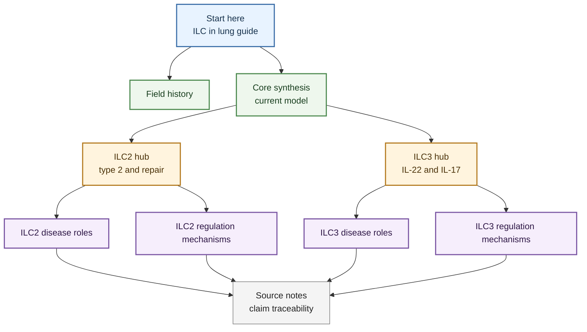

---
tags:
  - guide/beginner
  - axis/ILC_lung_homeostasis
  - axis/ILC_lung_infection
  - axis/ILC_airway_inflammation
  - axis/ILC_plasticity
  - tissue/lung
  - cell/ILC2
  - cell/ILC3
  - cell/ILC1
---

# ILC In Lung

## Scope

This page is the beginner-facing guide to the `ILC_in_lung` wiki. It explains how to enter the field, what the main biological questions are, and which pages to read next when learning innate lymphoid cell biology in lung and airway disease.

The wiki emphasizes `ILC2` and `ILC3` biology in pulmonary inflammation, respiratory viral infection, tissue repair, stromal niches, neuroimmune regulation, metabolism, and disease-associated plasticity. It is a source-aware research map, not a complete textbook or clinical guideline.

## Evidence Tags

`#guide/beginner` `#axis/ILC_lung_homeostasis` `#axis/ILC_lung_infection` `#axis/ILC_airway_inflammation` `#axis/ILC_plasticity` `#tissue/lung` `#cell/ILC2` `#cell/ILC3` `#cell/ILC1`

## Wiki Status

- The local source library currently contains 141 processed references, with 60 source pages promoted to `focused manual crystallization mode` and 81 retained as `provisional bulk-ingest mode`.
- Focused source pages are the preferred evidence layer for reusable biological claims because they include model context, assay directness, claim-level confidence, and caveats.
- Provisional source pages are useful for routing and triage, but their biological claims should be manually checked before being reused in manuscripts, figures, grant text, or durable synthesis.
- Batch provenance belongs in audit and log pages; digest, topic, and entity pages should read as biology-first knowledge nodes.

## Beginner Mental Model

For a first pass, think of lung ILCs as tissue-positioned immune response modules. They do not use antigen-specific receptors like T cells and B cells, but they can rapidly sense epithelial, stromal, microbial, metabolic, and neural cues. Their output depends on subset, tissue compartment, activation state, disease trigger, and timing.

| Subset | Simplest Starting Idea | Lung Disease Meaning | Main Caution |
|---|---|---|---|
| ILC2 | Type 2 and repair-capable ILCs | Allergic airway inflammation, viral AHR, epithelial repair, stromal niche feedback, neuroimmune regulation | ILC2s can be pathogenic, reparative, memory-like, or plastic depending on context |
| ILC3 | IL-22/IL-17-capable ILCs | Bacterial defense, neonatal lung niches, ARDS-like injury, neutrophilic and steroid-resistant asthma | IL-17-producing ILC-like cells require careful marker and lineage interpretation |
| ILC1/NK-like states | Type 1 inflammatory or cytotoxic-adjacent programs | Important for plasticity, infection, tumor, and mixed inflammation interpretation | Do not merge ILC1, NK cells, and ILC2-to-ILC1-like states without source-specific evidence |

## First Reading Path

1. Start with [ILC Research Trend From Then To Now](../digests/2026-04-20_ILC_research_trend_then_to_now/) to understand how the field moved from ILC discovery to lung disease mechanisms.
2. Read [Lung ILC Core Evidence Synthesis](../digests/2026-04-22_lung_ILC_core_evidence_synthesis/) for the current integrated map across ILC2 and ILC3.
3. Open [ILC2](../entities/ILC2/) and [ILC3](../entities/ILC3/) as entity hubs when you want cell-specific claims.
4. Use the disease pages when the question is about pathology: [ILC2 Roles In Pulmonary Disease](./ILC2_roles_in_pulmonary_disease/) and [ILC3 Roles In Pulmonary Disease](./ILC3_roles_in_pulmonary_disease/).
5. Use the regulation pages when the question is mechanistic: [ILC2 Functional Regulation Mechanisms](./ILC2_functional_regulation_mechanisms/) and [ILC3 Functional Regulation Mechanisms](./ILC3_functional_regulation_mechanisms/).
6. Go to source notes only when you need citation traceability, model details, or claim-level confidence boundaries.

## Concept Map

## Core Biological Threads

### 1. ILC2s: Allergic Pathology, Repair, And Niche Regulation

The ILC2 source set is strongest around asthma and allergic airway inflammation, respiratory viral infection, post-viral repair, metabolic regulation, neuroimmune regulation, tissue niches, and plasticity. ILC2s often amplify type 2 inflammation through IL-5 and IL-13, but they can also support epithelial repair through amphiregulin-associated programs and participate in stromal or macrophage niche remodeling.

Recent focused source notes add an important spatial and regulatory layer: lung ILC2s can sit in adventitial/peribronchovascular niches supported by IL-33/TSLP-producing stromal cells, while IFN-gamma can suppress ILC2 function or constrain type 2 lymphocyte movement during mixed inflammation. These claims now live primarily in [ILC2](../entities/ILC2/), with disease and mechanism expansion in [ILC2 Roles In Pulmonary Disease](./ILC2_roles_in_pulmonary_disease/), [ILC2 Functional Regulation Mechanisms](./ILC2_functional_regulation_mechanisms/), and [Lung ILC Core Evidence Synthesis](../digests/2026-04-22_lung_ILC_core_evidence_synthesis/).

### 2. ILC3s: Defense, IL-17 Inflammation, And Severe Asthma Branches

The ILC3 source set spans mucosal protection, lung IL-22 responses during bacterial infection, developmental lung niches, ARDS/IL-17A, neutrophilic airway inflammation, steroid-resistant asthma, fibroblast SCF/KIT licensing, and IL-17 classification boundaries. In this wiki, ILC3s should not be labeled simply as protective or pathogenic. Their role depends on whether the relevant output is IL-22 barrier defense, IL-17A/neutrophilic inflammation, chemokine production, or stromal crosstalk.

### 3. Plasticity Is A Feature, Not A Footnote

ILC subset labels are useful but incomplete. ILC2s can acquire memory-like behavior, become ILC1-like under COPD-associated inflammatory pressure, or show IL-17-producing ILC2/ILC3-like boundary states. ILC3s can also show state changes linked to smoking, steroid resistance, tissue stress, and transcriptional remodeling. Any serious claim should preserve marker set, tissue compartment, species, disease model, and assay type.

### 4. Evidence Type Matters

Mouse perturbation studies are usually strongest for causality. Human lung tissue, sputum, blood, nasal airway, and scRNA-seq studies are essential for relevance but often have different inferential limits. Reviews are useful for conceptual framing, but primary source notes should anchor mechanistic claims.

## How To Use Claim Confidence

| Confidence | How To Interpret It |
|---|---|
| High confidence | Source-specific claim is directly supported by the paper's model, assay, and outcome |
| Medium-high confidence | Mechanism is experimentally supported but translation, tissue generality, or disease breadth needs labels |
| Medium confidence | Useful working model or cross-source synthesis, but details require source-level checking |
| Low confidence | Hypothesis, review-level extrapolation, or claim that should not be reused without additional evidence |

## Common Beginner Mistakes To Avoid

- Do not treat `ILC2 activation` as automatically bad; ILC2s can drive airway disease or support repair depending on context.
- Do not treat `ILC3` as only a gut cell; this wiki includes lung ILC3 evidence in infection, development, ARDS-like injury, and severe asthma.
- Do not merge mouse lung, human sputum, human blood, and nasal-polyp findings without stating the compartment.
- Do not assume IL-17-producing ILC-like cells are always canonical ILC3s; some sources support ILC2/ILC3-like boundary states.
- Do not use provisional source notes as mature evidence until they are focused-crystallized.

## Page Map

| Question | Best Page |
|---|---|
| What is the overall story? | [Lung ILC Core Evidence Synthesis](../digests/2026-04-22_lung_ILC_core_evidence_synthesis/) |
| How did the field evolve? | [ILC Research Trend From Then To Now](../digests/2026-04-20_ILC_research_trend_then_to_now/) |
| What do ILC2s do in lung disease? | [ILC2 Roles In Pulmonary Disease](./ILC2_roles_in_pulmonary_disease/) |
| What regulates ILC2 function? | [ILC2 Functional Regulation Mechanisms](./ILC2_functional_regulation_mechanisms/) |
| What do ILC3s do in lung disease? | [ILC3 Roles In Pulmonary Disease](./ILC3_roles_in_pulmonary_disease/) |
| What regulates ILC3 function? | [ILC3 Functional Regulation Mechanisms](./ILC3_functional_regulation_mechanisms/) |
| Which claims are citation-ready? | Source pages marked `focused manual crystallization mode` |

## Open Questions

- Which ILC mechanisms are conserved between mouse allergic airway models and human asthma endotypes?
- When do respiratory viruses induce pathogenic ILC2-driven AHR versus protective ILC2-mediated repair?
- Which IL-17-producing ILC populations in lung disease are bona fide ILC3s, plastic ILC2-derived states, or mixed-gate populations?
- Which evidence layer should be prioritized next: human BAL, bronchial biopsy, sputum, lung scRNA-seq, spatial data, or perturbation models?

## Related Pages

- [ILC_in_lung_project](../projects/ILC_in_lung_project/)
- [Sources README](../sources/)
- [ILC2](../entities/ILC2/)
- [ILC3](../entities/ILC3/)
- [Lung ILC Disease Roles Companion](../digests/2026-04-20_ILC_pulmonary_disease_roles/)
- [ILC Research Trend From Then To Now](../digests/2026-04-20_ILC_research_trend_then_to_now/)
- [Reference Coverage Audit](../audit/2026-04-20_reference_coverage_audit/)
