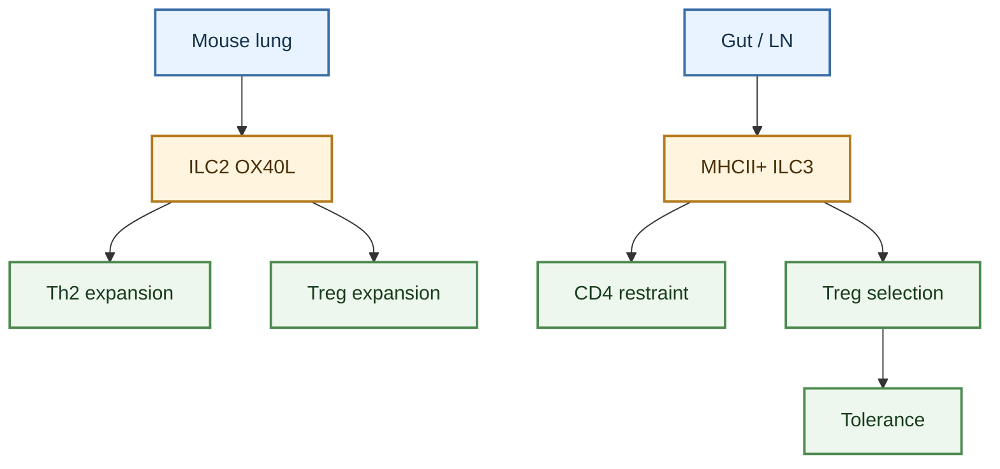
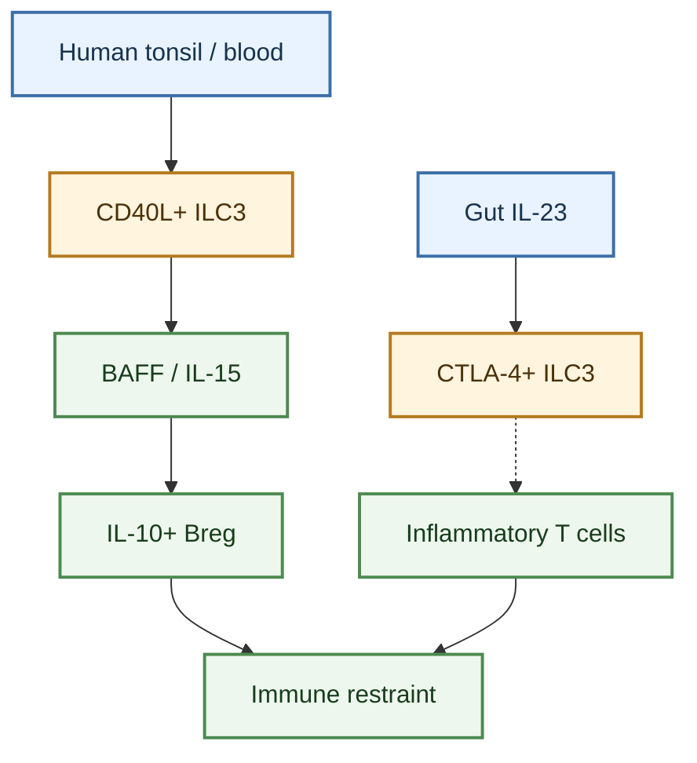

---
tags:
  - cell/ILC2
  - cell/ILC3
  - cell/T_cell
  - cell/B_cell
  - cell/Treg
  - tissue/lung
  - tissue/gut
  - tissue/tonsil
  - axis/adaptive_immunity
  - axis/ILC_regulation
---

# ILC Regulation Of Adaptive Immunity

## Scope

This topic page organizes evidence that innate lymphoid cells regulate adaptive immunity, with emphasis on T cells, regulatory T cells, and B cells. It is written for the ILC-in-lung wiki, but the evidence base is deliberately tissue-labeled: the clearest direct lung anchor is ILC2 OX40L control of local Th2 and Treg expansion in mouse type 2 inflammation, whereas much of the ILC3 evidence comes from gut, intestine-draining lymphoid tissue, tonsil, and blood.

Use this page when the question is "how can ILCs shape adaptive immune responses?" For lung disease claims, prioritize lung or airway sources and keep extrapulmonary mechanisms as context until pulmonary evidence is available.

## Evidence tags

`#cell/ILC2` `#cell/ILC3` `#cell/T_cell` `#cell/B_cell` `#cell/Treg` `#tissue/lung` `#tissue/gut` `#tissue/tonsil` `#axis/adaptive_immunity` `#axis/ILC_regulation`

## Confidence snapshot

- High confidence:
  mouse lung ILC2s can use IL-33-induced OX40L to license local Th2 and Treg expansion during type 2 inflammation ([Tissue-Restricted Adaptive Type 2 Immunity Is Orchestrated by Expression of the Costimulatory Molecule OX40L on Group 2 Innate Lymphoid Cells](../sources/2018_tissue_restricted_adaptive_type_2_immunity_is_orchestrated_by_expression_of_the_costimulatory_molecule_ox40l_on.md)).
- High confidence:
  gut ILC3s can restrain commensal-specific CD4 T-cell responses through MHCII-linked antigen-presentation programs ([Innate lymphoid cells regulate CD4+ T-cell responses to intestinal commensal bacteria](../sources/2013_innate_lymphoid_cells_regulate_cd4_t_cell_responses_to_intestinal_commensal_bacteria.md); [Group 3 innate lymphoid cells mediate intestinal selection of commensal bacteria-specific CD4+ T cells](../sources/2015_group_3_innate_lymphoid_cells_mediate_intestinal_selection_of_commensal_bacteria_specific_cd4_t_cells.md)).
- High confidence:
  gut ILC3s support or select regulatory T-cell programs through IL-2, MHCII, alphaV integrin, and IL-2 competition in source-specific intestinal tolerance systems ([Innate lymphoid cells support regulatory T cells in the intestine through interleukin-2](../sources/2019_innate_lymphoid_cells_support_regulatory_t_cells_in_the_intestine_through_interleukin.md); [ILC3s select microbiota-specific regulatory T cells to establish tolerance in the gut](../sources/2022_ilc3s_select_microbiota_specific_regulatory_t_cells_to_establish_tolerance_in_the_gut.md)).
- Medium-high confidence:
  human tonsil and blood ILC3s can provide CD40L/BAFF/IL-15-linked help that supports IL-10-positive PD-L1-positive immature transitional regulatory B cells; allergic/asthmatic associations are informative but not lung-tissue causality ([Human CD40 ligand-expressing type 3 innate lymphoid cells induce IL-10-producing immature transitional regulatory B cells](../sources/2018_human_cd40_ligand_expressing_type_3_innate_lymphoid_cells_induce_il_10_producing_immature_transitional_regulator.md)).
- Medium confidence:
  review-level ILC-T-cell literature is useful for organizing the field but should not replace primary source links when making mechanism claims ([The interplay between innate lymphoid cells and T cells](../sources/2020_the_interplay_between_innate_lymphoid_cells_and_t_cells.md)).
- Low confidence:
  direct lung ILC3 regulation of T cells, Tregs, or B cells remains underdeveloped in the current source library.

## Established observations

### Lung ILC2 costimulation

- ILC2s are not only cytokine producers. In mouse lung type 2 inflammation, IL-33 can induce OX40L on ILC2s, and ILC2-targeted OX40L loss impairs local adaptive type 2 inflammation after helminth or allergen challenge.
- The adaptive cell partners in this source include Th2 cells and Tregs. This is currently the strongest lung-direct ILC-to-adaptive-immunity axis in the wiki.
- Keep the species and perturbation context visible: this is mouse lung/adipose tissue evidence, not direct proof of human asthma therapeutic response.

### ILC3 control of CD4 T-cell tolerance

- MHCII-positive RORgammat-lineage ILCs and ILC3s can process/present antigen in gut-associated systems, but the observed output is restraint or selection of commensal-specific CD4 T cells rather than broad priming.
- ILC3-intrinsic MHCII loss can unleash commensal-specific CD4 T-cell responses and intestinal inflammation in mouse models.
- Human mucosal or pediatric IBD observations support relevance, but the tissue label remains gut.

### ILC3 support and selection of Tregs

- Intestinal ILC3-derived IL-2 can maintain local Tregs and oral tolerance downstream of macrophage/microbiota/IL-1beta cues.
- LTi-like MHCII-positive ILC3s can select microbiota-specific RORgammat-positive Tregs and restrain inflammatory Th17 diversion through antigen presentation, alphaV integrin, and IL-2 competition.
- ILC3-intrinsic CTLA-4 provides a separate gut checkpoint branch that restrains IL-23-mediated inflammatory T-cell programs ([CTLA-4-expressing ILC3s restrain interleukin-23-mediated inflammation](../sources/2024_ctla_4_expressing_ilc3s_restrain_interleukin_23_mediated_inflammation.md)).

### ILC3 help for regulatory B cells

- Human CD40L-positive ILC3s can localize near B-cell regions in tonsil and support B-cell survival, proliferation, and IL-10-positive PD-L1-positive immature transitional regulatory B-cell differentiation in coculture.
- The key molecular frame is CD40L, BAFF, and IL-15-linked crosstalk.
- This is a human regulatory B-cell axis, but direct pulmonary compartment evidence is not yet present in this source set.

### Review-level field frame

- ILC-T-cell crosstalk can amplify effector immunity or restrain adaptive responses depending on tissue, subset, mediator, and timing.
- For lung synthesis, use review sources to orient the reader and use primary sources for durable claims.

## Mechanism maps

### Lung anchor and gut T-cell tolerance

### B-cell and checkpoint branches

## Interpretation

ILC regulation of adaptive immunity should be modeled as a set of tissue-specific interfaces rather than as one universal function. In lung, the clearest current interface is ILC2 OX40L costimulation of local type 2 adaptive immunity. In gut and mucosal lymphoid tissues, ILC3s can regulate CD4 T-cell tolerance, Treg maintenance/selection, and regulatory B-cell differentiation through MHCII, IL-2, alphaV integrin, CD40L, BAFF, IL-15, and CTLA-4-linked pathways.

The practical rule is to keep lung-direct evidence and extrapulmonary mechanism evidence in separate mental bins. Gut ILC3 tolerance biology is highly informative for how ILCs can shape adaptive immunity, but it should be cited as gut/mucosal context until matching lung, BAL, sputum, bronchial biopsy, or pulmonary lymph-node evidence is available.

## Claim-level confidence boundaries

- `High confidence` is used when the source directly tests an ILC-adaptive cell interaction in its stated tissue/model.
- `Medium-high confidence` is used when human ex vivo, tissue-localization, or disease-association data support the axis but do not establish lung causality.
- `Medium confidence` is used for review-level framing or cross-source synthesis.
- `Low confidence` is used for direct pulmonary extrapolation from gut, tonsil, blood, or review-only evidence.

## Related pages

- [ILC2](../entities/ILC2.md)
- [ILC3](../entities/ILC3.md)
- [ILC2 functional regulation mechanisms](./ILC2_functional_regulation_mechanisms.md)
- [ILC3 functional regulation mechanisms](./ILC3_functional_regulation_mechanisms.md)
- [Lung ILC Core Evidence Synthesis](../digests/2026-04-22_lung_ILC_core_evidence_synthesis.md)

## Future Expansion Directions

- Add human lung, BAL, sputum, bronchial-biopsy, or pulmonary lymph-node data that directly test ILC regulation of T cells, B cells, or Tregs.
- Separate ILC2-Th2/Treg costimulation from ILC3-MHCII/Treg tolerance mechanisms in future figures and grant text.
- Track whether severe-asthma or infection datasets include paired ILC, T-cell, B-cell, and Treg state measurements with spatial or functional evidence.
